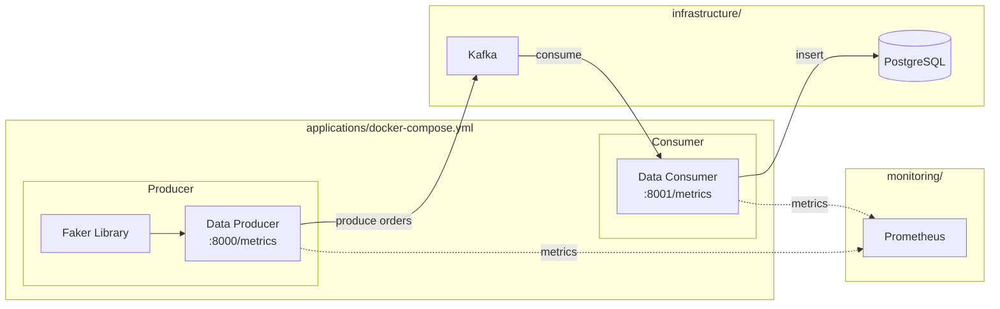

```mermaid
graph LR
    subgraph "applications/docker-compose.yml"
        subgraph "Producer"
            P[Data Producer<br/>:8000/metrics]
            F[Faker Library]
        end
        
        subgraph "Consumer"
            C[Data Consumer<br/>:8001/metrics]
        end
    end
    
    subgraph "infrastructure/"
        K[Kafka]
        PG[(PostgreSQL)]
    end
    
    subgraph "monitoring/"
        PR[Prometheus]
    end
    
    F --> P
    P -->|produce orders| K
    K -->|consume| C
    C -->|insert| PG
    
    P -.->|metrics| PR
    C -.->|metrics| PR
```