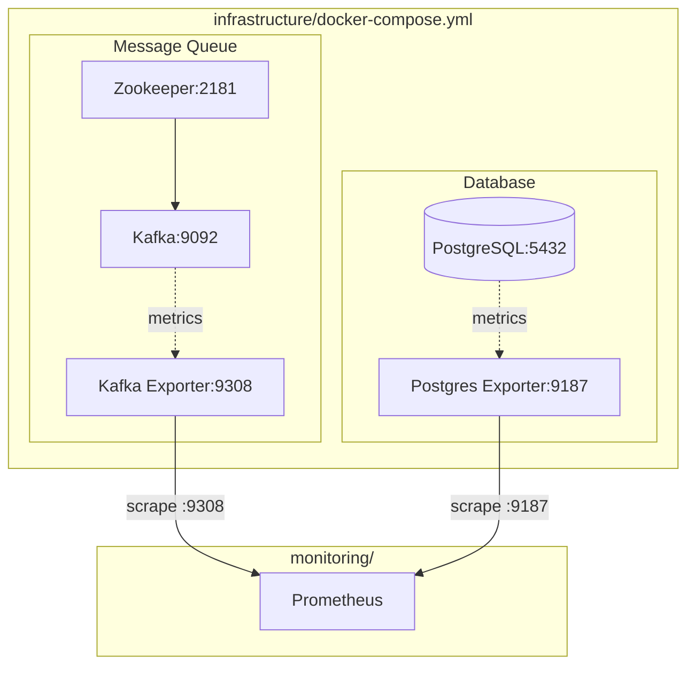

```mermaid
graph TB
    subgraph "infrastructure/docker-compose.yml"
        subgraph "Message Queue"
            ZK[Zookeeper:2181]
            K[Kafka:9092]
            KE[Kafka Exporter:9308]
        end
        
        subgraph "Database"
            PG[(PostgreSQL:5432)]
            PE[Postgres Exporter:9187]
        end
        
        ZK --> K
        K -.->|metrics| KE
        PG -.->|metrics| PE
    end
    
    subgraph "monitoring/"
        P[Prometheus]
    end
    
    KE -->|scrape :9308| P
    PE -->|scrape :9187| P
```