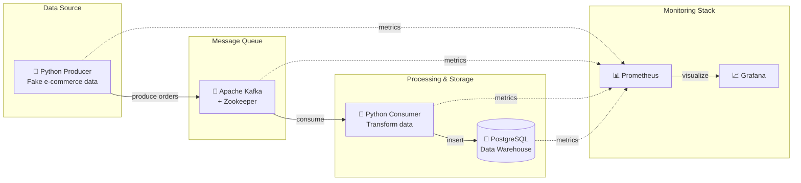

```mermaid
graph LR
    subgraph "Data Source"
        A[🐍 Python Producer<br/>Fake e-commerce data]
    end
    
    subgraph "Message Queue"
        B[📨 Apache Kafka<br/>+ Zookeeper]
    end
    
    subgraph "Processing & Storage"
        C[🐍 Python Consumer<br/>Transform data]
        D[(🐘 PostgreSQL<br/>Data Warehouse)]
    end
    
    subgraph "Monitoring Stack"
        E[📊 Prometheus]
        F[📈 Grafana]
    end
    
    A -->|produce orders| B
    B -->|consume| C
    C -->|insert| D
    
    A -.->|metrics| E
    B -.->|metrics| E
    C -.->|metrics| E
    D -.->|metrics| E
    E -->|visualize| F
```