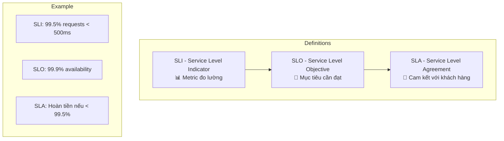

```mermaid
graph TB
    subgraph "Definitions"
        SLI[SLI - Service Level Indicator<br/>📊 Metric đo lường]
        SLO[SLO - Service Level Objective<br/>🎯 Mục tiêu cần đạt]
        SLA[SLA - Service Level Agreement<br/>📝 Cam kết với khách hàng]
    end
    
    SLI --> SLO --> SLA
    
    subgraph "Example"
        E1[SLI: 99.5% requests < 500ms]
        E2[SLO: 99.9% availability]
        E3[SLA: Hoàn tiền nếu < 99.5%]
    end
```