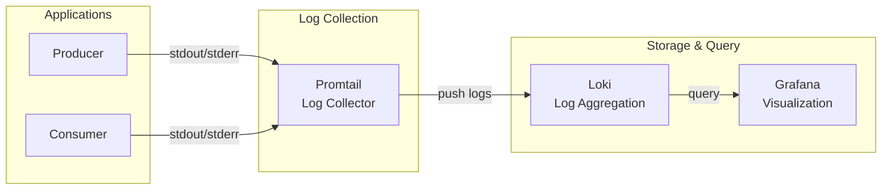

```mermaid
graph LR
    subgraph "Applications"
        P[Producer]
        C[Consumer]
    end
    
    subgraph "Log Collection"
        PR[Promtail<br/>Log Collector]
    end
    
    subgraph "Storage & Query"
        L[Loki<br/>Log Aggregation]
        G[Grafana<br/>Visualization]
    end
    
    P -->|stdout/stderr| PR
    C -->|stdout/stderr| PR
    PR -->|push logs| L
    L -->|query| G
```