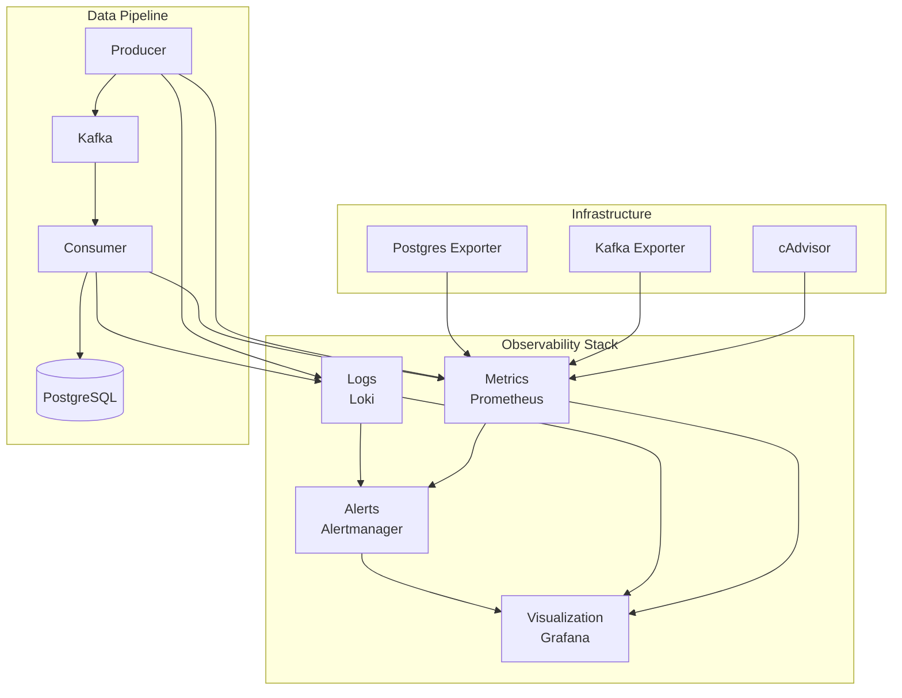

```mermaid
graph TB
    subgraph "Observability Stack"
        M[Metrics<br/>Prometheus]
        L[Logs<br/>Loki]
        A[Alerts<br/>Alertmanager]
        V[Visualization<br/>Grafana]
    end
    
    subgraph "Data Pipeline"
        P[Producer]
        K[Kafka]
        C[Consumer]
        DB[(PostgreSQL)]
    end
    
    subgraph "Infrastructure"
        CA[cAdvisor]
        KE[Kafka Exporter]
        PE[Postgres Exporter]
    end
    
    P --> K --> C --> DB
    P & C --> M
    P & C --> L
    CA & KE & PE --> M
    M & L --> A
    M & L & A --> V
```