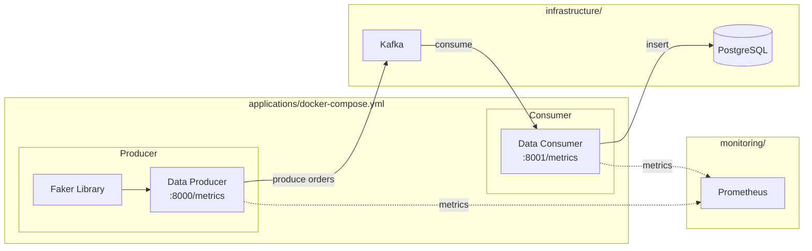
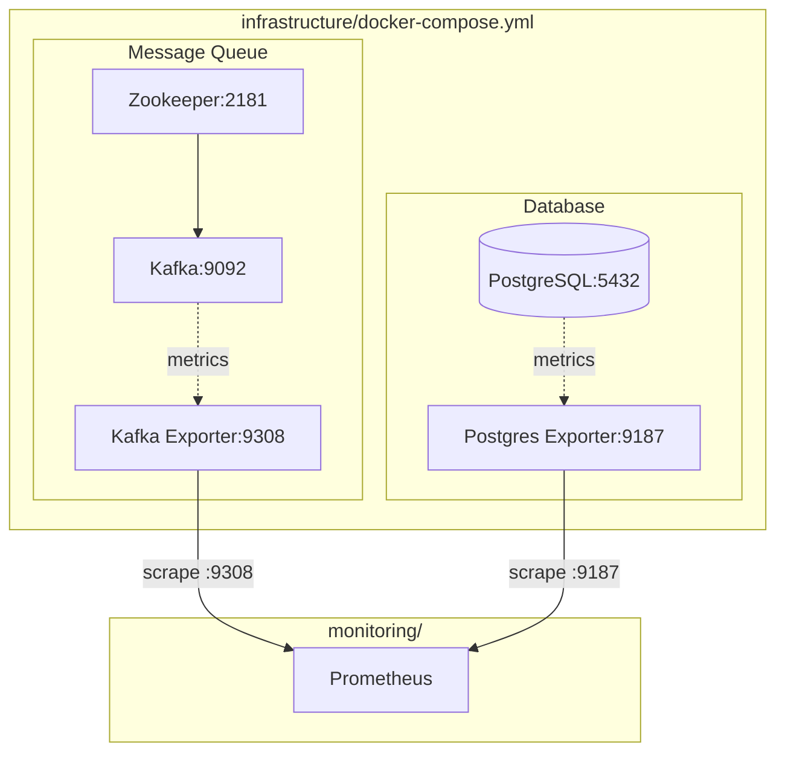
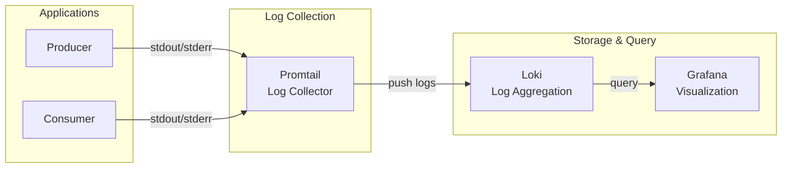
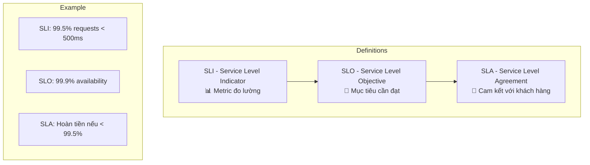
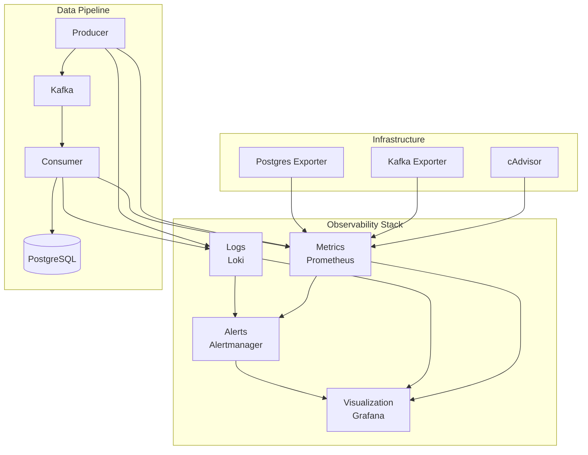
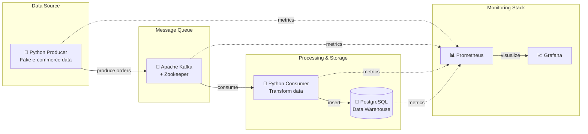
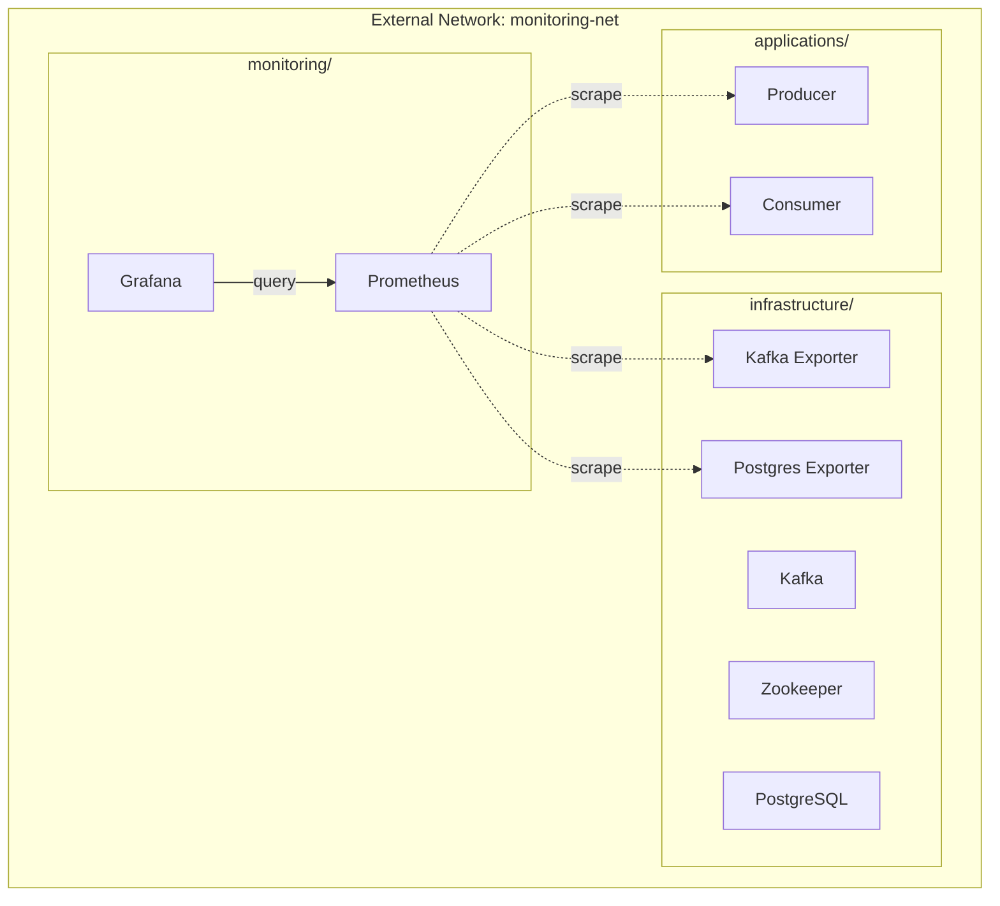

This file is a merged representation of the entire codebase, combined into a single document by Repomix.

# File Summary

## Purpose
This file contains a packed representation of the entire repository's contents.
It is designed to be easily consumable by AI systems for analysis, code review,
or other automated processes.

## File Format
The content is organized as follows:
1. This summary section
2. Repository information
3. Directory structure
4. Repository files (if enabled)
5. Multiple file entries, each consisting of:
  a. A header with the file path (## File: path/to/file)
  b. The full contents of the file in a code block

## Usage Guidelines
- This file should be treated as read-only. Any changes should be made to the
  original repository files, not this packed version.
- When processing this file, use the file path to distinguish
  between different files in the repository.
- Be aware that this file may contain sensitive information. Handle it with
  the same level of security as you would the original repository.

## Notes
- Some files may have been excluded based on .gitignore rules and Repomix's configuration
- Binary files are not included in this packed representation. Please refer to the Repository Structure section for a complete list of file paths, including binary files
- Files matching patterns in .gitignore are excluded
- Files matching default ignore patterns are excluded
- Files are sorted by Git change count (files with more changes are at the bottom)

# Directory Structure
```
applications/
  consumer/
    config.py
    Dockerfile
    logger.py
    main.py
    requirements.txt
    tracing.py
  producer/
    config.py
    Dockerfile
    logger.py
    main.py
    requirements.txt
    tracing.py
  applications-flow.md
  docker-compose.yml
infrastructure/
  postgres/
    init/
      01-init.sql
  docker-compose-application.yml
  infrastructure.md
monitoring/
  alertmanager/
    alertmanager.yml
  grafana/
    dashboards/
      applications/
        data-pipeline.json
        red-metrics.json
        slo-dashboard.json
      infrastructure/
        container-metrics.json
        kafka.json
        postgresql.json
      logs/
        logs-explorer.json
        test.json
      overview/
        correlation-dashboard.json
        system-overview.json
      tracing/
        tracing-overview.json
    provisioning/
      dashboards/
        dashboards.yml
      datasources/
        datasources.yml
  loki/
    rules/
      fake/
        alerts.yml
      alerts.yml
    loki-config.yml
  prometheus/
    rules/
      alert_rules.yml
      recording_rules.yml
      slo_alerts.yml
      slo_rules.yml
    prometheus.yml
  promtail/
    promtail-config.yml
  stress-testing/
    load-test/
      Dockerfile
      load_test.py
      requirements.txt
    scripts/
      chaos_test.sh
      ramp_up_test.sh
      run_load_test.sh
      spike_test.sh
    docker-compose-stress-test.yml
  docker-compose-monitoring.yml
  loki.md
  SLO.md
  stack.md
networks/
  docker-compose-network.yml
monitoring-overview.md
structure.md
```

# Files

## File: applications/consumer/config.py
````python
from pydantic_settings import BaseSettings


class Settings(BaseSettings):
    """Consumer configuration from environment variables"""
    
    # Kafka settings
    kafka_bootstrap_servers: str = "kafka:29092"
    kafka_topic: str = "ecommerce.orders"
    kafka_consumer_group: str = "order-processor"
    
    # PostgreSQL settings
    postgres_host: str = "postgres"
    postgres_port: int = 5432
    postgres_db: str = "datawarehouse"
    postgres_user: str = "postgres"
    postgres_password: str = "postgres123"
    
    # Consumer settings
    batch_size: int = 10
    poll_timeout_ms: int = 1000
    
    # Metrics server
    metrics_port: int = 8001
    
    # Tracing
    otel_exporter_otlp_endpoint: str = "http://jaeger:4317"
    otel_service_name: str = "data-consumer"
    otel_enabled: bool = True
    
    # Application
    app_name: str = "data-consumer"
    log_level: str = "INFO"
    
    class Config:
        env_prefix = ""
        case_sensitive = False
    
    @property
    def postgres_dsn(self) -> str:
        return (
            f"host={self.postgres_host} "
            f"port={self.postgres_port} "
            f"dbname={self.postgres_db} "
            f"user={self.postgres_user} "
            f"password={self.postgres_password}"
        )


settings = Settings()
````

## File: applications/consumer/Dockerfile
````
# applications/consumer/Dockerfile

FROM python:3.12-slim

WORKDIR /app

# Install dependencies
COPY requirements.txt .
RUN pip install --no-cache-dir -r requirements.txt

# Copy application code
COPY . .

# Expose metrics port
EXPOSE 8001

# Run the consumer
CMD ["python", "-u", "main.py"]
````

## File: applications/consumer/logger.py
````python
# applications/consumer/logger.py

import logging
import sys
from datetime import datetime, timezone
from pythonjsonlogger import jsonlogger

from config import settings


class CustomJsonFormatter(jsonlogger.JsonFormatter):
    """Custom JSON formatter with additional fields"""
    
    def add_fields(self, log_record, record, message_dict):
        super().add_fields(log_record, record, message_dict)
        
        # Timestamp in ISO format
        log_record['timestamp'] = datetime.now(timezone.utc).isoformat()
        
        # Service identification
        log_record['service'] = settings.app_name
        
        # Log level - lấy từ record thay vì log_record
        log_record['level'] = record.levelname
        
        # Source location
        log_record['logger'] = record.name
        log_record['module'] = record.module
        log_record['function'] = record.funcName
        log_record['line'] = record.lineno


def setup_logger(name: str = None) -> logging.Logger:
    """Setup structured JSON logger"""
    
    logger = logging.getLogger(name or settings.app_name)
    logger.setLevel(getattr(logging, settings.log_level))
    
    # Prevent duplicate handlers
    if logger.handlers:
        return logger
    
    # Console handler with JSON format
    console_handler = logging.StreamHandler(sys.stdout)
    console_handler.setLevel(getattr(logging, settings.log_level))
    
    # JSON formatter - không dùng rename_fields
    formatter = CustomJsonFormatter(
        fmt='%(timestamp)s %(level)s %(service)s %(message)s'
    )
    console_handler.setFormatter(formatter)
    
    logger.addHandler(console_handler)
    
    # Prevent propagation to root logger
    logger.propagate = False
    
    return logger


# Create default logger instance
logger = setup_logger()
````

## File: applications/consumer/main.py
````python
# applications/consumer/main.py

import json
import time
from datetime import datetime, timezone

import psycopg2
from psycopg2.extras import execute_batch
from kafka import KafkaConsumer
from kafka.errors import KafkaError
from prometheus_client import (
    Counter,
    Gauge,
    Histogram,
    Info,
    start_http_server,
)
from opentelemetry import trace
from opentelemetry.trace import Status, StatusCode, SpanKind

from config import settings
from logger import setup_logger
from tracing import tracer

# ===========================================
# Logging Setup
# ===========================================
logger = setup_logger()

# ===========================================
# Prometheus Metrics
# ===========================================

APP_INFO = Info(
    'pipeline_consumer_info',
    'Consumer application information'
)
APP_INFO.info({
    'version': '2.0.0',
    'kafka_topic': settings.kafka_topic,
    'consumer_group': settings.kafka_consumer_group,
    'pattern': 'RED'
})

MESSAGES_CONSUMED = Counter(
    'pipeline_consumer_messages_total',
    'Total number of messages consumed',
    ['topic', 'status', 'category']
)

BATCHES_PROCESSED = Counter(
    'pipeline_consumer_batches_total',
    'Total number of batches processed',
    ['status']
)

DB_OPERATIONS = Counter(
    'pipeline_consumer_db_operations_total',
    'Total database operations',
    ['operation', 'status']
)

ERRORS = Counter(
    'pipeline_consumer_errors_total',
    'Total number of errors by type and stage',
    ['error_type', 'stage']
)

MESSAGE_PROCESS_DURATION = Histogram(
    'pipeline_consumer_message_duration_seconds',
    'Time to process a single message',
    buckets=(0.001, 0.005, 0.01, 0.025, 0.05, 0.1, 0.25, 0.5, 1.0)
)

BATCH_PROCESS_DURATION = Histogram(
    'pipeline_consumer_batch_duration_seconds',
    'Time to process a batch of messages',
    buckets=(0.01, 0.05, 0.1, 0.25, 0.5, 1.0, 2.5, 5.0, 10.0)
)

DB_QUERY_DURATION = Histogram(
    'pipeline_consumer_db_query_duration_seconds',
    'Database query duration',
    ['operation'],
    buckets=(0.001, 0.005, 0.01, 0.025, 0.05, 0.1, 0.25, 0.5, 1.0, 2.5)
)

KAFKA_POLL_DURATION = Histogram(
    'pipeline_consumer_kafka_poll_duration_seconds',
    'Kafka poll duration',
    buckets=(0.01, 0.05, 0.1, 0.25, 0.5, 1.0, 2.0)
)

END_TO_END_LATENCY = Histogram(
    'pipeline_consumer_end_to_end_latency_seconds',
    'End-to-end latency from order creation to database insert',
    buckets=(0.1, 0.5, 1.0, 2.5, 5.0, 10.0, 30.0, 60.0)
)

ORDERS_PROCESSED = Counter(
    'pipeline_business_orders_processed_total',
    'Total orders processed by category',
    ['category']
)

REVENUE_PROCESSED = Counter(
    'pipeline_business_revenue_processed_total',
    'Total revenue processed',
    ['category']
)

CONSUMER_UP = Gauge(
    'pipeline_consumer_up',
    'Consumer is running (1) or not (0)'
)

KAFKA_CONNECTION_STATUS = Gauge(
    'pipeline_consumer_kafka_connected',
    'Kafka connection status'
)

DB_CONNECTION_STATUS = Gauge(
    'pipeline_consumer_db_connected',
    'Database connection status'
)

CONSUMER_LAG = Gauge(
    'pipeline_consumer_lag_messages',
    'Consumer lag per partition',
    ['topic', 'partition']
)

CURRENT_BATCH_SIZE = Gauge(
    'pipeline_consumer_current_batch_size',
    'Number of messages in current batch'
)

LAST_PROCESS_TIMESTAMP = Gauge(
    'pipeline_consumer_last_process_timestamp',
    'Timestamp of last successful process'
)

LAST_COMMIT_TIMESTAMP = Gauge(
    'pipeline_consumer_last_commit_timestamp',
    'Timestamp of last offset commit'
)


# ===========================================
# Database Handler
# ===========================================

class DatabaseHandler:
    def __init__(self):
        self.conn = None
        self._connect()
    
    def _connect(self):
        """Connect to PostgreSQL with retry logic"""
        max_retries = 30
        retry_interval = 2
        
        for attempt in range(max_retries):
            try:
                self.conn = psycopg2.connect(settings.postgres_dsn)
                self.conn.autocommit = False
                logger.info(
                    "Connected to PostgreSQL",
                    extra={
                        "event": "db_connected",
                        "host": settings.postgres_host,
                        "database": settings.postgres_db,
                        "attempt": attempt + 1
                    }
                )
                DB_CONNECTION_STATUS.set(1)
                return
            except psycopg2.Error as e:
                DB_CONNECTION_STATUS.set(0)
                ERRORS.labels(error_type="connection", stage="db_init").inc()
                logger.warning(
                    "PostgreSQL connection failed, retrying...",
                    extra={
                        "event": "db_connection_retry",
                        "attempt": attempt + 1,
                        "max_retries": max_retries,
                        "error": str(e)
                    }
                )
                time.sleep(retry_interval)
        
        raise Exception("Failed to connect to PostgreSQL after maximum retries")
    
    def insert_orders(self, orders: list[dict], parent_span=None) -> int:
        """Insert batch of orders into database with tracing"""
        if not orders:
            return 0
        
        with tracer.start_as_current_span(
            "db_insert_orders",
            kind=SpanKind.CLIENT
        ) as span:
            span.set_attribute("db.system", "postgresql")
            span.set_attribute("db.name", settings.postgres_db)
            span.set_attribute("db.operation", "INSERT")
            span.set_attribute("db.batch_size", len(orders))
            
            insert_sql = """
                INSERT INTO ecommerce.orders (
                    order_id, customer_id, product_id, product_name, 
                    category, quantity, unit_price, total_amount,
                    order_status, created_at, processed_at
                ) VALUES (
                    %(order_id)s, %(customer_id)s, %(product_id)s, %(product_name)s,
                    %(category)s, %(quantity)s, %(unit_price)s, %(total_amount)s,
                    %(order_status)s, %(created_at)s, %(processed_at)s
                )
                ON CONFLICT (order_id) DO NOTHING
            """
            
            try:
                start_time = time.time()
                
                with self.conn.cursor() as cur:
                    process_time = datetime.now(timezone.utc)
                    
                    for order in orders:
                        order['processed_at'] = process_time.isoformat()
                        if isinstance(order.get('created_at'), str):
                            order['created_at'] = datetime.fromisoformat(
                                order['created_at'].replace('Z', '+00:00')
                            )
                    
                    execute_batch(cur, insert_sql, orders, page_size=100)
                    inserted = cur.rowcount
                    self.conn.commit()
                
                duration = time.time() - start_time
                
                span.set_attribute("db.rows_affected", inserted)
                span.set_attribute("duration_ms", round(duration * 1000, 2))
                span.set_status(Status(StatusCode.OK))
                
                DB_QUERY_DURATION.labels(operation="insert_batch").observe(duration)
                DB_OPERATIONS.labels(operation="insert", status="success").inc(len(orders))
                
                logger.debug(
                    "Orders inserted into database",
                    extra={
                        "event": "db_insert_success",
                        "count": inserted,
                        "duration_ms": round(duration * 1000, 2)
                    }
                )
                
                return inserted
                
            except psycopg2.Error as e:
                span.set_status(Status(StatusCode.ERROR, str(e)))
                span.record_exception(e)
                
                ERRORS.labels(error_type=type(e).__name__, stage="db_insert").inc()
                DB_OPERATIONS.labels(operation="insert", status="failed").inc(len(orders))
                
                logger.error(
                    "Database insert failed",
                    extra={
                        "event": "db_insert_error",
                        "error": str(e),
                        "error_type": type(e).__name__,
                        "batch_size": len(orders)
                    }
                )
                self.conn.rollback()
                
                try:
                    self._connect()
                except Exception:
                    DB_CONNECTION_STATUS.set(0)
                
                return 0
    
    def close(self):
        """Close database connection"""
        if self.conn:
            self.conn.close()
            DB_CONNECTION_STATUS.set(0)
            logger.info("Database connection closed", extra={"event": "db_closed"})


# ===========================================
# Kafka Consumer
# ===========================================

class OrderConsumer:
    def __init__(self, db_handler: DatabaseHandler):
        self.consumer = None
        self.db = db_handler
        self._connect()
    
    def _connect(self):
        """Connect to Kafka with retry logic"""
        max_retries = 30
        retry_interval = 2
        
        for attempt in range(max_retries):
            try:
                self.consumer = KafkaConsumer(
                    settings.kafka_topic,
                    bootstrap_servers=settings.kafka_bootstrap_servers,
                    group_id=settings.kafka_consumer_group,
                    value_deserializer=lambda m: json.loads(m.decode('utf-8')),
                    auto_offset_reset='earliest',
                    enable_auto_commit=False,
                    max_poll_records=settings.batch_size,
                )
                logger.info(
                    "Connected to Kafka",
                    extra={
                        "event": "kafka_connected",
                        "bootstrap_servers": settings.kafka_bootstrap_servers,
                        "topic": settings.kafka_topic,
                        "consumer_group": settings.kafka_consumer_group,
                        "attempt": attempt + 1
                    }
                )
                CONSUMER_UP.set(1)
                KAFKA_CONNECTION_STATUS.set(1)
                return
            except KafkaError as e:
                KAFKA_CONNECTION_STATUS.set(0)
                ERRORS.labels(error_type="connection", stage="kafka_init").inc()
                logger.warning(
                    "Kafka connection failed, retrying...",
                    extra={
                        "event": "kafka_connection_retry",
                        "attempt": attempt + 1,
                        "max_retries": max_retries,
                        "error": str(e)
                    }
                )
                time.sleep(retry_interval)
        
        raise Exception("Failed to connect to Kafka after maximum retries")
    
    def process_messages(self):
        """Main processing loop with tracing"""
        batch: list[dict] = []
        
        logger.info("Starting message processing loop", extra={"event": "processing_started"})
        
        try:
            while True:
                # Poll for messages
                with tracer.start_as_current_span(
                    "kafka_poll",
                    kind=SpanKind.CONSUMER
                ) as poll_span:
                    poll_start = time.time()
                    records = self.consumer.poll(
                        timeout_ms=settings.poll_timeout_ms,
                        max_records=settings.batch_size
                    )
                    poll_duration = time.time() - poll_start
                    
                    poll_span.set_attribute("messaging.system", "kafka")
                    poll_span.set_attribute("messaging.operation", "poll")
                    poll_span.set_attribute("duration_ms", round(poll_duration * 1000, 2))
                    
                    KAFKA_POLL_DURATION.observe(poll_duration)
                
                if not records:
                    if batch:
                        self._process_batch(batch)
                        batch = []
                    continue
                
                # Process received messages
                for topic_partition, messages in records.items():
                    for message in messages:
                        try:
                            msg_start = time.time()
                            order = message.value
                            category = order.get("category", "unknown")
                            
                            # Create span for consuming
                            with tracer.start_as_current_span(
                                "consume_message",
                                kind=SpanKind.CONSUMER
                            ) as msg_span:
                                # Add span attributes
                                msg_span.set_attribute("messaging.system", "kafka")
                                msg_span.set_attribute("messaging.destination", settings.kafka_topic)
                                msg_span.set_attribute("messaging.kafka.partition", topic_partition.partition)
                                msg_span.set_attribute("messaging.kafka.offset", message.offset)
                                msg_span.set_attribute("order.id", order.get("order_id", ""))
                                msg_span.set_attribute("order.category", category)
                                
                                # Link to producer trace if available
                                if "trace_id" in order:
                                    msg_span.set_attribute("producer.trace_id", order["trace_id"])
                                
                                batch.append(order)
                                
                                MESSAGES_CONSUMED.labels(
                                    topic=settings.kafka_topic,
                                    status="success",
                                    category=category
                                ).inc()
                                
                                msg_duration = time.time() - msg_start
                                MESSAGE_PROCESS_DURATION.observe(msg_duration)
                                
                                # Calculate end-to-end latency
                                if 'created_at' in order:
                                    try:
                                        created_at = datetime.fromisoformat(
                                            order['created_at'].replace('Z', '+00:00')
                                        )
                                        e2e_latency = (datetime.now(timezone.utc) - created_at).total_seconds()
                                        END_TO_END_LATENCY.observe(e2e_latency)
                                        msg_span.set_attribute("e2e_latency_seconds", e2e_latency)
                                    except Exception:
                                        pass
                                
                                CONSUMER_LAG.labels(
                                    topic=topic_partition.topic,
                                    partition=str(topic_partition.partition)
                                ).set(message.offset)
                                
                                msg_span.set_status(Status(StatusCode.OK))
                                
                                logger.info(
                                    "Message consumed",
                                    extra={
                                        "event": "message_consumed",
                                        "order_id": order.get("order_id"),
                                        "trace_id": order.get("trace_id", ""),
                                        "category": category,
                                        "partition": topic_partition.partition,
                                        "offset": message.offset
                                    }
                                )
                                
                        except Exception as e:
                            MESSAGES_CONSUMED.labels(
                                topic=settings.kafka_topic,
                                status="failed",
                                category="unknown"
                            ).inc()
                            
                            ERRORS.labels(
                                error_type=type(e).__name__,
                                stage="message_parse"
                            ).inc()
                            
                            logger.error(
                                "Failed to process message",
                                extra={
                                    "event": "message_parse_error",
                                    "error": str(e),
                                    "error_type": type(e).__name__,
                                    "partition": topic_partition.partition,
                                    "offset": message.offset
                                }
                            )

                
                CURRENT_BATCH_SIZE.set(len(batch))
                
                if len(batch) >= settings.batch_size:
                    self._process_batch(batch)
                    batch = []
                    
        except KeyboardInterrupt:
            logger.info("Shutdown requested", extra={"event": "shutdown_requested"})
            if batch:
                self._process_batch(batch)
    
    def _process_batch(self, batch: list[dict]):
        """Process and commit a batch of messages with tracing"""
        if not batch:
            return
        
        with tracer.start_as_current_span(
            "process_batch",
            kind=SpanKind.INTERNAL
        ) as batch_span:
            batch_span.set_attribute("batch.size", len(batch))
            
            start_time = time.time()
            
            # Insert to database
            inserted = self.db.insert_orders(batch)
            
            # Commit Kafka offsets
            self.consumer.commit()
            LAST_COMMIT_TIMESTAMP.set(time.time())
            
            duration = time.time() - start_time
            
            batch_span.set_attribute("batch.inserted", inserted)
            batch_span.set_attribute("duration_ms", round(duration * 1000, 2))
            
            BATCH_PROCESS_DURATION.observe(duration)
            
            if inserted == len(batch):
                batch_span.set_status(Status(StatusCode.OK))
                BATCHES_PROCESSED.labels(status="success").inc()
            elif inserted == 0:
                batch_span.set_status(Status(StatusCode.ERROR, "No records inserted"))
                BATCHES_PROCESSED.labels(status="failed").inc()
            else:
                batch_span.set_status(Status(StatusCode.OK))
                BATCHES_PROCESSED.labels(status="partial").inc()
            
            # Business metrics
            for order in batch:
                category = order.get("category", "unknown")
                ORDERS_PROCESSED.labels(category=category).inc()
                REVENUE_PROCESSED.labels(category=category).inc(order.get("total_amount", 0))
            
            LAST_PROCESS_TIMESTAMP.set(time.time())
            CURRENT_BATCH_SIZE.set(0)
            
            logger.info(
                "Batch processed",
                extra={
                    "event": "batch_processed",
                    "batch_size": len(batch),
                    "inserted": inserted,
                    "duration_ms": round(duration * 1000, 2),
                    "throughput_per_sec": round(len(batch) / duration, 2) if duration > 0 else 0
                }
            )
    
    def close(self):
        """Close the consumer"""
        if self.consumer:
            self.consumer.close()
            CONSUMER_UP.set(0)
            KAFKA_CONNECTION_STATUS.set(0)
            logger.info("Consumer closed", extra={"event": "consumer_closed"})


# ===========================================
# Main
# ===========================================

def main():
    logger.info(
        "Starting Data Consumer",
        extra={
            "event": "consumer_starting",
            "config": {
                "kafka_servers": settings.kafka_bootstrap_servers,
                "topic": settings.kafka_topic,
                "consumer_group": settings.kafka_consumer_group,
                "postgres_host": settings.postgres_host,
                "postgres_db": settings.postgres_db,
                "batch_size": settings.batch_size,
                "metrics_port": settings.metrics_port,
                "tracing_enabled": settings.otel_enabled,
                "tracing_endpoint": settings.otel_exporter_otlp_endpoint
            }
        }
    )
    
    # Start Prometheus metrics server
    start_http_server(settings.metrics_port)
    logger.info(
        "Metrics server started",
        extra={"event": "metrics_server_started", "port": settings.metrics_port}
    )
    
    # Create handlers
    db_handler = DatabaseHandler()
    consumer = OrderConsumer(db_handler)
    
    try:
        consumer.process_messages()
    except Exception as e:
        ERRORS.labels(error_type="fatal", stage="main").inc()
        logger.error(
            "Fatal error in consumer",
            extra={"event": "fatal_error", "error": str(e), "error_type": type(e).__name__}
        )
    finally:
        consumer.close()
        db_handler.close()
        logger.info("Consumer stopped", extra={"event": "consumer_stopped"})


if __name__ == "__main__":
    main()
````

## File: applications/consumer/requirements.txt
````
# Kafka
kafka-python-ng==2.2.2

# PostgreSQL
psycopg2-binary==2.9.9

# Prometheus metrics
prometheus-client==0.20.0

# Logging
python-json-logger==2.0.7

# Utilities
pydantic==2.6.4
pydantic-settings==2.2.1

# OpenTelemetry - Tracing
opentelemetry-api==1.24.0
opentelemetry-sdk==1.24.0
opentelemetry-exporter-otlp==1.24.0
opentelemetry-instrumentation==0.45b0
````

## File: applications/consumer/tracing.py
````python
# applications/consumer/tracing.py

from opentelemetry import trace
from opentelemetry.sdk.trace import TracerProvider
from opentelemetry.sdk.trace.export import BatchSpanProcessor
from opentelemetry.exporter.otlp.proto.grpc.trace_exporter import OTLPSpanExporter
from opentelemetry.sdk.resources import Resource
from opentelemetry.semconv.resource import ResourceAttributes

from config import settings


def setup_tracing() -> trace.Tracer:
    """Setup OpenTelemetry tracing"""
    
    if not settings.otel_enabled:
        return trace.get_tracer(settings.otel_service_name)
    
    # Create resource with service info
    resource = Resource.create({
        ResourceAttributes.SERVICE_NAME: settings.otel_service_name,
        ResourceAttributes.SERVICE_VERSION: "2.0.0",
        ResourceAttributes.DEPLOYMENT_ENVIRONMENT: "development",
    })
    
    # Create tracer provider
    provider = TracerProvider(resource=resource)
    
    # Create OTLP exporter
    otlp_exporter = OTLPSpanExporter(
        endpoint=settings.otel_exporter_otlp_endpoint,
        insecure=True
    )
    
    # Add span processor
    provider.add_span_processor(BatchSpanProcessor(otlp_exporter))
    
    # Set global tracer provider
    trace.set_tracer_provider(provider)
    
    return trace.get_tracer(settings.otel_service_name)


# Create global tracer
tracer = setup_tracing()
````

## File: applications/producer/config.py
````python
# applications/producer/config.py

from pydantic_settings import BaseSettings
from typing import Optional


class Settings(BaseSettings):
    """Producer configuration from environment variables"""
    
    # Kafka settings
    kafka_bootstrap_servers: str = "kafka:29092"
    kafka_topic: str = "ecommerce.orders"
    
    # Producer settings
    produce_interval_seconds: float = 1.0  # Produce every N seconds
    batch_size: int = 5  # Messages per batch
    
    # Metrics server
    metrics_port: int = 8000

    # Tracing
    otel_exporter_otlp_endpoint: str = "http://jaeger:4317"
    otel_service_name: str = "data-producer"
    otel_enabled: bool = True

    # Application
    app_name: str = "data-producer"
    log_level: str = "INFO"
    
    class Config:
        env_prefix = ""
        case_sensitive = False


settings = Settings()
````

## File: applications/producer/Dockerfile
````
# applications/producer/Dockerfile

FROM python:3.12-slim

WORKDIR /app

# Install dependencies
COPY requirements.txt .
RUN pip install --no-cache-dir -r requirements.txt

# Copy application code
COPY . .

# Expose metrics port
EXPOSE 8000

# Run the producer
CMD ["python", "-u", "main.py"]
````

## File: applications/producer/logger.py
````python
# applications/producer/logger.py

import logging
import sys
from datetime import datetime, timezone
from pythonjsonlogger import jsonlogger

from config import settings


class CustomJsonFormatter(jsonlogger.JsonFormatter):
    """Custom JSON formatter with additional fields"""
    
    def add_fields(self, log_record, record, message_dict):
        super().add_fields(log_record, record, message_dict)
        
        # Timestamp in ISO format
        log_record['timestamp'] = datetime.now(timezone.utc).isoformat()
        
        # Service identification
        log_record['service'] = settings.app_name
        
        # Log level - lấy từ record thay vì log_record
        log_record['level'] = record.levelname
        
        # Source location
        log_record['logger'] = record.name
        log_record['module'] = record.module
        log_record['function'] = record.funcName
        log_record['line'] = record.lineno


def setup_logger(name: str = None) -> logging.Logger:
    """Setup structured JSON logger"""
    
    logger = logging.getLogger(name or settings.app_name)
    logger.setLevel(getattr(logging, settings.log_level))
    
    # Prevent duplicate handlers
    if logger.handlers:
        return logger
    
    # Console handler with JSON format
    console_handler = logging.StreamHandler(sys.stdout)
    console_handler.setLevel(getattr(logging, settings.log_level))
    
    # JSON formatter - không dùng rename_fields
    formatter = CustomJsonFormatter(
        fmt='%(timestamp)s %(level)s %(service)s %(message)s'
    )
    console_handler.setFormatter(formatter)
    
    logger.addHandler(console_handler)
    
    # Prevent propagation to root logger
    logger.propagate = False
    
    return logger


# Create default logger instance
logger = setup_logger()
````

## File: applications/producer/main.py
````python
# applications/producer/main.py

import json
import random
import time
import uuid
from datetime import datetime, timezone
from typing import Any

from faker import Faker
from kafka import KafkaProducer
from kafka.errors import KafkaError
from prometheus_client import (
    Counter,
    Gauge,
    Histogram,
    Info,
    start_http_server,
)
from opentelemetry import trace
from opentelemetry.trace import Status, StatusCode

from config import settings
from logger import setup_logger
from tracing import tracer

# ===========================================
# Logging Setup
# ===========================================
logger = setup_logger()

# ===========================================
# Prometheus Metrics
# ===========================================

APP_INFO = Info(
    'pipeline_producer_info',
    'Producer application information'
)
APP_INFO.info({
    'version': '2.0.0',
    'kafka_topic': settings.kafka_topic,
    'pattern': 'RED'
})

MESSAGES_PRODUCED = Counter(
    'pipeline_producer_messages_total',
    'Total number of messages produced',
    ['topic', 'status', 'category']
)

BATCHES_PRODUCED = Counter(
    'pipeline_producer_batches_total',
    'Total number of batches produced',
    ['status']
)

ERRORS = Counter(
    'pipeline_producer_errors_total',
    'Total number of errors by type',
    ['error_type', 'stage']
)

MESSAGE_PRODUCE_DURATION = Histogram(
    'pipeline_producer_message_duration_seconds',
    'Time to produce a single message to Kafka',
    ['topic'],
    buckets=(0.001, 0.005, 0.01, 0.025, 0.05, 0.075, 0.1, 0.25, 0.5, 1.0)
)

BATCH_PRODUCE_DURATION = Histogram(
    'pipeline_producer_batch_duration_seconds',
    'Time to produce a batch of messages',
    ['topic'],
    buckets=(0.01, 0.05, 0.1, 0.25, 0.5, 1.0, 2.5, 5.0, 10.0)
)

MESSAGE_SIZE = Histogram(
    'pipeline_producer_message_size_bytes',
    'Size of produced messages in bytes',
    ['topic'],
    buckets=(100, 500, 1000, 2500, 5000, 10000, 25000)
)

ORDERS_BY_CATEGORY = Counter(
    'pipeline_business_orders_total',
    'Total orders by category',
    ['category']
)

REVENUE = Counter(
    'pipeline_business_revenue_total',
    'Total revenue generated',
    ['category']
)

ORDER_VALUE = Histogram(
    'pipeline_business_order_value',
    'Distribution of order values',
    ['category'],
    buckets=(10, 25, 50, 100, 250, 500, 1000, 2500, 5000)
)

ITEMS_PER_ORDER = Histogram(
    'pipeline_business_items_per_order',
    'Distribution of items per order',
    buckets=(1, 2, 3, 4, 5, 10)
)

PRODUCER_UP = Gauge(
    'pipeline_producer_up',
    'Producer is running (1) or not (0)'
)

KAFKA_CONNECTION_STATUS = Gauge(
    'pipeline_producer_kafka_connected',
    'Kafka connection status (1=connected, 0=disconnected)'
)

CURRENT_BATCH_SIZE = Gauge(
    'pipeline_producer_current_batch_size',
    'Current configured batch size'
)

LAST_PRODUCE_TIMESTAMP = Gauge(
    'pipeline_producer_last_produce_timestamp',
    'Timestamp of last successful produce'
)

# ===========================================
# Fake Data Generator
# ===========================================

fake = Faker()

PRODUCTS = {
    "Electronics": [
        {"name": "Smartphone", "price_range": (299, 1299)},
        {"name": "Laptop", "price_range": (499, 2499)},
        {"name": "Tablet", "price_range": (199, 999)},
        {"name": "Headphones", "price_range": (29, 399)},
        {"name": "Smart Watch", "price_range": (99, 599)},
    ],
    "Clothing": [
        {"name": "T-Shirt", "price_range": (15, 45)},
        {"name": "Jeans", "price_range": (35, 120)},
        {"name": "Jacket", "price_range": (50, 250)},
        {"name": "Sneakers", "price_range": (45, 180)},
        {"name": "Dress", "price_range": (30, 150)},
    ],
    "Home & Garden": [
        {"name": "Coffee Maker", "price_range": (25, 200)},
        {"name": "Vacuum Cleaner", "price_range": (80, 400)},
        {"name": "Bed Sheets", "price_range": (30, 120)},
        {"name": "Plant Pot", "price_range": (10, 50)},
        {"name": "Lamp", "price_range": (20, 150)},
    ],
    "Books": [
        {"name": "Fiction Novel", "price_range": (8, 25)},
        {"name": "Technical Book", "price_range": (30, 80)},
        {"name": "Cookbook", "price_range": (15, 45)},
        {"name": "Biography", "price_range": (12, 35)},
        {"name": "Children Book", "price_range": (5, 20)},
    ],
    "Sports": [
        {"name": "Yoga Mat", "price_range": (15, 60)},
        {"name": "Dumbbell Set", "price_range": (30, 150)},
        {"name": "Running Shoes", "price_range": (60, 200)},
        {"name": "Bicycle", "price_range": (200, 1500)},
        {"name": "Tennis Racket", "price_range": (25, 200)},
    ],
}


def generate_order(trace_id: str = None) -> dict[str, Any]:
    """Generate a fake e-commerce order"""
    category = random.choice(list(PRODUCTS.keys()))
    product = random.choice(PRODUCTS[category])
    
    quantity = random.randint(1, 5)
    unit_price = round(random.uniform(*product["price_range"]), 2)
    total_amount = round(quantity * unit_price, 2)
    
    order = {
        "order_id": str(uuid.uuid4()),
        "customer_id": f"CUST-{fake.random_number(digits=6, fix_len=True)}",
        "product_id": f"PROD-{fake.random_number(digits=8, fix_len=True)}",
        "product_name": product["name"],
        "category": category,
        "quantity": quantity,
        "unit_price": unit_price,
        "total_amount": total_amount,
        "order_status": "pending",
        "customer_email": fake.email(),
        "shipping_address": fake.address().replace("\n", ", "),
        "created_at": datetime.now(timezone.utc).isoformat(),
    }
    
    # Add trace_id for correlation
    if trace_id:
        order["trace_id"] = trace_id
    
    return order


# ===========================================
# Kafka Producer
# ===========================================

class OrderProducer:
    def __init__(self):
        self.producer = None
        self._connect()
    
    def _connect(self):
        """Connect to Kafka with retry logic"""
        max_retries = 30
        retry_interval = 2
        
        for attempt in range(max_retries):
            try:
                self.producer = KafkaProducer(
                    bootstrap_servers=settings.kafka_bootstrap_servers,
                    value_serializer=lambda v: json.dumps(v).encode('utf-8'),
                    key_serializer=lambda k: k.encode('utf-8') if k else None,
                    acks='all',
                    retries=3,
                    max_in_flight_requests_per_connection=1,
                )
                logger.info(
                    "Connected to Kafka",
                    extra={
                        "event": "kafka_connected",
                        "bootstrap_servers": settings.kafka_bootstrap_servers,
                        "attempt": attempt + 1
                    }
                )
                PRODUCER_UP.set(1)
                KAFKA_CONNECTION_STATUS.set(1)
                return
            except KafkaError as e:
                KAFKA_CONNECTION_STATUS.set(0)
                ERRORS.labels(error_type="connection", stage="init").inc()
                logger.warning(
                    "Kafka connection failed, retrying...",
                    extra={
                        "event": "kafka_connection_retry",
                        "attempt": attempt + 1,
                        "max_retries": max_retries,
                        "error": str(e)
                    }
                )
                time.sleep(retry_interval)
        
        raise Exception("Failed to connect to Kafka after maximum retries")
    
    def produce(self, order: dict) -> bool:
        """Produce a single order to Kafka with tracing"""
        category = order.get("category", "unknown")
        
        # Create span for this operation
        with tracer.start_as_current_span(
            "produce_order",
            kind=trace.SpanKind.PRODUCER
        ) as span:
            # Add span attributes
            span.set_attribute("messaging.system", "kafka")
            span.set_attribute("messaging.destination", settings.kafka_topic)
            span.set_attribute("order.id", order["order_id"])
            span.set_attribute("order.category", category)
            span.set_attribute("order.amount", order["total_amount"])
            
            # Get trace_id and add to order for correlation
            trace_id = format(span.get_span_context().trace_id, '032x')
            order["trace_id"] = trace_id
            
            message_bytes = json.dumps(order).encode('utf-8')
            span.set_attribute("messaging.message.payload_size_bytes", len(message_bytes))
            
            try:
                start_time = time.time()
                
                future = self.producer.send(
                    settings.kafka_topic,
                    key=order["order_id"],
                    value=order
                )
                future.get(timeout=10)
                
                duration = time.time() - start_time
                
                # Record success in span
                span.set_status(Status(StatusCode.OK))
                span.set_attribute("duration_ms", round(duration * 1000, 2))
                
                # Metrics
                MESSAGES_PRODUCED.labels(
                    topic=settings.kafka_topic,
                    status="success",
                    category=category
                ).inc()
                
                MESSAGE_PRODUCE_DURATION.labels(topic=settings.kafka_topic).observe(duration)
                MESSAGE_SIZE.labels(topic=settings.kafka_topic).observe(len(message_bytes))
                
                ORDERS_BY_CATEGORY.labels(category=category).inc()
                REVENUE.labels(category=category).inc(order["total_amount"])
                ORDER_VALUE.labels(category=category).observe(order["total_amount"])
                ITEMS_PER_ORDER.observe(order["quantity"])
                
                LAST_PRODUCE_TIMESTAMP.set(time.time())
                
                logger.debug(
                    "Order produced successfully",
                    extra={
                        "event": "order_produced",
                        "order_id": order["order_id"],
                        "trace_id": trace_id,
                        "category": category,
                        "amount": order["total_amount"],
                        "duration_ms": round(duration * 1000, 2)
                    }
                )
                
                return True
                
            except Exception as e:
                # Record error in span
                span.set_status(Status(StatusCode.ERROR, str(e)))
                span.record_exception(e)
                
                MESSAGES_PRODUCED.labels(
                    topic=settings.kafka_topic,
                    status="failed",
                    category=category
                ).inc()
                
                ERRORS.labels(
                    error_type=type(e).__name__,
                    stage="produce"
                ).inc()
                
                logger.error(
                    "Failed to produce order",
                    extra={
                        "event": "produce_error",
                        "order_id": order.get("order_id"),
                        "trace_id": trace_id,
                        "error": str(e),
                        "error_type": type(e).__name__
                    }
                )
                return False
    
    def produce_batch(self, batch_size: int) -> tuple[int, int]:
        """Produce a batch of orders with tracing"""
        
        # Create parent span for batch
        with tracer.start_as_current_span(
            "produce_batch",
            kind=trace.SpanKind.INTERNAL
        ) as batch_span:
            batch_span.set_attribute("batch.size", batch_size)
            
            success_count = 0
            failed_count = 0
            batch_orders = []
            
            CURRENT_BATCH_SIZE.set(batch_size)
            
            start_time = time.time()
            
            for _ in range(batch_size):
                order = generate_order()
                if self.produce(order):
                    success_count += 1
                    batch_orders.append(order["order_id"])
                else:
                    failed_count += 1
            
            self.producer.flush()
            
            duration = time.time() - start_time
            
            # Record batch results in span
            batch_span.set_attribute("batch.success_count", success_count)
            batch_span.set_attribute("batch.failed_count", failed_count)
            batch_span.set_attribute("batch.duration_ms", round(duration * 1000, 2))
            
            if failed_count == 0:
                batch_span.set_status(Status(StatusCode.OK))
                BATCHES_PRODUCED.labels(status="success").inc()
            elif success_count == 0:
                batch_span.set_status(Status(StatusCode.ERROR, "All messages failed"))
                BATCHES_PRODUCED.labels(status="failed").inc()
            else:
                batch_span.set_status(Status(StatusCode.OK))
                BATCHES_PRODUCED.labels(status="partial").inc()
            
            BATCH_PRODUCE_DURATION.labels(topic=settings.kafka_topic).observe(duration)
            
            logger.info(
                "Batch produced",
                extra={
                    "event": "batch_produced",
                    "batch_size": batch_size,
                    "success_count": success_count,
                    "failed_count": failed_count,
                    "duration_ms": round(duration * 1000, 2),
                    "throughput_per_sec": round(batch_size / duration, 2) if duration > 0 else 0
                }
            )
            
            return success_count, failed_count
    
    def close(self):
        """Close the producer"""
        if self.producer:
            self.producer.close()
            PRODUCER_UP.set(0)
            KAFKA_CONNECTION_STATUS.set(0)
            logger.info("Producer closed", extra={"event": "producer_closed"})


# ===========================================
# Main Loop
# ===========================================

def main():
    logger.info(
        "Starting Data Producer",
        extra={
            "event": "producer_starting",
            "config": {
                "kafka_servers": settings.kafka_bootstrap_servers,
                "topic": settings.kafka_topic,
                "batch_size": settings.batch_size,
                "interval_seconds": settings.produce_interval_seconds,
                "metrics_port": settings.metrics_port,
                "tracing_enabled": settings.otel_enabled,
                "tracing_endpoint": settings.otel_exporter_otlp_endpoint
            }
        }
    )
    
    # Start Prometheus metrics server
    start_http_server(settings.metrics_port)
    logger.info(
        "Metrics server started",
        extra={"event": "metrics_server_started", "port": settings.metrics_port}
    )
    
    # Create producer
    producer = OrderProducer()
    
    try:
        batch_number = 0
        while True:
            batch_number += 1
            
            # Create span for each iteration
            with tracer.start_as_current_span(f"batch_iteration_{batch_number}"):
                success, failed = producer.produce_batch(settings.batch_size)
            
            time.sleep(settings.produce_interval_seconds)
            
    except KeyboardInterrupt:
        logger.info("Shutdown requested", extra={"event": "shutdown_requested"})
    except Exception as e:
        ERRORS.labels(error_type="fatal", stage="main").inc()
        logger.error(
            "Fatal error in producer",
            extra={"event": "fatal_error", "error": str(e), "error_type": type(e).__name__}
        )
    finally:
        producer.close()
        logger.info("Producer stopped", extra={"event": "producer_stopped"})


if __name__ == "__main__":
    main()
````

## File: applications/producer/requirements.txt
````
# Kafka
kafka-python-ng==2.2.2

# Fake data generation
faker==24.4.0

# Prometheus metrics
prometheus-client==0.20.0

# Logging
python-json-logger==2.0.7

# Utilities
pydantic==2.6.4
pydantic-settings==2.2.1

# OpenTelemetry - Tracing
opentelemetry-api==1.24.0
opentelemetry-sdk==1.24.0
opentelemetry-exporter-otlp==1.24.0
opentelemetry-instrumentation==0.45b0
````

## File: applications/producer/tracing.py
````python
# applications/producer/tracing.py

from opentelemetry import trace
from opentelemetry.sdk.trace import TracerProvider
from opentelemetry.sdk.trace.export import BatchSpanProcessor
from opentelemetry.exporter.otlp.proto.grpc.trace_exporter import OTLPSpanExporter
from opentelemetry.sdk.resources import Resource
from opentelemetry.semconv.resource import ResourceAttributes

from config import settings


def setup_tracing() -> trace.Tracer:
    """Setup OpenTelemetry tracing"""
    
    if not settings.otel_enabled:
        return trace.get_tracer(settings.otel_service_name)
    
    # Create resource with service info
    resource = Resource.create({
        ResourceAttributes.SERVICE_NAME: settings.otel_service_name,
        ResourceAttributes.SERVICE_VERSION: "2.0.0",
        ResourceAttributes.DEPLOYMENT_ENVIRONMENT: "development",
    })
    
    # Create tracer provider
    provider = TracerProvider(resource=resource)
    
    # Create OTLP exporter
    otlp_exporter = OTLPSpanExporter(
        endpoint=settings.otel_exporter_otlp_endpoint,
        insecure=True
    )
    
    # Add span processor
    provider.add_span_processor(BatchSpanProcessor(otlp_exporter))
    
    # Set global tracer provider
    trace.set_tracer_provider(provider)
    
    return trace.get_tracer(settings.otel_service_name)


# Create global tracer
tracer = setup_tracing()
````

## File: applications/applications-flow.md
````markdown

````

## File: applications/docker-compose.yml
````yaml
# applications/docker-compose.yml

services:
  # ===========================================
  # Data Producer - Generate fake orders
  # ===========================================
  data-producer:
    build:
      context: ./producer
      dockerfile: Dockerfile
    container_name: data-producer
    restart: unless-stopped
    environment:
      # Kafka settings
      KAFKA_BOOTSTRAP_SERVERS: kafka:29092
      KAFKA_TOPIC: ecommerce.orders
      
      # Producer settings
      PRODUCE_INTERVAL_SECONDS: "1.0"
      BATCH_SIZE: "5"
      
      # Metrics
      METRICS_PORT: "8000"
      
      # Logging
      LOG_LEVEL: INFO
    ports:
      - "8000:8000"
    networks:
      - monitoring-net
    # depends_on:
    #   kafka:
    #     condition: service_healthy
    healthcheck:
      test: ["CMD", "wget", "--spider", "-q", "http://localhost:8000/metrics"]
      interval: 30s
      timeout: 10s
      retries: 3
      start_period: 30s

  # ===========================================
  # Data Consumer - Process orders to PostgreSQL
  # ===========================================
  data-consumer:
    build:
      context: ./consumer
      dockerfile: Dockerfile
    container_name: data-consumer
    restart: unless-stopped
    environment:
      # Kafka settings
      KAFKA_BOOTSTRAP_SERVERS: kafka:29092
      KAFKA_TOPIC: ecommerce.orders
      KAFKA_CONSUMER_GROUP: order-processor
      
      # PostgreSQL settings
      POSTGRES_HOST: postgres
      POSTGRES_PORT: "5432"
      POSTGRES_DB: datawarehouse
      POSTGRES_USER: postgres
      POSTGRES_PASSWORD: postgres123
      
      # Consumer settings
      BATCH_SIZE: "10"
      POLL_TIMEOUT_MS: "1000"
      
      # Metrics
      METRICS_PORT: "8001"
      
      # Logging
      LOG_LEVEL: INFO
    ports:
      - "8001:8001"
    networks:
      - monitoring-net
    # depends_on:
    #   kafka:
    #     condition: service_healthy
    #   postgres:
    #     condition: service_healthy
    healthcheck:
      test: ["CMD", "wget", "--spider", "-q", "http://localhost:8001/metrics"]
      interval: 30s
      timeout: 10s
      retries: 3
      start_period: 30s

# ===========================================
# Networks
# ===========================================
networks:
  monitoring-net:
    external: true
````

## File: infrastructure/postgres/init/01-init.sql
````sql
-- infrastructure/postgres/init/01-init.sql

-- ===========================================
-- Database cho Data Pipeline
-- ===========================================

-- Tạo schema cho e-commerce data
CREATE SCHEMA IF NOT EXISTS ecommerce;

-- Bảng orders - nơi lưu data từ Kafka consumer
CREATE TABLE ecommerce.orders (
    id SERIAL PRIMARY KEY,
    order_id VARCHAR(50) UNIQUE NOT NULL,
    customer_id VARCHAR(50) NOT NULL,
    product_id VARCHAR(50) NOT NULL,
    product_name VARCHAR(255) NOT NULL,
    category VARCHAR(100),
    quantity INTEGER NOT NULL,
    unit_price DECIMAL(10, 2) NOT NULL,
    total_amount DECIMAL(10, 2) NOT NULL,
    order_status VARCHAR(50) DEFAULT 'pending',
    created_at TIMESTAMP DEFAULT CURRENT_TIMESTAMP,
    processed_at TIMESTAMP,
    
    -- Indexes cho queries thường dùng
    CONSTRAINT chk_quantity CHECK (quantity > 0),
    CONSTRAINT chk_price CHECK (unit_price > 0)
);

CREATE INDEX idx_orders_customer ON ecommerce.orders(customer_id);
CREATE INDEX idx_orders_created_at ON ecommerce.orders(created_at);
CREATE INDEX idx_orders_status ON ecommerce.orders(order_status);
CREATE INDEX idx_orders_category ON ecommerce.orders(category);

-- Bảng để track processing metrics
CREATE TABLE ecommerce.processing_logs (
    id SERIAL PRIMARY KEY,
    batch_id VARCHAR(50) NOT NULL,
    records_processed INTEGER NOT NULL,
    records_failed INTEGER DEFAULT 0,
    processing_time_ms INTEGER,
    created_at TIMESTAMP DEFAULT CURRENT_TIMESTAMP
);

-- View cho monitoring
CREATE VIEW ecommerce.orders_summary AS
SELECT 
    DATE(created_at) as order_date,
    COUNT(*) as total_orders,
    SUM(total_amount) as total_revenue,
    AVG(total_amount) as avg_order_value,
    COUNT(DISTINCT customer_id) as unique_customers
FROM ecommerce.orders
GROUP BY DATE(created_at)
ORDER BY order_date DESC;

-- Grant permissions
GRANT ALL PRIVILEGES ON SCHEMA ecommerce TO postgres;
GRANT ALL PRIVILEGES ON ALL TABLES IN SCHEMA ecommerce TO postgres;
GRANT ALL PRIVILEGES ON ALL SEQUENCES IN SCHEMA ecommerce TO postgres;

-- Log initialization
DO $$
BEGIN
    RAISE NOTICE 'Database initialization completed successfully!';
END $$;
````

## File: infrastructure/infrastructure.md
````markdown

````

## File: monitoring/alertmanager/alertmanager.yml
````yaml
# monitoring/alertmanager/alertmanager.yml

global:
  # Thời gian chờ trước khi gửi lại alert nếu vẫn còn firing
  resolve_timeout: 5m

# Route tree - định tuyến alerts
route:
  # Default receiver
  receiver: 'default-receiver'
  
  # Group alerts by these labels
  group_by: ['alertname', 'severity', 'service']
  
  # Thời gian chờ trước khi gửi group đầu tiên
  group_wait: 30s
  
  # Thời gian chờ trước khi gửi alerts mới trong cùng group
  group_interval: 5m
  
  # Thời gian chờ trước khi gửi lại alert đã gửi
  repeat_interval: 4h

  # Child routes - routing dựa trên labels
  routes:
    # Critical alerts - gửi ngay
    - match:
        severity: critical
      receiver: 'critical-receiver'
      group_wait: 10s
      repeat_interval: 1h

    # Warning alerts
    - match:
        severity: warning
      receiver: 'warning-receiver'
      repeat_interval: 4h

    # Info alerts - ít urgent hơn
    - match:
        severity: info
      receiver: 'default-receiver'
      repeat_interval: 12h

# Inhibition rules - suppress alerts
inhibit_rules:
  # Nếu critical đang fire, suppress warning cùng service
  - source_match:
      severity: 'critical'
    target_match:
      severity: 'warning'
    equal: ['alertname', 'service']

# Receivers - nơi nhận alerts
receivers:
  - name: 'default-receiver'
    # Webhook để test (có thể xem trong Alertmanager UI)
    webhook_configs:
      - url: 'http://localhost:5001/webhook'
        send_resolved: true

  - name: 'critical-receiver'
    webhook_configs:
      - url: 'http://localhost:5001/webhook'
        send_resolved: true
    # Có thể thêm Slack, Email, PagerDuty ở đây
    # slack_configs:
    #   - api_url: 'https://hooks.slack.com/services/xxx/yyy/zzz'
    #     channel: '#alerts-critical'
    #     send_resolved: true

  - name: 'warning-receiver'
    webhook_configs:
      - url: 'http://localhost:5001/webhook'
        send_resolved: true
````

## File: monitoring/grafana/dashboards/applications/data-pipeline.json
````json
{
  "uid": "data-pipeline-dashboard",
  "title": "Data Pipeline Overview",
  "description": "Monitoring data pipeline: Producer → Kafka → Consumer → PostgreSQL",
  "tags": ["applications", "data-pipeline", "producer", "consumer"],
  "timezone": "browser",
  "schemaVersion": 39,
  "version": 1,
  "refresh": "10s",
  
  "time": {
    "from": "now-30m",
    "to": "now"
  },

  "templating": {
    "list": []
  },

  "annotations": {
    "list": [
      {
        "builtIn": 1,
        "datasource": { "type": "grafana", "uid": "-- Grafana --" },
        "enable": true,
        "hide": true,
        "iconColor": "rgba(0, 211, 255, 1)",
        "name": "Annotations & Alerts",
        "type": "dashboard"
      }
    ]
  },

  "panels": [
    {
      "id": 1,
      "title": "🚀 Data Pipeline Flow",
      "type": "text",
      "gridPos": { "h": 3, "w": 24, "x": 0, "y": 0 },
      "options": {
        "mode": "markdown",
        "content": "## Pipeline: **Producer** → **Kafka** → **Consumer** → **PostgreSQL**\n\n*Metrics sẽ hiển thị khi Producer và Consumer được khởi động.*"
      }
    },

    {
      "id": 2,
      "title": "Producer Status",
      "type": "stat",
      "gridPos": { "h": 4, "w": 6, "x": 0, "y": 3 },
      "datasource": { "type": "prometheus", "uid": "prometheus" },
      "targets": [
        {
          "refId": "A",
          "expr": "up{job=\"data-producer\"}",
          "instant": true
        }
      ],
      "options": {
        "reduceOptions": { "values": false, "calcs": ["lastNotNull"], "fields": "" },
        "colorMode": "background",
        "graphMode": "none",
        "justifyMode": "auto",
        "textMode": "auto"
      },
      "fieldConfig": {
        "defaults": {
          "noValue": "WAITING",
          "mappings": [
            { "type": "value", "options": { "0": { "text": "DOWN", "color": "red" }, "1": { "text": "UP", "color": "green" } } }
          ],
          "thresholds": { "mode": "absolute", "steps": [{ "color": "gray", "value": null }, { "color": "green", "value": 1 }] }
        },
        "overrides": []
      }
    },

    {
      "id": 3,
      "title": "Consumer Status",
      "type": "stat",
      "gridPos": { "h": 4, "w": 6, "x": 6, "y": 3 },
      "datasource": { "type": "prometheus", "uid": "prometheus" },
      "targets": [
        {
          "refId": "A",
          "expr": "up{job=\"data-consumer\"}",
          "instant": true
        }
      ],
      "options": {
        "reduceOptions": { "values": false, "calcs": ["lastNotNull"], "fields": "" },
        "colorMode": "background",
        "graphMode": "none",
        "justifyMode": "auto",
        "textMode": "auto"
      },
      "fieldConfig": {
        "defaults": {
          "noValue": "WAITING",
          "mappings": [
            { "type": "value", "options": { "0": { "text": "DOWN", "color": "red" }, "1": { "text": "UP", "color": "green" } } }
          ],
          "thresholds": { "mode": "absolute", "steps": [{ "color": "gray", "value": null }, { "color": "green", "value": 1 }] }
        },
        "overrides": []
      }
    },

    {
      "id": 4,
      "title": "Messages Produced (Total)",
      "type": "stat",
      "gridPos": { "h": 4, "w": 6, "x": 12, "y": 3 },
      "datasource": { "type": "prometheus", "uid": "prometheus" },
      "targets": [
        {
          "refId": "A",
          "expr": "pipeline_messages_produced_total",
          "instant": true
        }
      ],
      "options": {
        "reduceOptions": { "values": false, "calcs": ["lastNotNull"], "fields": "" },
        "colorMode": "value",
        "graphMode": "area",
        "justifyMode": "auto",
        "textMode": "auto"
      },
      "fieldConfig": {
        "defaults": {
          "unit": "short",
          "noValue": "0",
          "thresholds": { "mode": "absolute", "steps": [{ "color": "blue", "value": null }] }
        },
        "overrides": []
      }
    },

    {
      "id": 5,
      "title": "Messages Consumed (Total)",
      "type": "stat",
      "gridPos": { "h": 4, "w": 6, "x": 18, "y": 3 },
      "datasource": { "type": "prometheus", "uid": "prometheus" },
      "targets": [
        {
          "refId": "A",
          "expr": "pipeline_messages_consumed_total",
          "instant": true
        }
      ],
      "options": {
        "reduceOptions": { "values": false, "calcs": ["lastNotNull"], "fields": "" },
        "colorMode": "value",
        "graphMode": "area",
        "justifyMode": "auto",
        "textMode": "auto"
      },
      "fieldConfig": {
        "defaults": {
          "unit": "short",
          "noValue": "0",
          "thresholds": { "mode": "absolute", "steps": [{ "color": "green", "value": null }] }
        },
        "overrides": []
      }
    },

    {
      "id": 6,
      "title": "Production Rate (msg/s)",
      "type": "timeseries",
      "gridPos": { "h": 8, "w": 12, "x": 0, "y": 7 },
      "datasource": { "type": "prometheus", "uid": "prometheus" },
      "targets": [
        {
          "refId": "A",
          "expr": "rate(pipeline_messages_produced_total[1m])",
          "legendFormat": "Produced"
        },
        {
          "refId": "B",
          "expr": "rate(pipeline_messages_consumed_total[1m])",
          "legendFormat": "Consumed"
        }
      ],
      "options": {
        "tooltip": { "mode": "multi", "sort": "desc" },
        "legend": { "displayMode": "table", "placement": "right", "showLegend": true, "calcs": ["mean", "max", "last"] }
      },
      "fieldConfig": {
        "defaults": {
          "custom": { "drawStyle": "line", "lineInterpolation": "smooth", "fillOpacity": 20, "gradientMode": "scheme", "lineWidth": 2 },
          "unit": "msg/s",
          "thresholds": { "mode": "absolute", "steps": [{ "color": "green", "value": null }] }
        },
        "overrides": [
          { "matcher": { "id": "byName", "options": "Produced" }, "properties": [{ "id": "color", "value": { "fixedColor": "blue", "mode": "fixed" } }] },
          { "matcher": { "id": "byName", "options": "Consumed" }, "properties": [{ "id": "color", "value": { "fixedColor": "green", "mode": "fixed" } }] }
        ]
      }
    },

    {
      "id": 7,
      "title": "Processing Latency",
      "type": "timeseries",
      "gridPos": { "h": 8, "w": 12, "x": 12, "y": 7 },
      "datasource": { "type": "prometheus", "uid": "prometheus" },
      "targets": [
        {
          "refId": "A",
          "expr": "histogram_quantile(0.50, rate(pipeline_processing_duration_seconds_bucket[5m]))",
          "legendFormat": "p50"
        },
        {
          "refId": "B",
          "expr": "histogram_quantile(0.95, rate(pipeline_processing_duration_seconds_bucket[5m]))",
          "legendFormat": "p95"
        },
        {
          "refId": "C",
          "expr": "histogram_quantile(0.99, rate(pipeline_processing_duration_seconds_bucket[5m]))",
          "legendFormat": "p99"
        }
      ],
      "options": {
        "tooltip": { "mode": "multi", "sort": "desc" },
        "legend": { "displayMode": "table", "placement": "right", "showLegend": true, "calcs": ["mean", "max", "last"] }
      },
      "fieldConfig": {
        "defaults": {
          "custom": { "drawStyle": "line", "lineInterpolation": "smooth", "fillOpacity": 10, "gradientMode": "scheme", "lineWidth": 2 },
          "unit": "s",
          "thresholds": { "mode": "absolute", "steps": [{ "color": "green", "value": null }, { "color": "yellow", "value": 0.5 }, { "color": "red", "value": 1 }] }
        },
        "overrides": []
      }
    },

    {
      "id": 8,
      "title": "Errors",
      "type": "timeseries",
      "gridPos": { "h": 6, "w": 12, "x": 0, "y": 15 },
      "datasource": { "type": "prometheus", "uid": "prometheus" },
      "targets": [
        {
          "refId": "A",
          "expr": "rate(pipeline_errors_total{job=\"data-producer\"}[1m])",
          "legendFormat": "Producer Errors"
        },
        {
          "refId": "B",
          "expr": "rate(pipeline_errors_total{job=\"data-consumer\"}[1m])",
          "legendFormat": "Consumer Errors"
        }
      ],
      "options": {
        "tooltip": { "mode": "multi", "sort": "desc" },
        "legend": { "displayMode": "list", "placement": "bottom", "showLegend": true }
      },
      "fieldConfig": {
        "defaults": {
          "custom": { "drawStyle": "line", "lineInterpolation": "smooth", "fillOpacity": 30, "gradientMode": "scheme", "lineWidth": 2 },
          "unit": "errors/s",
          "thresholds": { "mode": "absolute", "steps": [{ "color": "green", "value": null }, { "color": "red", "value": 0.1 }] }
        },
        "overrides": []
      }
    },

    {
      "id": 9,
      "title": "Database Inserts (from Consumer)",
      "type": "timeseries",
      "gridPos": { "h": 6, "w": 12, "x": 12, "y": 15 },
      "datasource": { "type": "prometheus", "uid": "prometheus" },
      "targets": [
        {
          "refId": "A",
          "expr": "rate(pipeline_db_inserts_total[1m])",
          "legendFormat": "Inserts/s"
        }
      ],
      "options": {
        "tooltip": { "mode": "single", "sort": "none" },
        "legend": { "displayMode": "list", "placement": "bottom", "showLegend": true }
      },
      "fieldConfig": {
        "defaults": {
          "custom": { "drawStyle": "bars", "fillOpacity": 50, "gradientMode": "hue", "lineWidth": 1 },
          "unit": "ops",
          "thresholds": { "mode": "absolute", "steps": [{ "color": "purple", "value": null }] }
        },
        "overrides": []
      }
    },

    {
      "id": 10,
      "title": "Orders by Category (Real-time)",
      "type": "piechart",
      "gridPos": { "h": 7, "w": 8, "x": 0, "y": 21 },
      "datasource": { "type": "prometheus", "uid": "prometheus" },
      "targets": [
        {
          "refId": "A",
          "expr": "sum by (category) (pipeline_orders_by_category)",
          "legendFormat": "{{category}}",
          "instant": true
        }
      ],
      "options": {
        "reduceOptions": { "values": false, "calcs": ["lastNotNull"], "fields": "" },
        "pieType": "donut",
        "legend": { "displayMode": "table", "placement": "right", "showLegend": true, "values": ["value", "percent"] }
      },
      "fieldConfig": {
        "defaults": {
          "unit": "short"
        },
        "overrides": []
      }
    },

    {
      "id": 11,
      "title": "Revenue Generated",
      "type": "stat",
      "gridPos": { "h": 7, "w": 8, "x": 8, "y": 21 },
      "datasource": { "type": "prometheus", "uid": "prometheus" },
      "targets": [
        {
          "refId": "A",
          "expr": "pipeline_total_revenue",
          "instant": true
        }
      ],
      "options": {
        "reduceOptions": { "values": false, "calcs": ["lastNotNull"], "fields": "" },
        "colorMode": "value",
        "graphMode": "area",
        "justifyMode": "auto",
        "textMode": "auto"
      },
      "fieldConfig": {
        "defaults": {
          "unit": "currencyUSD",
          "noValue": "$0",
          "thresholds": { "mode": "absolute", "steps": [{ "color": "green", "value": null }] }
        },
        "overrides": []
      }
    },

    {
      "id": 12,
      "title": "Pipeline Health Score",
      "type": "gauge",
      "gridPos": { "h": 7, "w": 8, "x": 16, "y": 21 },
      "datasource": { "type": "prometheus", "uid": "prometheus" },
      "targets": [
        {
          "refId": "A",
          "expr": "(1 - (rate(pipeline_errors_total[5m]) / (rate(pipeline_messages_produced_total[5m]) + 0.001))) * 100",
          "instant": true
        }
      ],
      "options": {
        "reduceOptions": { "values": false, "calcs": ["lastNotNull"], "fields": "" },
        "showThresholdLabels": false,
        "showThresholdMarkers": true
      },
      "fieldConfig": {
        "defaults": {
          "unit": "percent",
          "min": 0,
          "max": 100,
          "noValue": "N/A",
          "thresholds": { "mode": "absolute", "steps": [{ "color": "red", "value": null }, { "color": "yellow", "value": 90 }, { "color": "green", "value": 99 }] }
        },
        "overrides": []
      }
    }
  ]
}
````

## File: monitoring/grafana/dashboards/applications/red-metrics.json
````json
{
  "uid": "red-metrics-dashboard",
  "title": "RED Metrics - Data Pipeline",
  "description": "Rate, Errors, Duration metrics for the data pipeline",
  "tags": ["red", "applications", "sre"],
  "timezone": "browser",
  "schemaVersion": 39,
  "version": 1,
  "refresh": "10s",
  
  "time": {
    "from": "now-30m",
    "to": "now"
  },

  "templating": {
    "list": []
  },

  "annotations": {
    "list": [
      {
        "builtIn": 1,
        "datasource": { "type": "grafana", "uid": "-- Grafana --" },
        "enable": true,
        "hide": true,
        "iconColor": "rgba(0, 211, 255, 1)",
        "name": "Annotations & Alerts",
        "type": "dashboard"
      }
    ]
  },

  "panels": [
    {
      "id": 100,
      "title": "",
      "type": "text",
      "gridPos": { "h": 2, "w": 24, "x": 0, "y": 0 },
      "options": {
        "mode": "markdown",
        "content": "## 📊 RED Metrics Overview\n**R**ate (throughput) | **E**rrors (failures) | **D**uration (latency)   The golden signals for service health"
      }
    },

    {
      "id": 1,
      "title": "🚀 PRODUCER",
      "type": "row",
      "gridPos": { "h": 1, "w": 24, "x": 0, "y": 2 },
      "collapsed": false
    },

    {
      "id": 2,
      "title": "Rate (msg/min)",
      "type": "stat",
      "gridPos": { "h": 5, "w": 4, "x": 0, "y": 3 },
      "datasource": { "type": "prometheus", "uid": "prometheus" },
      "targets": [
        {
          "refId": "A",
          "expr": "sum(rate(pipeline_producer_messages_total{status=\"success\"}[1m])) * 60",
          "instant": true
        }
      ],
      "options": {
        "reduceOptions": { "values": false, "calcs": ["lastNotNull"], "fields": "" },
        "colorMode": "value",
        "graphMode": "area",
        "justifyMode": "auto",
        "textMode": "auto"
      },
      "fieldConfig": {
        "defaults": {
          "unit": "short",
          "decimals": 0,
          "thresholds": { "mode": "absolute", "steps": [{ "color": "blue", "value": null }] }
        },
        "overrides": []
      }
    },

    {
      "id": 3,
      "title": "Error Rate",
      "type": "stat",
      "gridPos": { "h": 5, "w": 4, "x": 4, "y": 3 },
      "datasource": { "type": "prometheus", "uid": "prometheus" },
      "targets": [
        {
          "refId": "A",
          "expr": "sum(rate(pipeline_producer_messages_total{status=\"failed\"}[5m])) / (sum(rate(pipeline_producer_messages_total[5m])) + 0.001) * 100",
          "instant": true
        }
      ],
      "options": {
        "reduceOptions": { "values": false, "calcs": ["lastNotNull"], "fields": "" },
        "colorMode": "value",
        "graphMode": "area",
        "justifyMode": "auto",
        "textMode": "auto"
      },
      "fieldConfig": {
        "defaults": {
          "unit": "percent",
          "decimals": 2,
          "noValue": "0%",
          "thresholds": { "mode": "absolute", "steps": [{ "color": "green", "value": null }, { "color": "yellow", "value": 1 }, { "color": "red", "value": 5 }] }
        },
        "overrides": []
      }
    },

    {
      "id": 4,
      "title": "P95 Latency",
      "type": "stat",
      "gridPos": { "h": 5, "w": 4, "x": 8, "y": 3 },
      "datasource": { "type": "prometheus", "uid": "prometheus" },
      "targets": [
        {
          "refId": "A",
          "expr": "histogram_quantile(0.95, rate(pipeline_producer_message_duration_seconds_bucket[5m]))",
          "instant": true
        }
      ],
      "options": {
        "reduceOptions": { "values": false, "calcs": ["lastNotNull"], "fields": "" },
        "colorMode": "value",
        "graphMode": "area",
        "justifyMode": "auto",
        "textMode": "auto"
      },
      "fieldConfig": {
        "defaults": {
          "unit": "s",
          "decimals": 3,
          "thresholds": { "mode": "absolute", "steps": [{ "color": "green", "value": null }, { "color": "yellow", "value": 0.1 }, { "color": "red", "value": 0.5 }] }
        },
        "overrides": []
      }
    },

    {
      "id": 5,
      "title": "Producer Throughput",
      "type": "timeseries",
      "gridPos": { "h": 7, "w": 12, "x": 12, "y": 3 },
      "datasource": { "type": "prometheus", "uid": "prometheus" },
      "targets": [
        {
          "refId": "A",
          "expr": "sum(rate(pipeline_producer_messages_total{status=\"success\"}[1m])) * 60",
          "legendFormat": "Success"
        },
        {
          "refId": "B",
          "expr": "sum(rate(pipeline_producer_messages_total{status=\"failed\"}[1m])) * 60",
          "legendFormat": "Failed"
        }
      ],
      "options": {
        "tooltip": { "mode": "multi", "sort": "desc" },
        "legend": { "displayMode": "list", "placement": "bottom", "showLegend": true }
      },
      "fieldConfig": {
        "defaults": {
          "custom": { "drawStyle": "line", "lineInterpolation": "smooth", "fillOpacity": 20, "lineWidth": 2, "pointSize": 5, "showPoints": "auto" },
          "unit": "short"
        },
        "overrides": [
          { "matcher": { "id": "byName", "options": "Success" }, "properties": [{ "id": "color", "value": { "fixedColor": "blue", "mode": "fixed" } }] },
          { "matcher": { "id": "byName", "options": "Failed" }, "properties": [{ "id": "color", "value": { "fixedColor": "red", "mode": "fixed" } }] }
        ]
      }
    },

    {
      "id": 6,
      "title": "Producer Latency Percentiles",
      "type": "timeseries",
      "gridPos": { "h": 7, "w": 12, "x": 0, "y": 8 },
      "datasource": { "type": "prometheus", "uid": "prometheus" },
      "targets": [
        {
          "refId": "A",
          "expr": "histogram_quantile(0.50, rate(pipeline_producer_message_duration_seconds_bucket[5m]))",
          "legendFormat": "p50"
        },
        {
          "refId": "B",
          "expr": "histogram_quantile(0.95, rate(pipeline_producer_message_duration_seconds_bucket[5m]))",
          "legendFormat": "p95"
        },
        {
          "refId": "C",
          "expr": "histogram_quantile(0.99, rate(pipeline_producer_message_duration_seconds_bucket[5m]))",
          "legendFormat": "p99"
        }
      ],
      "options": {
        "tooltip": { "mode": "multi", "sort": "desc" },
        "legend": { "displayMode": "list", "placement": "bottom", "showLegend": true }
      },
      "fieldConfig": {
        "defaults": {
          "custom": { "drawStyle": "line", "lineInterpolation": "smooth", "fillOpacity": 10, "lineWidth": 2 },
          "unit": "s"
        },
        "overrides": [
          { "matcher": { "id": "byName", "options": "p50" }, "properties": [{ "id": "color", "value": { "fixedColor": "green", "mode": "fixed" } }] },
          { "matcher": { "id": "byName", "options": "p95" }, "properties": [{ "id": "color", "value": { "fixedColor": "yellow", "mode": "fixed" } }] },
          { "matcher": { "id": "byName", "options": "p99" }, "properties": [{ "id": "color", "value": { "fixedColor": "red", "mode": "fixed" } }] }
        ]
      }
    },

    {
      "id": 7,
      "title": "Producer Errors by Type",
      "type": "timeseries",
      "gridPos": { "h": 7, "w": 12, "x": 12, "y": 10 },
      "datasource": { "type": "prometheus", "uid": "prometheus" },
      "targets": [
        {
          "refId": "A",
          "expr": "sum by (error_type, stage) (rate(pipeline_producer_errors_total[5m])) * 60",
          "legendFormat": "{{error_type}} ({{stage}})"
        }
      ],
      "options": {
        "tooltip": { "mode": "multi", "sort": "desc" },
        "legend": { "displayMode": "list", "placement": "bottom", "showLegend": true }
      },
      "fieldConfig": {
        "defaults": {
          "custom": { "drawStyle": "bars", "fillOpacity": 50, "lineWidth": 1, "stacking": { "mode": "normal" } },
          "unit": "short",
          "noValue": "0"
        },
        "overrides": []
      }
    },

    {
      "id": 10,
      "title": "📥 CONSUMER",
      "type": "row",
      "gridPos": { "h": 1, "w": 24, "x": 0, "y": 17 },
      "collapsed": false
    },

    {
      "id": 11,
      "title": "Rate (msg/min)",
      "type": "stat",
      "gridPos": { "h": 5, "w": 4, "x": 0, "y": 18 },
      "datasource": { "type": "prometheus", "uid": "prometheus" },
      "targets": [
        {
          "refId": "A",
          "expr": "sum(rate(pipeline_consumer_messages_total{status=\"success\"}[1m])) * 60",
          "instant": true
        }
      ],
      "options": {
        "reduceOptions": { "values": false, "calcs": ["lastNotNull"], "fields": "" },
        "colorMode": "value",
        "graphMode": "area",
        "justifyMode": "auto",
        "textMode": "auto"
      },
      "fieldConfig": {
        "defaults": {
          "unit": "short",
          "decimals": 0,
          "thresholds": { "mode": "absolute", "steps": [{ "color": "green", "value": null }] }
        },
        "overrides": []
      }
    },

    {
      "id": 12,
      "title": "Error Rate",
      "type": "stat",
      "gridPos": { "h": 5, "w": 4, "x": 4, "y": 18 },
      "datasource": { "type": "prometheus", "uid": "prometheus" },
      "targets": [
        {
          "refId": "A",
          "expr": "sum(rate(pipeline_consumer_messages_total{status=\"failed\"}[5m])) / (sum(rate(pipeline_consumer_messages_total[5m])) + 0.001) * 100",
          "instant": true
        }
      ],
      "options": {
        "reduceOptions": { "values": false, "calcs": ["lastNotNull"], "fields": "" },
        "colorMode": "value",
        "graphMode": "area",
        "justifyMode": "auto",
        "textMode": "auto"
      },
      "fieldConfig": {
        "defaults": {
          "unit": "percent",
          "decimals": 2,
          "noValue": "0%",
          "thresholds": { "mode": "absolute", "steps": [{ "color": "green", "value": null }, { "color": "yellow", "value": 1 }, { "color": "red", "value": 5 }] }
        },
        "overrides": []
      }
    },

    {
      "id": 13,
      "title": "P95 Latency",
      "type": "stat",
      "gridPos": { "h": 5, "w": 4, "x": 8, "y": 18 },
      "datasource": { "type": "prometheus", "uid": "prometheus" },
      "targets": [
        {
          "refId": "A",
          "expr": "histogram_quantile(0.95, rate(pipeline_consumer_batch_duration_seconds_bucket[5m]))",
          "instant": true
        }
      ],
      "options": {
        "reduceOptions": { "values": false, "calcs": ["lastNotNull"], "fields": "" },
        "colorMode": "value",
        "graphMode": "area",
        "justifyMode": "auto",
        "textMode": "auto"
      },
      "fieldConfig": {
        "defaults": {
          "unit": "s",
          "decimals": 3,
          "thresholds": { "mode": "absolute", "steps": [{ "color": "green", "value": null }, { "color": "yellow", "value": 0.5 }, { "color": "red", "value": 1 }] }
        },
        "overrides": []
      }
    },

    {
      "id": 14,
      "title": "E2E Latency (P95)",
      "type": "stat",
      "gridPos": { "h": 5, "w": 4, "x": 0, "y": 23 },
      "datasource": { "type": "prometheus", "uid": "prometheus" },
      "targets": [
        {
          "refId": "A",
          "expr": "histogram_quantile(0.95, rate(pipeline_consumer_end_to_end_latency_seconds_bucket[5m]))",
          "instant": true
        }
      ],
      "options": {
        "reduceOptions": { "values": false, "calcs": ["lastNotNull"], "fields": "" },
        "colorMode": "value",
        "graphMode": "area",
        "justifyMode": "auto",
        "textMode": "auto"
      },
      "fieldConfig": {
        "defaults": {
          "unit": "s",
          "decimals": 2,
          "thresholds": { "mode": "absolute", "steps": [{ "color": "green", "value": null }, { "color": "yellow", "value": 5 }, { "color": "red", "value": 30 }] }
        },
        "overrides": []
      }
    },

    {
      "id": 15,
      "title": "DB Inserts/min",
      "type": "stat",
      "gridPos": { "h": 5, "w": 4, "x": 4, "y": 23 },
      "datasource": { "type": "prometheus", "uid": "prometheus" },
      "targets": [
        {
          "refId": "A",
          "expr": "sum(rate(pipeline_consumer_db_operations_total{status=\"success\"}[1m])) * 60",
          "instant": true
        }
      ],
      "options": {
        "reduceOptions": { "values": false, "calcs": ["lastNotNull"], "fields": "" },
        "colorMode": "value",
        "graphMode": "area",
        "justifyMode": "auto",
        "textMode": "auto"
      },
      "fieldConfig": {
        "defaults": {
          "unit": "short",
          "decimals": 0,
          "thresholds": { "mode": "absolute", "steps": [{ "color": "purple", "value": null }] }
        },
        "overrides": []
      }
    },

    {
      "id": 16,
      "title": "Consumer Throughput",
      "type": "timeseries",
      "gridPos": { "h": 7, "w": 12, "x": 12, "y": 18 },
      "datasource": { "type": "prometheus", "uid": "prometheus" },
      "targets": [
        {
          "refId": "A",
          "expr": "sum(rate(pipeline_consumer_messages_total{status=\"success\"}[1m])) * 60",
          "legendFormat": "Consumed"
        },
        {
          "refId": "B",
          "expr": "sum(rate(pipeline_consumer_db_operations_total{status=\"success\"}[1m])) * 60",
          "legendFormat": "Inserted to DB"
        }
      ],
      "options": {
        "tooltip": { "mode": "multi", "sort": "desc" },
        "legend": { "displayMode": "list", "placement": "bottom", "showLegend": true }
      },
      "fieldConfig": {
        "defaults": {
          "custom": { "drawStyle": "line", "lineInterpolation": "smooth", "fillOpacity": 20, "lineWidth": 2 },
          "unit": "short"
        },
        "overrides": [
          { "matcher": { "id": "byName", "options": "Consumed" }, "properties": [{ "id": "color", "value": { "fixedColor": "green", "mode": "fixed" } }] },
          { "matcher": { "id": "byName", "options": "Inserted to DB" }, "properties": [{ "id": "color", "value": { "fixedColor": "purple", "mode": "fixed" } }] }
        ]
      }
    },

    {
      "id": 17,
      "title": "End-to-End Latency",
      "type": "timeseries",
      "gridPos": { "h": 7, "w": 12, "x": 0, "y": 28 },
      "datasource": { "type": "prometheus", "uid": "prometheus" },
      "targets": [
        {
          "refId": "A",
          "expr": "histogram_quantile(0.50, rate(pipeline_consumer_end_to_end_latency_seconds_bucket[5m]))",
          "legendFormat": "p50"
        },
        {
          "refId": "B",
          "expr": "histogram_quantile(0.95, rate(pipeline_consumer_end_to_end_latency_seconds_bucket[5m]))",
          "legendFormat": "p95"
        },
        {
          "refId": "C",
          "expr": "histogram_quantile(0.99, rate(pipeline_consumer_end_to_end_latency_seconds_bucket[5m]))",
          "legendFormat": "p99"
        }
      ],
      "options": {
        "tooltip": { "mode": "multi", "sort": "desc" },
        "legend": { "displayMode": "list", "placement": "bottom", "showLegend": true }
      },
      "fieldConfig": {
        "defaults": {
          "custom": { "drawStyle": "line", "lineInterpolation": "smooth", "fillOpacity": 10, "lineWidth": 2 },
          "unit": "s"
        },
        "overrides": []
      }
    },

    {
      "id": 18,
      "title": "Consumer Errors by Type",
      "type": "timeseries",
      "gridPos": { "h": 7, "w": 12, "x": 12, "y": 25 },
      "datasource": { "type": "prometheus", "uid": "prometheus" },
      "targets": [
        {
          "refId": "A",
          "expr": "sum by (error_type, stage) (rate(pipeline_consumer_errors_total[5m])) * 60",
          "legendFormat": "{{error_type}} ({{stage}})"
        }
      ],
      "options": {
        "tooltip": { "mode": "multi", "sort": "desc" },
        "legend": { "displayMode": "list", "placement": "bottom", "showLegend": true }
      },
      "fieldConfig": {
        "defaults": {
          "custom": { "drawStyle": "bars", "fillOpacity": 50, "lineWidth": 1, "stacking": { "mode": "normal" } },
          "unit": "short",
          "noValue": "0"
        },
        "overrides": []
      }
    },

    {
      "id": 20,
      "title": "💰 BUSINESS METRICS",
      "type": "row",
      "gridPos": { "h": 1, "w": 24, "x": 0, "y": 35 },
      "collapsed": false
    },

    {
      "id": 21,
      "title": "Orders/min",
      "type": "stat",
      "gridPos": { "h": 5, "w": 4, "x": 0, "y": 36 },
      "datasource": { "type": "prometheus", "uid": "prometheus" },
      "targets": [
        {
          "refId": "A",
          "expr": "sum(rate(pipeline_business_orders_total[1m])) * 60",
          "instant": true
        }
      ],
      "options": {
        "reduceOptions": { "values": false, "calcs": ["lastNotNull"], "fields": "" },
        "colorMode": "value",
        "graphMode": "area",
        "justifyMode": "auto",
        "textMode": "auto"
      },
      "fieldConfig": {
        "defaults": {
          "unit": "short",
          "decimals": 0,
          "thresholds": { "mode": "absolute", "steps": [{ "color": "purple", "value": null }] }
        },
        "overrides": []
      }
    },

    {
      "id": 22,
      "title": "Revenue/min",
      "type": "stat",
      "gridPos": { "h": 5, "w": 4, "x": 4, "y": 36 },
      "datasource": { "type": "prometheus", "uid": "prometheus" },
      "targets": [
        {
          "refId": "A",
          "expr": "sum(rate(pipeline_business_revenue_total[1m])) * 60",
          "instant": true
        }
      ],
      "options": {
        "reduceOptions": { "values": false, "calcs": ["lastNotNull"], "fields": "" },
        "colorMode": "value",
        "graphMode": "area",
        "justifyMode": "auto",
        "textMode": "auto"
      },
      "fieldConfig": {
        "defaults": {
          "unit": "currencyUSD",
          "decimals": 0,
          "thresholds": { "mode": "absolute", "steps": [{ "color": "green", "value": null }] }
        },
        "overrides": []
      }
    },

    {
      "id": 23,
      "title": "Avg Order Value",
      "type": "stat",
      "gridPos": { "h": 5, "w": 4, "x": 8, "y": 36 },
      "datasource": { "type": "prometheus", "uid": "prometheus" },
      "targets": [
        {
          "refId": "A",
          "expr": "sum(rate(pipeline_business_revenue_total[5m])) / (sum(rate(pipeline_business_orders_total[5m])) + 0.001)",
          "instant": true
        }
      ],
      "options": {
        "reduceOptions": { "values": false, "calcs": ["lastNotNull"], "fields": "" },
        "colorMode": "value",
        "graphMode": "area",
        "justifyMode": "auto",
        "textMode": "auto"
      },
      "fieldConfig": {
        "defaults": {
          "unit": "currencyUSD",
          "decimals": 2,
          "thresholds": { "mode": "absolute", "steps": [{ "color": "orange", "value": null }] }
        },
        "overrides": []
      }
    },

    {
      "id": 24,
      "title": "Orders by Category",
      "type": "piechart",
      "gridPos": { "h": 8, "w": 6, "x": 12, "y": 36 },
      "datasource": { "type": "prometheus", "uid": "prometheus" },
      "targets": [
        {
          "refId": "A",
          "expr": "sum by (category) (pipeline_business_orders_total)",
          "legendFormat": "{{category}}",
          "instant": true
        }
      ],
      "options": {
        "reduceOptions": { "values": false, "calcs": ["lastNotNull"], "fields": "" },
        "pieType": "donut",
        "legend": { "displayMode": "table", "placement": "right", "showLegend": true, "values": ["value", "percent"] }
      },
      "fieldConfig": {
        "defaults": { "unit": "short" },
        "overrides": []
      }
    },

    {
      "id": 25,
      "title": "Revenue by Category",
      "type": "piechart",
      "gridPos": { "h": 8, "w": 6, "x": 18, "y": 36 },
      "datasource": { "type": "prometheus", "uid": "prometheus" },
      "targets": [
        {
          "refId": "A",
          "expr": "sum by (category) (pipeline_business_revenue_total)",
          "legendFormat": "{{category}}",
          "instant": true
        }
      ],
      "options": {
        "reduceOptions": { "values": false, "calcs": ["lastNotNull"], "fields": "" },
        "pieType": "donut",
        "legend": { "displayMode": "table", "placement": "right", "showLegend": true, "values": ["value", "percent"] }
      },
      "fieldConfig": {
        "defaults": { "unit": "currencyUSD" },
        "overrides": []
      }
    },

    {
      "id": 26,
      "title": "Revenue Over Time",
      "type": "timeseries",
      "gridPos": { "h": 8, "w": 12, "x": 0, "y": 41 },
      "datasource": { "type": "prometheus", "uid": "prometheus" },
      "targets": [
        {
          "refId": "A",
          "expr": "sum by (category) (rate(pipeline_business_revenue_total[1m])) * 60",
          "legendFormat": "{{category}}"
        }
      ],
      "options": {
        "tooltip": { "mode": "multi", "sort": "desc" },
        "legend": { "displayMode": "table", "placement": "right", "showLegend": true, "calcs": ["sum"] }
      },
      "fieldConfig": {
        "defaults": {
          "custom": { "drawStyle": "line", "lineInterpolation": "smooth", "fillOpacity": 30, "lineWidth": 2, "stacking": { "mode": "normal" } },
          "unit": "currencyUSD"
        },
        "overrides": []
      }
    },

    {
      "id": 27,
      "title": "Order Value Distribution",
      "type": "timeseries",
      "gridPos": { "h": 8, "w": 12, "x": 12, "y": 44 },
      "datasource": { "type": "prometheus", "uid": "prometheus" },
      "targets": [
        {
          "refId": "A",
          "expr": "histogram_quantile(0.50, rate(pipeline_business_order_value_bucket[5m]))",
          "legendFormat": "Median"
        },
        {
          "refId": "B",
          "expr": "histogram_quantile(0.90, rate(pipeline_business_order_value_bucket[5m]))",
          "legendFormat": "p90"
        },
        {
          "refId": "C",
          "expr": "histogram_quantile(0.99, rate(pipeline_business_order_value_bucket[5m]))",
          "legendFormat": "p99 (High Value)"
        }
      ],
      "options": {
        "tooltip": { "mode": "multi", "sort": "desc" },
        "legend": { "displayMode": "list", "placement": "bottom", "showLegend": true }
      },
      "fieldConfig": {
        "defaults": {
          "custom": { "drawStyle": "line", "lineInterpolation": "smooth", "fillOpacity": 10, "lineWidth": 2 },
          "unit": "currencyUSD"
        },
        "overrides": []
      }
    }
  ]
}
````

## File: monitoring/grafana/dashboards/applications/slo-dashboard.json
````json
{
  "uid": "slo-dashboard",
  "title": "SLI/SLO Dashboard",
  "description": "Service Level Indicators and Objectives monitoring",
  "tags": ["slo", "sre", "reliability"],
  "timezone": "browser",
  "schemaVersion": 39,
  "version": 1,
  "refresh": "30s",
  
  "time": {
    "from": "now-24h",
    "to": "now"
  },

  "templating": {
    "list": []
  },

  "annotations": {
    "list": [
      {
        "builtIn": 1,
        "datasource": { "type": "grafana", "uid": "-- Grafana --" },
        "enable": true,
        "hide": true,
        "iconColor": "rgba(0, 211, 255, 1)",
        "name": "Annotations & Alerts",
        "type": "dashboard"
      }
    ]
  },

  "panels": [
    {
      "id": 100,
      "title": "",
      "type": "text",
      "gridPos": { "h": 3, "w": 24, "x": 0, "y": 0 },
      "options": {
        "mode": "markdown",
        "content": "## 🎯 SLI/SLO Dashboard\n\n| Service | SLO Target | Error Budget (30d) |\n|---------|------------|--------------------|\n| Producer Success Rate | 99.9% | 43.2 min |\n| Consumer Success Rate | 99.9% | 43.2 min |\n| Latency P95 | < 100ms (Producer), < 5s (E2E) | - |"
      }
    },

    {
      "id": 1,
      "title": "📊 ERROR BUDGET STATUS",
      "type": "row",
      "gridPos": { "h": 1, "w": 24, "x": 0, "y": 3 },
      "collapsed": false
    },

    {
      "id": 2,
      "title": "Producer Error Budget",
      "type": "gauge",
      "gridPos": { "h": 6, "w": 6, "x": 0, "y": 4 },
      "datasource": { "type": "prometheus", "uid": "prometheus" },
      "targets": [
        {
          "refId": "A",
          "expr": "error_budget:producer:remaining_percent",
          "instant": true
        }
      ],
      "options": {
        "reduceOptions": { "values": false, "calcs": ["lastNotNull"], "fields": "" },
        "showThresholdLabels": false,
        "showThresholdMarkers": true
      },
      "fieldConfig": {
        "defaults": {
          "unit": "percent",
          "min": 0,
          "max": 100,
          "thresholds": { 
            "mode": "absolute", 
            "steps": [
              { "color": "red", "value": null },
              { "color": "orange", "value": 20 },
              { "color": "yellow", "value": 50 },
              { "color": "green", "value": 75 }
            ] 
          }
        },
        "overrides": []
      }
    },

    {
      "id": 3,
      "title": "Consumer Error Budget",
      "type": "gauge",
      "gridPos": { "h": 6, "w": 6, "x": 6, "y": 4 },
      "datasource": { "type": "prometheus", "uid": "prometheus" },
      "targets": [
        {
          "refId": "A",
          "expr": "error_budget:consumer:remaining_percent",
          "instant": true
        }
      ],
      "options": {
        "reduceOptions": { "values": false, "calcs": ["lastNotNull"], "fields": "" },
        "showThresholdLabels": false,
        "showThresholdMarkers": true
      },
      "fieldConfig": {
        "defaults": {
          "unit": "percent",
          "min": 0,
          "max": 100,
          "thresholds": { 
            "mode": "absolute", 
            "steps": [
              { "color": "red", "value": null },
              { "color": "orange", "value": 20 },
              { "color": "yellow", "value": 50 },
              { "color": "green", "value": 75 }
            ] 
          }
        },
        "overrides": []
      }
    },

    {
      "id": 4,
      "title": "Producer Burn Rate (1h)",
      "type": "stat",
      "gridPos": { "h": 6, "w": 3, "x": 12, "y": 4 },
      "datasource": { "type": "prometheus", "uid": "prometheus" },
      "targets": [
        {
          "refId": "A",
          "expr": "burn_rate:producer:1h",
          "instant": true
        }
      ],
      "options": {
        "reduceOptions": { "values": false, "calcs": ["lastNotNull"], "fields": "" },
        "colorMode": "value",
        "graphMode": "area",
        "justifyMode": "auto",
        "textMode": "auto"
      },
      "fieldConfig": {
        "defaults": {
          "unit": "x",
          "decimals": 2,
          "noValue": "0",
          "thresholds": { 
            "mode": "absolute", 
            "steps": [
              { "color": "green", "value": null },
              { "color": "yellow", "value": 1 },
              { "color": "orange", "value": 6 },
              { "color": "red", "value": 14.4 }
            ] 
          }
        },
        "overrides": []
      }
    },

    {
      "id": 5,
      "title": "Consumer Burn Rate (1h)",
      "type": "stat",
      "gridPos": { "h": 6, "w": 3, "x": 15, "y": 4 },
      "datasource": { "type": "prometheus", "uid": "prometheus" },
      "targets": [
        {
          "refId": "A",
          "expr": "burn_rate:consumer:1h",
          "instant": true
        }
      ],
      "options": {
        "reduceOptions": { "values": false, "calcs": ["lastNotNull"], "fields": "" },
        "colorMode": "value",
        "graphMode": "area",
        "justifyMode": "auto",
        "textMode": "auto"
      },
      "fieldConfig": {
        "defaults": {
          "unit": "x",
          "decimals": 2,
          "noValue": "0",
          "thresholds": { 
            "mode": "absolute", 
            "steps": [
              { "color": "green", "value": null },
              { "color": "yellow", "value": 1 },
              { "color": "orange", "value": 6 },
              { "color": "red", "value": 14.4 }
            ] 
          }
        },
        "overrides": []
      }
    },

    {
      "id": 6,
      "title": "Error Budget Burn Over Time",
      "type": "timeseries",
      "gridPos": { "h": 6, "w": 6, "x": 18, "y": 4 },
      "datasource": { "type": "prometheus", "uid": "prometheus" },
      "targets": [
        {
          "refId": "A",
          "expr": "error_budget:producer:consumed_percent",
          "legendFormat": "Producer Consumed"
        },
        {
          "refId": "B",
          "expr": "error_budget:consumer:consumed_percent",
          "legendFormat": "Consumer Consumed"
        }
      ],
      "options": {
        "tooltip": { "mode": "multi", "sort": "desc" },
        "legend": { "displayMode": "list", "placement": "bottom", "showLegend": true }
      },
      "fieldConfig": {
        "defaults": {
          "custom": { "drawStyle": "line", "lineInterpolation": "smooth", "fillOpacity": 20, "lineWidth": 2 },
          "unit": "percent",
          "min": 0,
          "max": 100
        },
        "overrides": []
      }
    },

    {
      "id": 10,
      "title": "📈 SLI METRICS",
      "type": "row",
      "gridPos": { "h": 1, "w": 24, "x": 0, "y": 10 },
      "collapsed": false
    },

    {
      "id": 11,
      "title": "Producer Success Rate",
      "type": "stat",
      "gridPos": { "h": 4, "w": 4, "x": 0, "y": 11 },
      "datasource": { "type": "prometheus", "uid": "prometheus" },
      "targets": [
        {
          "refId": "A",
          "expr": "sli:producer:success_rate * 100",
          "instant": true
        }
      ],
      "options": {
        "reduceOptions": { "values": false, "calcs": ["lastNotNull"], "fields": "" },
        "colorMode": "value",
        "graphMode": "area",
        "justifyMode": "auto",
        "textMode": "auto"
      },
      "fieldConfig": {
        "defaults": {
          "unit": "percent",
          "decimals": 3,
          "thresholds": { 
            "mode": "absolute", 
            "steps": [
              { "color": "red", "value": null },
              { "color": "yellow", "value": 99 },
              { "color": "green", "value": 99.9 }
            ] 
          }
        },
        "overrides": []
      }
    },

    {
      "id": 12,
      "title": "Consumer Success Rate",
      "type": "stat",
      "gridPos": { "h": 4, "w": 4, "x": 4, "y": 11 },
      "datasource": { "type": "prometheus", "uid": "prometheus" },
      "targets": [
        {
          "refId": "A",
          "expr": "sli:consumer:success_rate * 100",
          "instant": true
        }
      ],
      "options": {
        "reduceOptions": { "values": false, "calcs": ["lastNotNull"], "fields": "" },
        "colorMode": "value",
        "graphMode": "area",
        "justifyMode": "auto",
        "textMode": "auto"
      },
      "fieldConfig": {
        "defaults": {
          "unit": "percent",
          "decimals": 3,
          "thresholds": { 
            "mode": "absolute", 
            "steps": [
              { "color": "red", "value": null },
              { "color": "yellow", "value": 99 },
              { "color": "green", "value": 99.9 }
            ] 
          }
        },
        "overrides": []
      }
    },

    {
      "id": 13,
      "title": "Producer Latency Compliance",
      "type": "stat",
      "gridPos": { "h": 4, "w": 4, "x": 8, "y": 11 },
      "datasource": { "type": "prometheus", "uid": "prometheus" },
      "targets": [
        {
          "refId": "A",
          "expr": "sli:producer:latency_good * 100",
          "instant": true
        }
      ],
      "options": {
        "reduceOptions": { "values": false, "calcs": ["lastNotNull"], "fields": "" },
        "colorMode": "value",
        "graphMode": "area",
        "justifyMode": "auto",
        "textMode": "auto"
      },
      "fieldConfig": {
        "defaults": {
          "unit": "percent",
          "decimals": 2,
          "thresholds": { 
            "mode": "absolute", 
            "steps": [
              { "color": "red", "value": null },
              { "color": "yellow", "value": 95 },
              { "color": "green", "value": 99 }
            ] 
          }
        },
        "overrides": []
      }
    },

    {
      "id": 14,
      "title": "E2E Latency Compliance",
      "type": "stat",
      "gridPos": { "h": 4, "w": 4, "x": 12, "y": 11 },
      "datasource": { "type": "prometheus", "uid": "prometheus" },
      "targets": [
        {
          "refId": "A",
          "expr": "sli:consumer:latency_good * 100",
          "instant": true
        }
      ],
      "options": {
        "reduceOptions": { "values": false, "calcs": ["lastNotNull"], "fields": "" },
        "colorMode": "value",
        "graphMode": "area",
        "justifyMode": "auto",
        "textMode": "auto"
      },
      "fieldConfig": {
        "defaults": {
          "unit": "percent",
          "decimals": 2,
          "thresholds": { 
            "mode": "absolute", 
            "steps": [
              { "color": "red", "value": null },
              { "color": "yellow", "value": 95 },
              { "color": "green", "value": 99 }
            ] 
          }
        },
        "overrides": []
      }
    },

    {
      "id": 15,
      "title": "Database Availability",
      "type": "stat",
      "gridPos": { "h": 4, "w": 4, "x": 16, "y": 11 },
      "datasource": { "type": "prometheus", "uid": "prometheus" },
      "targets": [
        {
          "refId": "A",
          "expr": "sli:database:availability * 100",
          "instant": true
        }
      ],
      "options": {
        "reduceOptions": { "values": false, "calcs": ["lastNotNull"], "fields": "" },
        "colorMode": "value",
        "graphMode": "area",
        "justifyMode": "auto",
        "textMode": "auto"
      },
      "fieldConfig": {
        "defaults": {
          "unit": "percent",
          "decimals": 3,
          "thresholds": { 
            "mode": "absolute", 
            "steps": [
              { "color": "red", "value": null },
              { "color": "yellow", "value": 99 },
              { "color": "green", "value": 99.95 }
            ] 
          }
        },
        "overrides": []
      }
    },

    {
      "id": 16,
      "title": "Consumer Lag",
      "type": "stat",
      "gridPos": { "h": 4, "w": 4, "x": 20, "y": 11 },
      "datasource": { "type": "prometheus", "uid": "prometheus" },
      "targets": [
        {
          "refId": "A",
          "expr": "sum(kafka_consumergroup_lag)",
          "instant": true
        }
      ],
      "options": {
        "reduceOptions": { "values": false, "calcs": ["lastNotNull"], "fields": "" },
        "colorMode": "value",
        "graphMode": "area",
        "justifyMode": "auto",
        "textMode": "auto"
      },
      "fieldConfig": {
        "defaults": {
          "unit": "short",
          "decimals": 0,
          "noValue": "0",
          "thresholds": { 
            "mode": "absolute", 
            "steps": [
              { "color": "green", "value": null },
              { "color": "yellow", "value": 500 },
              { "color": "red", "value": 1000 }
            ] 
          }
        },
        "overrides": []
      }
    },

    {
      "id": 20,
      "title": "SLI Trends Over Time",
      "type": "timeseries",
      "gridPos": { "h": 8, "w": 12, "x": 0, "y": 15 },
      "datasource": { "type": "prometheus", "uid": "prometheus" },
      "targets": [
        {
          "refId": "A",
          "expr": "sli:producer:success_rate * 100",
          "legendFormat": "Producer Success Rate"
        },
        {
          "refId": "B",
          "expr": "sli:consumer:success_rate * 100",
          "legendFormat": "Consumer Success Rate"
        },
        {
          "refId": "C",
          "expr": "99.9",
          "legendFormat": "SLO Target (99.9%)"
        }
      ],
      "options": {
        "tooltip": { "mode": "multi", "sort": "desc" },
        "legend": { "displayMode": "table", "placement": "right", "showLegend": true, "calcs": ["mean", "min"] }
      },
      "fieldConfig": {
        "defaults": {
          "custom": { "drawStyle": "line", "lineInterpolation": "smooth", "fillOpacity": 10, "lineWidth": 2 },
          "unit": "percent",
          "min": 99,
          "max": 100
        },
        "overrides": [
          { 
            "matcher": { "id": "byName", "options": "SLO Target (99.9%)" }, 
            "properties": [
              { "id": "custom.lineStyle", "value": { "fill": "dash", "dash": [10, 10] } },
              { "id": "color", "value": { "fixedColor": "red", "mode": "fixed" } }
            ] 
          }
        ]
      }
    },

    {
      "id": 21,
      "title": "Burn Rate Trend",
      "type": "timeseries",
      "gridPos": { "h": 8, "w": 12, "x": 12, "y": 15 },
      "datasource": { "type": "prometheus", "uid": "prometheus" },
      "targets": [
        {
          "refId": "A",
          "expr": "burn_rate:producer:1h",
          "legendFormat": "Producer (1h)"
        },
        {
          "refId": "B",
          "expr": "burn_rate:consumer:1h",
          "legendFormat": "Consumer (1h)"
        },
        {
          "refId": "C",
          "expr": "1",
          "legendFormat": "Normal Rate (1x)"
        },
        {
          "refId": "D",
          "expr": "14.4",
          "legendFormat": "Critical (14.4x)"
        }
      ],
      "options": {
        "tooltip": { "mode": "multi", "sort": "desc" },
        "legend": { "displayMode": "table", "placement": "right", "showLegend": true, "calcs": ["mean", "max"] }
      },
      "fieldConfig": {
        "defaults": {
          "custom": { "drawStyle": "line", "lineInterpolation": "smooth", "fillOpacity": 10, "lineWidth": 2 },
          "unit": "x",
          "min": 0
        },
        "overrides": [
          { 
            "matcher": { "id": "byName", "options": "Normal Rate (1x)" }, 
            "properties": [
              { "id": "custom.lineStyle", "value": { "fill": "dash", "dash": [10, 10] } },
              { "id": "color", "value": { "fixedColor": "green", "mode": "fixed" } }
            ] 
          },
          { 
            "matcher": { "id": "byName", "options": "Critical (14.4x)" }, 
            "properties": [
              { "id": "custom.lineStyle", "value": { "fill": "dash", "dash": [10, 10] } },
              { "id": "color", "value": { "fixedColor": "red", "mode": "fixed" } }
            ] 
          }
        ]
      }
    },

    {
      "id": 30,
      "title": "📋 SLO SUMMARY TABLE",
      "type": "row",
      "gridPos": { "h": 1, "w": 24, "x": 0, "y": 23 },
      "collapsed": false
    },

    {
      "id": 31,
      "title": "SLO Status",
      "type": "table",
      "gridPos": { "h": 6, "w": 24, "x": 0, "y": 24 },
      "datasource": { "type": "prometheus", "uid": "prometheus" },
      "targets": [
        {
          "refId": "A",
          "expr": "sli:producer:success_rate * 100",
          "instant": true,
          "format": "table"
        },
        {
          "refId": "B",
          "expr": "sli:consumer:success_rate * 100",
          "instant": true,
          "format": "table"
        },
        {
          "refId": "C",
          "expr": "sli:database:availability * 100",
          "instant": true,
          "format": "table"
        },
        {
          "refId": "D",
          "expr": "error_budget:producer:remaining_percent",
          "instant": true,
          "format": "table"
        },
        {
          "refId": "E",
          "expr": "error_budget:consumer:remaining_percent",
          "instant": true,
          "format": "table"
        }
      ],
      "transformations": [
        { "id": "merge", "options": {} },
        { 
          "id": "organize", 
          "options": { 
            "excludeByName": { "Time": true },
            "renameByName": { 
              "Value #A": "Producer Success %",
              "Value #B": "Consumer Success %",
              "Value #C": "Database Availability %",
              "Value #D": "Producer Budget %",
              "Value #E": "Consumer Budget %"
            }
          } 
        }
      ],
      "options": {
        "showHeader": true,
        "cellHeight": "md"
      },
      "fieldConfig": {
        "defaults": {
          "custom": { "align": "center", "displayMode": "color-background-solid" },
          "unit": "percent",
          "decimals": 2,
          "thresholds": { 
            "mode": "absolute", 
            "steps": [
              { "color": "red", "value": null },
              { "color": "yellow", "value": 50 },
              { "color": "green", "value": 99 }
            ] 
          }
        },
        "overrides": []
      }
    }
  ]
}
````

## File: monitoring/grafana/dashboards/infrastructure/container-metrics.json
````json
{
  "uid": "container-metrics",
  "title": "Container Metrics",
  "description": "Docker container resource usage monitoring",
  "tags": ["infrastructure", "containers", "cadvisor"],
  "timezone": "browser",
  "schemaVersion": 39,
  "version": 1,
  "refresh": "30s",
  
  "time": {
    "from": "now-1h",
    "to": "now"
  },

  "templating": {
    "list": [
      {
        "name": "container",
        "type": "query",
        "datasource": { "type": "prometheus", "uid": "prometheus" },
        "query": "label_values(container_cpu_usage_seconds_total{name=~\".+\"}, name)",
        "refresh": 2,
        "includeAll": true,
        "multi": true,
        "current": { "selected": true, "text": "All", "value": "$__all" }
      }
    ]
  },

  "annotations": {
    "list": [
      {
        "builtIn": 1,
        "datasource": { "type": "grafana", "uid": "-- Grafana --" },
        "enable": true,
        "hide": true,
        "iconColor": "rgba(0, 211, 255, 1)",
        "name": "Annotations & Alerts",
        "type": "dashboard"
      }
    ]
  },

  "panels": [
    {
      "id": 1,
      "title": "Running Containers",
      "type": "stat",
      "gridPos": { "h": 4, "w": 4, "x": 0, "y": 0 },
      "datasource": { "type": "prometheus", "uid": "prometheus" },
      "targets": [
        {
          "refId": "A",
          "expr": "count(container_last_seen{name=~\".+\"})",
          "instant": true
        }
      ],
      "options": {
        "reduceOptions": { "values": false, "calcs": ["lastNotNull"], "fields": "" },
        "colorMode": "value",
        "graphMode": "none",
        "justifyMode": "auto",
        "textMode": "auto"
      },
      "fieldConfig": {
        "defaults": {
          "unit": "short",
          "thresholds": { "mode": "absolute", "steps": [{ "color": "green", "value": null }] }
        },
        "overrides": []
      }
    },

    {
      "id": 2,
      "title": "Total CPU Usage",
      "type": "stat",
      "gridPos": { "h": 4, "w": 5, "x": 4, "y": 0 },
      "datasource": { "type": "prometheus", "uid": "prometheus" },
      "targets": [
        {
          "refId": "A",
          "expr": "sum(rate(container_cpu_usage_seconds_total{name=~\".+\"}[5m])) * 100",
          "instant": true
        }
      ],
      "options": {
        "reduceOptions": { "values": false, "calcs": ["lastNotNull"], "fields": "" },
        "colorMode": "value",
        "graphMode": "area",
        "justifyMode": "auto",
        "textMode": "auto"
      },
      "fieldConfig": {
        "defaults": {
          "unit": "percent",
          "thresholds": { "mode": "absolute", "steps": [{ "color": "green", "value": null }, { "color": "yellow", "value": 70 }, { "color": "red", "value": 90 }] }
        },
        "overrides": []
      }
    },

    {
      "id": 3,
      "title": "Total Memory Usage",
      "type": "stat",
      "gridPos": { "h": 4, "w": 5, "x": 9, "y": 0 },
      "datasource": { "type": "prometheus", "uid": "prometheus" },
      "targets": [
        {
          "refId": "A",
          "expr": "sum(container_memory_usage_bytes{name=~\".+\"})",
          "instant": true
        }
      ],
      "options": {
        "reduceOptions": { "values": false, "calcs": ["lastNotNull"], "fields": "" },
        "colorMode": "value",
        "graphMode": "area",
        "justifyMode": "auto",
        "textMode": "auto"
      },
      "fieldConfig": {
        "defaults": {
          "unit": "bytes",
          "thresholds": { "mode": "absolute", "steps": [{ "color": "green", "value": null }, { "color": "yellow", "value": 4294967296 }, { "color": "red", "value": 8589934592 }] }
        },
        "overrides": []
      }
    },

    {
      "id": 4,
      "title": "Network In",
      "type": "stat",
      "gridPos": { "h": 4, "w": 5, "x": 14, "y": 0 },
      "datasource": { "type": "prometheus", "uid": "prometheus" },
      "targets": [
        {
          "refId": "A",
          "expr": "sum(rate(container_network_receive_bytes_total{name=~\".+\"}[5m]))",
          "instant": true
        }
      ],
      "options": {
        "reduceOptions": { "values": false, "calcs": ["lastNotNull"], "fields": "" },
        "colorMode": "value",
        "graphMode": "area",
        "justifyMode": "auto",
        "textMode": "auto"
      },
      "fieldConfig": {
        "defaults": {
          "unit": "Bps",
          "thresholds": { "mode": "absolute", "steps": [{ "color": "blue", "value": null }] }
        },
        "overrides": []
      }
    },

    {
      "id": 5,
      "title": "Network Out",
      "type": "stat",
      "gridPos": { "h": 4, "w": 5, "x": 19, "y": 0 },
      "datasource": { "type": "prometheus", "uid": "prometheus" },
      "targets": [
        {
          "refId": "A",
          "expr": "sum(rate(container_network_transmit_bytes_total{name=~\".+\"}[5m]))",
          "instant": true
        }
      ],
      "options": {
        "reduceOptions": { "values": false, "calcs": ["lastNotNull"], "fields": "" },
        "colorMode": "value",
        "graphMode": "area",
        "justifyMode": "auto",
        "textMode": "auto"
      },
      "fieldConfig": {
        "defaults": {
          "unit": "Bps",
          "thresholds": { "mode": "absolute", "steps": [{ "color": "purple", "value": null }] }
        },
        "overrides": []
      }
    },

    {
      "id": 6,
      "title": "CPU Usage by Container",
      "type": "timeseries",
      "gridPos": { "h": 8, "w": 12, "x": 0, "y": 4 },
      "datasource": { "type": "prometheus", "uid": "prometheus" },
      "targets": [
        {
          "refId": "A",
          "expr": "rate(container_cpu_usage_seconds_total{name=~\"$container\"}[5m]) * 100",
          "legendFormat": "{{name}}"
        }
      ],
      "options": {
        "tooltip": { "mode": "multi", "sort": "desc" },
        "legend": { "displayMode": "table", "placement": "right", "showLegend": true, "calcs": ["mean", "max"] }
      },
      "fieldConfig": {
        "defaults": {
          "custom": { "drawStyle": "line", "lineInterpolation": "smooth", "fillOpacity": 20, "gradientMode": "scheme", "lineWidth": 2, "stacking": { "mode": "none" } },
          "unit": "percent",
          "thresholds": { "mode": "absolute", "steps": [{ "color": "green", "value": null }, { "color": "yellow", "value": 70 }, { "color": "red", "value": 90 }] }
        },
        "overrides": []
      }
    },

    {
      "id": 7,
      "title": "Memory Usage by Container",
      "type": "timeseries",
      "gridPos": { "h": 8, "w": 12, "x": 12, "y": 4 },
      "datasource": { "type": "prometheus", "uid": "prometheus" },
      "targets": [
        {
          "refId": "A",
          "expr": "container_memory_usage_bytes{name=~\"$container\"}",
          "legendFormat": "{{name}}"
        }
      ],
      "options": {
        "tooltip": { "mode": "multi", "sort": "desc" },
        "legend": { "displayMode": "table", "placement": "right", "showLegend": true, "calcs": ["mean", "max"] }
      },
      "fieldConfig": {
        "defaults": {
          "custom": { "drawStyle": "line", "lineInterpolation": "smooth", "fillOpacity": 20, "gradientMode": "scheme", "lineWidth": 2 },
          "unit": "bytes",
          "thresholds": { "mode": "absolute", "steps": [{ "color": "green", "value": null }, { "color": "yellow", "value": 536870912 }, { "color": "red", "value": 1073741824 }] }
        },
        "overrides": []
      }
    },

    {
      "id": 8,
      "title": "Network I/O by Container",
      "type": "timeseries",
      "gridPos": { "h": 8, "w": 12, "x": 0, "y": 12 },
      "datasource": { "type": "prometheus", "uid": "prometheus" },
      "targets": [
        {
          "refId": "A",
          "expr": "rate(container_network_receive_bytes_total{name=~\"$container\"}[5m])",
          "legendFormat": "{{name}} - Receive"
        },
        {
          "refId": "B",
          "expr": "rate(container_network_transmit_bytes_total{name=~\"$container\"}[5m]) * -1",
          "legendFormat": "{{name}} - Transmit"
        }
      ],
      "options": {
        "tooltip": { "mode": "multi", "sort": "desc" },
        "legend": { "displayMode": "table", "placement": "right", "showLegend": true, "calcs": ["mean", "max"] }
      },
      "fieldConfig": {
        "defaults": {
          "custom": { "drawStyle": "line", "lineInterpolation": "smooth", "fillOpacity": 20, "gradientMode": "scheme", "lineWidth": 2 },
          "unit": "Bps",
          "thresholds": { "mode": "absolute", "steps": [{ "color": "blue", "value": null }] }
        },
        "overrides": []
      }
    },

    {
      "id": 9,
      "title": "Disk I/O by Container",
      "type": "timeseries",
      "gridPos": { "h": 8, "w": 12, "x": 12, "y": 12 },
      "datasource": { "type": "prometheus", "uid": "prometheus" },
      "targets": [
        {
          "refId": "A",
          "expr": "rate(container_fs_reads_bytes_total{name=~\"$container\"}[5m])",
          "legendFormat": "{{name}} - Read"
        },
        {
          "refId": "B",
          "expr": "rate(container_fs_writes_bytes_total{name=~\"$container\"}[5m]) * -1",
          "legendFormat": "{{name}} - Write"
        }
      ],
      "options": {
        "tooltip": { "mode": "multi", "sort": "desc" },
        "legend": { "displayMode": "table", "placement": "right", "showLegend": true, "calcs": ["mean", "max"] }
      },
      "fieldConfig": {
        "defaults": {
          "custom": { "drawStyle": "line", "lineInterpolation": "smooth", "fillOpacity": 20, "gradientMode": "scheme", "lineWidth": 2 },
          "unit": "Bps",
          "thresholds": { "mode": "absolute", "steps": [{ "color": "orange", "value": null }] }
        },
        "overrides": []
      }
    },

    {
      "id": 10,
      "title": "Container Resource Table",
      "type": "table",
      "gridPos": { "h": 8, "w": 24, "x": 0, "y": 20 },
      "datasource": { "type": "prometheus", "uid": "prometheus" },
      "targets": [
        {
          "refId": "A",
          "expr": "rate(container_cpu_usage_seconds_total{name=~\".+\"}[5m]) * 100",
          "format": "table",
          "instant": true
        },
        {
          "refId": "B",
          "expr": "container_memory_usage_bytes{name=~\".+\"}",
          "format": "table",
          "instant": true
        },
        {
          "refId": "C",
          "expr": "container_spec_memory_limit_bytes{name=~\".+\"}",
          "format": "table",
          "instant": true
        }
      ],
      "transformations": [
        { "id": "merge", "options": {} },
        { 
          "id": "organize", 
          "options": { 
            "excludeByName": { "Time": true, "__name__": true, "id": true, "image": true, "instance": true, "job": true },
            "renameByName": { "name": "Container", "Value #A": "CPU %", "Value #B": "Memory Used", "Value #C": "Memory Limit" }
          } 
        }
      ],
      "options": {
        "showHeader": true,
        "cellHeight": "sm",
        "footer": { "show": true, "reducer": ["sum"], "countRows": false }
      },
      "fieldConfig": {
        "defaults": {
          "custom": { "align": "auto", "displayMode": "auto", "filterable": true }
        },
        "overrides": [
          { 
            "matcher": { "id": "byName", "options": "CPU %" }, 
            "properties": [
              { "id": "unit", "value": "percent" },
              { "id": "custom.displayMode", "value": "gradient-gauge" },
              { "id": "max", "value": 100 },
              { "id": "thresholds", "value": { "mode": "absolute", "steps": [{ "color": "green", "value": null }, { "color": "yellow", "value": 50 }, { "color": "red", "value": 80 }] } }
            ] 
          },
          { 
            "matcher": { "id": "byName", "options": "Memory Used" }, 
            "properties": [
              { "id": "unit", "value": "bytes" },
              { "id": "custom.displayMode", "value": "gradient-gauge" },
              { "id": "thresholds", "value": { "mode": "absolute", "steps": [{ "color": "green", "value": null }, { "color": "yellow", "value": 536870912 }, { "color": "red", "value": 1073741824 }] } }
            ] 
          },
          { 
            "matcher": { "id": "byName", "options": "Memory Limit" }, 
            "properties": [{ "id": "unit", "value": "bytes" }] 
          }
        ]
      }
    }
  ]
}
````

## File: monitoring/grafana/dashboards/infrastructure/kafka.json
````json
{
  "uid": "kafka-dashboard",
  "title": "Kafka Overview",
  "description": "Monitoring Apache Kafka cluster health and performance",
  "tags": ["infrastructure", "kafka", "messaging"],
  "timezone": "browser",
  "schemaVersion": 39,
  "version": 1,
  "refresh": "30s",
  
  "time": {
    "from": "now-1h",
    "to": "now"
  },

  "templating": {
    "list": [
      {
        "name": "topic",
        "type": "query",
        "datasource": { "type": "prometheus", "uid": "prometheus" },
        "query": "label_values(kafka_topic_partitions, topic)",
        "refresh": 2,
        "includeAll": true,
        "multi": true,
        "current": { "selected": true, "text": "All", "value": "$__all" }
      }
    ]
  },

  "annotations": {
    "list": [
      {
        "builtIn": 1,
        "datasource": { "type": "grafana", "uid": "-- Grafana --" },
        "enable": true,
        "hide": true,
        "iconColor": "rgba(0, 211, 255, 1)",
        "name": "Annotations & Alerts",
        "type": "dashboard"
      }
    ]
  },

  "panels": [
    {
      "id": 1,
      "title": "Kafka Brokers Up",
      "type": "stat",
      "gridPos": { "h": 4, "w": 4, "x": 0, "y": 0 },
      "datasource": { "type": "prometheus", "uid": "prometheus" },
      "targets": [
        {
          "refId": "A",
          "expr": "count(kafka_brokers)",
          "instant": true
        }
      ],
      "options": {
        "reduceOptions": { "values": false, "calcs": ["lastNotNull"], "fields": "" },
        "colorMode": "background",
        "graphMode": "none",
        "justifyMode": "auto",
        "textMode": "auto"
      },
      "fieldConfig": {
        "defaults": {
          "unit": "short",
          "thresholds": { "mode": "absolute", "steps": [{ "color": "red", "value": null }, { "color": "green", "value": 1 }] }
        },
        "overrides": []
      }
    },

    {
      "id": 2,
      "title": "Total Topics",
      "type": "stat",
      "gridPos": { "h": 4, "w": 4, "x": 4, "y": 0 },
      "datasource": { "type": "prometheus", "uid": "prometheus" },
      "targets": [
        {
          "refId": "A",
          "expr": "count(kafka_topic_partitions)",
          "instant": true
        }
      ],
      "options": {
        "reduceOptions": { "values": false, "calcs": ["lastNotNull"], "fields": "" },
        "colorMode": "value",
        "graphMode": "none",
        "justifyMode": "auto",
        "textMode": "auto"
      },
      "fieldConfig": {
        "defaults": {
          "unit": "short",
          "thresholds": { "mode": "absolute", "steps": [{ "color": "blue", "value": null }] }
        },
        "overrides": []
      }
    },

    {
      "id": 3,
      "title": "Total Partitions",
      "type": "stat",
      "gridPos": { "h": 4, "w": 4, "x": 8, "y": 0 },
      "datasource": { "type": "prometheus", "uid": "prometheus" },
      "targets": [
        {
          "refId": "A",
          "expr": "sum(kafka_topic_partitions)",
          "instant": true
        }
      ],
      "options": {
        "reduceOptions": { "values": false, "calcs": ["lastNotNull"], "fields": "" },
        "colorMode": "value",
        "graphMode": "none",
        "justifyMode": "auto",
        "textMode": "auto"
      },
      "fieldConfig": {
        "defaults": {
          "unit": "short",
          "thresholds": { "mode": "absolute", "steps": [{ "color": "purple", "value": null }] }
        },
        "overrides": []
      }
    },

    {
      "id": 4,
      "title": "Under Replicated Partitions",
      "type": "stat",
      "gridPos": { "h": 4, "w": 4, "x": 12, "y": 0 },
      "datasource": { "type": "prometheus", "uid": "prometheus" },
      "targets": [
        {
          "refId": "A",
          "expr": "sum(kafka_topic_partition_under_replicated_partition)",
          "instant": true
        }
      ],
      "options": {
        "reduceOptions": { "values": false, "calcs": ["lastNotNull"], "fields": "" },
        "colorMode": "background",
        "graphMode": "none",
        "justifyMode": "auto",
        "textMode": "auto"
      },
      "fieldConfig": {
        "defaults": {
          "unit": "short",
          "noValue": "0",
          "thresholds": { "mode": "absolute", "steps": [{ "color": "green", "value": null }, { "color": "red", "value": 1 }] }
        },
        "overrides": []
      }
    },

    {
      "id": 5,
      "title": "Offline Partitions",
      "type": "stat",
      "gridPos": { "h": 4, "w": 4, "x": 16, "y": 0 },
      "datasource": { "type": "prometheus", "uid": "prometheus" },
      "targets": [
        {
          "refId": "A",
          "expr": "sum(kafka_topic_partition_leader{leader=\"-1\"})",
          "instant": true
        }
      ],
      "options": {
        "reduceOptions": { "values": false, "calcs": ["lastNotNull"], "fields": "" },
        "colorMode": "background",
        "graphMode": "none",
        "justifyMode": "auto",
        "textMode": "auto"
      },
      "fieldConfig": {
        "defaults": {
          "unit": "short",
          "noValue": "0",
          "thresholds": { "mode": "absolute", "steps": [{ "color": "green", "value": null }, { "color": "red", "value": 1 }] }
        },
        "overrides": []
      }
    },

    {
      "id": 6,
      "title": "Consumer Groups",
      "type": "stat",
      "gridPos": { "h": 4, "w": 4, "x": 20, "y": 0 },
      "datasource": { "type": "prometheus", "uid": "prometheus" },
      "targets": [
        {
          "refId": "A",
          "expr": "count(count by (consumergroup) (kafka_consumergroup_current_offset))",
          "instant": true
        }
      ],
      "options": {
        "reduceOptions": { "values": false, "calcs": ["lastNotNull"], "fields": "" },
        "colorMode": "value",
        "graphMode": "none",
        "justifyMode": "auto",
        "textMode": "auto"
      },
      "fieldConfig": {
        "defaults": {
          "unit": "short",
          "noValue": "0",
          "thresholds": { "mode": "absolute", "steps": [{ "color": "blue", "value": null }] }
        },
        "overrides": []
      }
    },

    {
      "id": 7,
      "title": "Messages In per Second (by Topic)",
      "type": "timeseries",
      "gridPos": { "h": 8, "w": 12, "x": 0, "y": 4 },
      "datasource": { "type": "prometheus", "uid": "prometheus" },
      "targets": [
        {
          "refId": "A",
          "expr": "sum by (topic) (rate(kafka_topic_partition_current_offset{topic=~\"$topic\"}[1m]))",
          "legendFormat": "{{topic}}"
        }
      ],
      "options": {
        "tooltip": { "mode": "multi", "sort": "desc" },
        "legend": { "displayMode": "table", "placement": "right", "showLegend": true, "calcs": ["mean", "max", "sum"] }
      },
      "fieldConfig": {
        "defaults": {
          "custom": { "drawStyle": "line", "lineInterpolation": "smooth", "fillOpacity": 20, "gradientMode": "scheme", "lineWidth": 2, "pointSize": 5, "showPoints": "auto" },
          "unit": "msg/s",
          "thresholds": { "mode": "absolute", "steps": [{ "color": "green", "value": null }] }
        },
        "overrides": []
      }
    },

    {
      "id": 8,
      "title": "Consumer Group Lag",
      "type": "timeseries",
      "gridPos": { "h": 8, "w": 12, "x": 12, "y": 4 },
      "datasource": { "type": "prometheus", "uid": "prometheus" },
      "targets": [
        {
          "refId": "A",
          "expr": "sum by (consumergroup, topic) (kafka_consumergroup_lag{topic=~\"$topic\"})",
          "legendFormat": "{{consumergroup}} - {{topic}}"
        }
      ],
      "options": {
        "tooltip": { "mode": "multi", "sort": "desc" },
        "legend": { "displayMode": "table", "placement": "right", "showLegend": true, "calcs": ["mean", "max", "last"] }
      },
      "fieldConfig": {
        "defaults": {
          "custom": { "drawStyle": "line", "lineInterpolation": "smooth", "fillOpacity": 10, "gradientMode": "scheme", "lineWidth": 2 },
          "unit": "short",
          "thresholds": { "mode": "absolute", "steps": [{ "color": "green", "value": null }, { "color": "yellow", "value": 1000 }, { "color": "red", "value": 10000 }] }
        },
        "overrides": []
      }
    },

    {
      "id": 9,
      "title": "Topic Partitions",
      "type": "table",
      "gridPos": { "h": 8, "w": 12, "x": 0, "y": 12 },
      "datasource": { "type": "prometheus", "uid": "prometheus" },
      "targets": [
        {
          "refId": "A",
          "expr": "kafka_topic_partitions{topic=~\"$topic\"}",
          "format": "table",
          "instant": true
        }
      ],
      "transformations": [
        { "id": "organize", "options": { "excludeByName": { "Time": true, "__name__": true, "instance": true, "job": true }, "renameByName": { "topic": "Topic", "Value": "Partitions" } } }
      ],
      "options": {
        "showHeader": true,
        "cellHeight": "sm"
      },
      "fieldConfig": {
        "defaults": {
          "custom": { "align": "auto", "displayMode": "auto", "filterable": true }
        },
        "overrides": [
          { "matcher": { "id": "byName", "options": "Partitions" }, "properties": [{ "id": "custom.displayMode", "value": "color-background" }, { "id": "thresholds", "value": { "mode": "absolute", "steps": [{ "color": "blue", "value": null }] } }] }
        ]
      }
    },

    {
      "id": 10,
      "title": "Current Offset by Partition",
      "type": "timeseries",
      "gridPos": { "h": 8, "w": 12, "x": 12, "y": 12 },
      "datasource": { "type": "prometheus", "uid": "prometheus" },
      "targets": [
        {
          "refId": "A",
          "expr": "kafka_topic_partition_current_offset{topic=~\"$topic\"}",
          "legendFormat": "{{topic}}-{{partition}}"
        }
      ],
      "options": {
        "tooltip": { "mode": "multi", "sort": "desc" },
        "legend": { "displayMode": "table", "placement": "right", "showLegend": true, "calcs": ["last"] }
      },
      "fieldConfig": {
        "defaults": {
          "custom": { "drawStyle": "line", "lineInterpolation": "stepAfter", "fillOpacity": 0, "lineWidth": 1 },
          "unit": "short",
          "thresholds": { "mode": "absolute", "steps": [{ "color": "green", "value": null }] }
        },
        "overrides": []
      }
    },

    {
      "id": 11,
      "title": "Consumer Group Lag Sum",
      "type": "gauge",
      "gridPos": { "h": 6, "w": 8, "x": 0, "y": 20 },
      "datasource": { "type": "prometheus", "uid": "prometheus" },
      "targets": [
        {
          "refId": "A",
          "expr": "sum(kafka_consumergroup_lag)",
          "instant": true
        }
      ],
      "options": {
        "reduceOptions": { "values": false, "calcs": ["lastNotNull"], "fields": "" },
        "showThresholdLabels": false,
        "showThresholdMarkers": true
      },
      "fieldConfig": {
        "defaults": {
          "unit": "short",
          "min": 0,
          "max": 100000,
          "noValue": "0",
          "thresholds": { "mode": "absolute", "steps": [{ "color": "green", "value": null }, { "color": "yellow", "value": 5000 }, { "color": "red", "value": 50000 }] }
        },
        "overrides": []
      }
    },

    {
      "id": 12,
      "title": "Messages per Partition",
      "type": "bargauge",
      "gridPos": { "h": 6, "w": 16, "x": 8, "y": 20 },
      "datasource": { "type": "prometheus", "uid": "prometheus" },
      "targets": [
        {
          "refId": "A",
          "expr": "kafka_topic_partition_current_offset{topic=~\"$topic\"}",
          "legendFormat": "{{topic}}-p{{partition}}",
          "instant": true
        }
      ],
      "options": {
        "reduceOptions": { "values": false, "calcs": ["lastNotNull"], "fields": "" },
        "orientation": "horizontal",
        "displayMode": "gradient",
        "showUnfilled": true
      },
      "fieldConfig": {
        "defaults": {
          "unit": "short",
          "thresholds": { "mode": "absolute", "steps": [{ "color": "blue", "value": null }] }
        },
        "overrides": []
      }
    }
  ]
}
````

## File: monitoring/grafana/dashboards/infrastructure/postgresql.json
````json
{
  "uid": "postgresql-dashboard",
  "title": "PostgreSQL Overview",
  "description": "Monitoring PostgreSQL database performance and health",
  "tags": ["infrastructure", "postgresql", "database"],
  "timezone": "browser",
  "schemaVersion": 39,
  "version": 1,
  "refresh": "30s",
  
  "time": {
    "from": "now-1h",
    "to": "now"
  },

  "templating": {
    "list": []
  },

  "annotations": {
    "list": [
      {
        "builtIn": 1,
        "datasource": { "type": "grafana", "uid": "-- Grafana --" },
        "enable": true,
        "hide": true,
        "iconColor": "rgba(0, 211, 255, 1)",
        "name": "Annotations & Alerts",
        "type": "dashboard"
      }
    ]
  },

  "panels": [
    {
      "id": 1,
      "title": "PostgreSQL Status",
      "type": "stat",
      "gridPos": { "h": 4, "w": 4, "x": 0, "y": 0 },
      "datasource": { "type": "prometheus", "uid": "prometheus" },
      "targets": [
        {
          "refId": "A",
          "expr": "pg_up",
          "instant": true
        }
      ],
      "options": {
        "reduceOptions": { "values": false, "calcs": ["lastNotNull"], "fields": "" },
        "colorMode": "background",
        "graphMode": "none",
        "justifyMode": "auto",
        "textMode": "auto"
      },
      "fieldConfig": {
        "defaults": {
          "mappings": [
            { "type": "value", "options": { "0": { "text": "DOWN", "color": "red" }, "1": { "text": "UP", "color": "green" } } }
          ],
          "thresholds": { "mode": "absolute", "steps": [{ "color": "red", "value": null }, { "color": "green", "value": 1 }] }
        },
        "overrides": []
      }
    },

    {
      "id": 2,
      "title": "Database Size",
      "type": "stat",
      "gridPos": { "h": 4, "w": 5, "x": 4, "y": 0 },
      "datasource": { "type": "prometheus", "uid": "prometheus" },
      "targets": [
        {
          "refId": "A",
          "expr": "pg_database_size_bytes{datname=\"datawarehouse\"}",
          "instant": true
        }
      ],
      "options": {
        "reduceOptions": { "values": false, "calcs": ["lastNotNull"], "fields": "" },
        "colorMode": "value",
        "graphMode": "area",
        "justifyMode": "auto",
        "textMode": "auto"
      },
      "fieldConfig": {
        "defaults": {
          "unit": "bytes",
          "thresholds": { "mode": "absolute", "steps": [{ "color": "green", "value": null }, { "color": "yellow", "value": 1073741824 }, { "color": "red", "value": 5368709120 }] }
        },
        "overrides": []
      }
    },

    {
      "id": 3,
      "title": "Active Connections",
      "type": "stat",
      "gridPos": { "h": 4, "w": 5, "x": 9, "y": 0 },
      "datasource": { "type": "prometheus", "uid": "prometheus" },
      "targets": [
        {
          "refId": "A",
          "expr": "sum(pg_stat_activity_count{datname=\"datawarehouse\"})",
          "instant": true
        }
      ],
      "options": {
        "reduceOptions": { "values": false, "calcs": ["lastNotNull"], "fields": "" },
        "colorMode": "value",
        "graphMode": "area",
        "justifyMode": "auto",
        "textMode": "auto"
      },
      "fieldConfig": {
        "defaults": {
          "unit": "short",
          "thresholds": { "mode": "absolute", "steps": [{ "color": "green", "value": null }, { "color": "yellow", "value": 50 }, { "color": "red", "value": 100 }] }
        },
        "overrides": []
      }
    },

    {
      "id": 4,
      "title": "Max Connections",
      "type": "stat",
      "gridPos": { "h": 4, "w": 5, "x": 14, "y": 0 },
      "datasource": { "type": "prometheus", "uid": "prometheus" },
      "targets": [
        {
          "refId": "A",
          "expr": "pg_settings_max_connections",
          "instant": true
        }
      ],
      "options": {
        "reduceOptions": { "values": false, "calcs": ["lastNotNull"], "fields": "" },
        "colorMode": "value",
        "graphMode": "none",
        "justifyMode": "auto",
        "textMode": "auto"
      },
      "fieldConfig": {
        "defaults": {
          "unit": "short",
          "thresholds": { "mode": "absolute", "steps": [{ "color": "blue", "value": null }] }
        },
        "overrides": []
      }
    },

    {
      "id": 5,
      "title": "Uptime",
      "type": "stat",
      "gridPos": { "h": 4, "w": 5, "x": 19, "y": 0 },
      "datasource": { "type": "prometheus", "uid": "prometheus" },
      "targets": [
        {
          "refId": "A",
          "expr": "time() - pg_postmaster_start_time_seconds",
          "instant": true
        }
      ],
      "options": {
        "reduceOptions": { "values": false, "calcs": ["lastNotNull"], "fields": "" },
        "colorMode": "value",
        "graphMode": "none",
        "justifyMode": "auto",
        "textMode": "auto"
      },
      "fieldConfig": {
        "defaults": {
          "unit": "s",
          "thresholds": { "mode": "absolute", "steps": [{ "color": "green", "value": null }] }
        },
        "overrides": []
      }
    },

    {
      "id": 6,
      "title": "Connections by State",
      "type": "timeseries",
      "gridPos": { "h": 8, "w": 12, "x": 0, "y": 4 },
      "datasource": { "type": "prometheus", "uid": "prometheus" },
      "targets": [
        {
          "refId": "A",
          "expr": "pg_stat_activity_count{datname=\"datawarehouse\"}",
          "legendFormat": "{{state}}"
        }
      ],
      "options": {
        "tooltip": { "mode": "multi", "sort": "desc" },
        "legend": { "displayMode": "table", "placement": "right", "showLegend": true, "calcs": ["mean", "max"] }
      },
      "fieldConfig": {
        "defaults": {
          "custom": { "drawStyle": "line", "lineInterpolation": "smooth", "fillOpacity": 20, "gradientMode": "scheme", "lineWidth": 2, "pointSize": 5, "showPoints": "auto", "stacking": { "mode": "none" } },
          "unit": "short",
          "thresholds": { "mode": "absolute", "steps": [{ "color": "green", "value": null }] }
        },
        "overrides": []
      }
    },

    {
      "id": 7,
      "title": "Transactions per Second",
      "type": "timeseries",
      "gridPos": { "h": 8, "w": 12, "x": 12, "y": 4 },
      "datasource": { "type": "prometheus", "uid": "prometheus" },
      "targets": [
        {
          "refId": "A",
          "expr": "rate(pg_stat_database_xact_commit{datname=\"datawarehouse\"}[1m])",
          "legendFormat": "Commits"
        },
        {
          "refId": "B",
          "expr": "rate(pg_stat_database_xact_rollback{datname=\"datawarehouse\"}[1m])",
          "legendFormat": "Rollbacks"
        }
      ],
      "options": {
        "tooltip": { "mode": "multi", "sort": "desc" },
        "legend": { "displayMode": "table", "placement": "right", "showLegend": true, "calcs": ["mean", "max"] }
      },
      "fieldConfig": {
        "defaults": {
          "custom": { "drawStyle": "line", "lineInterpolation": "smooth", "fillOpacity": 10, "gradientMode": "scheme", "lineWidth": 2 },
          "unit": "ops",
          "thresholds": { "mode": "absolute", "steps": [{ "color": "green", "value": null }] }
        },
        "overrides": [
          { "matcher": { "id": "byName", "options": "Rollbacks" }, "properties": [{ "id": "color", "value": { "fixedColor": "red", "mode": "fixed" } }] }
        ]
      }
    },

    {
      "id": 8,
      "title": "Rows Operations",
      "type": "timeseries",
      "gridPos": { "h": 8, "w": 12, "x": 0, "y": 12 },
      "datasource": { "type": "prometheus", "uid": "prometheus" },
      "targets": [
        {
          "refId": "A",
          "expr": "rate(pg_stat_database_tup_inserted{datname=\"datawarehouse\"}[1m])",
          "legendFormat": "Inserted"
        },
        {
          "refId": "B",
          "expr": "rate(pg_stat_database_tup_updated{datname=\"datawarehouse\"}[1m])",
          "legendFormat": "Updated"
        },
        {
          "refId": "C",
          "expr": "rate(pg_stat_database_tup_deleted{datname=\"datawarehouse\"}[1m])",
          "legendFormat": "Deleted"
        },
        {
          "refId": "D",
          "expr": "rate(pg_stat_database_tup_fetched{datname=\"datawarehouse\"}[1m])",
          "legendFormat": "Fetched"
        }
      ],
      "options": {
        "tooltip": { "mode": "multi", "sort": "desc" },
        "legend": { "displayMode": "table", "placement": "right", "showLegend": true, "calcs": ["mean", "max"] }
      },
      "fieldConfig": {
        "defaults": {
          "custom": { "drawStyle": "line", "lineInterpolation": "smooth", "fillOpacity": 10, "gradientMode": "scheme", "lineWidth": 2 },
          "unit": "rowsps",
          "thresholds": { "mode": "absolute", "steps": [{ "color": "green", "value": null }] }
        },
        "overrides": []
      }
    },

    {
      "id": 9,
      "title": "Cache Hit Ratio",
      "type": "gauge",
      "gridPos": { "h": 8, "w": 6, "x": 12, "y": 12 },
      "datasource": { "type": "prometheus", "uid": "prometheus" },
      "targets": [
        {
          "refId": "A",
          "expr": "pg_stat_database_blks_hit{datname=\"datawarehouse\"} / (pg_stat_database_blks_hit{datname=\"datawarehouse\"} + pg_stat_database_blks_read{datname=\"datawarehouse\"}) * 100",
          "instant": true
        }
      ],
      "options": {
        "reduceOptions": { "values": false, "calcs": ["lastNotNull"], "fields": "" },
        "showThresholdLabels": false,
        "showThresholdMarkers": true
      },
      "fieldConfig": {
        "defaults": {
          "unit": "percent",
          "min": 0,
          "max": 100,
          "thresholds": { "mode": "absolute", "steps": [{ "color": "red", "value": null }, { "color": "yellow", "value": 80 }, { "color": "green", "value": 95 }] }
        },
        "overrides": []
      }
    },

    {
      "id": 10,
      "title": "Deadlocks",
      "type": "stat",
      "gridPos": { "h": 4, "w": 6, "x": 18, "y": 12 },
      "datasource": { "type": "prometheus", "uid": "prometheus" },
      "targets": [
        {
          "refId": "A",
          "expr": "increase(pg_stat_database_deadlocks{datname=\"datawarehouse\"}[1h])",
          "instant": true
        }
      ],
      "options": {
        "reduceOptions": { "values": false, "calcs": ["lastNotNull"], "fields": "" },
        "colorMode": "background",
        "graphMode": "area",
        "justifyMode": "auto",
        "textMode": "auto"
      },
      "fieldConfig": {
        "defaults": {
          "unit": "short",
          "thresholds": { "mode": "absolute", "steps": [{ "color": "green", "value": null }, { "color": "yellow", "value": 1 }, { "color": "red", "value": 5 }] }
        },
        "overrides": []
      }
    },

    {
      "id": 11,
      "title": "Temp Files Created",
      "type": "stat",
      "gridPos": { "h": 4, "w": 6, "x": 18, "y": 16 },
      "datasource": { "type": "prometheus", "uid": "prometheus" },
      "targets": [
        {
          "refId": "A",
          "expr": "increase(pg_stat_database_temp_files{datname=\"datawarehouse\"}[1h])",
          "instant": true
        }
      ],
      "options": {
        "reduceOptions": { "values": false, "calcs": ["lastNotNull"], "fields": "" },
        "colorMode": "value",
        "graphMode": "area",
        "justifyMode": "auto",
        "textMode": "auto"
      },
      "fieldConfig": {
        "defaults": {
          "unit": "short",
          "thresholds": { "mode": "absolute", "steps": [{ "color": "green", "value": null }, { "color": "yellow", "value": 10 }, { "color": "red", "value": 50 }] }
        },
        "overrides": []
      }
    }
  ]
}
````

## File: monitoring/grafana/dashboards/logs/logs-explorer.json
````json
{
  "uid": "logs-dashboard",
  "title": "Logs Explorer",
  "description": "Centralized logs from all services",
  "tags": ["logs", "loki", "observability"],
  "timezone": "browser",
  "schemaVersion": 39,
  "version": 1,
  "refresh": "10s",
  
  "time": {
    "from": "now-1h",
    "to": "now"
  },

  "templating": {
    "list": [
      {
        "name": "service",
        "type": "query",
        "datasource": { "type": "loki", "uid": "loki" },
        "query": "label_values(service)",
        "refresh": 2,
        "includeAll": true,
        "multi": true,
        "current": { "selected": true, "text": "All", "value": "$__all" }
      },
      {
        "name": "level",
        "type": "query",
        "datasource": { "type": "loki", "uid": "loki" },
        "query": "label_values(level)",
        "refresh": 2,
        "includeAll": true,
        "multi": true,
        "current": { "selected": true, "text": "All", "value": "$__all" }
      },
      {
        "name": "search",
        "type": "textbox",
        "current": { "value": "" },
        "label": "Search"
      }
    ]
  },

  "annotations": {
    "list": []
  },

  "panels": [
    {
      "id": 1,
      "title": "Log Volume",
      "type": "timeseries",
      "gridPos": { "h": 6, "w": 24, "x": 0, "y": 0 },
      "datasource": { "type": "loki", "uid": "loki" },
      "targets": [
        {
          "refId": "A",
          "expr": "sum by (service) (count_over_time({service=~\"$service\"} [$__interval]))",
          "legendFormat": "{{service}}"
        }
      ],
      "options": {
        "tooltip": { "mode": "multi", "sort": "desc" },
        "legend": { "displayMode": "table", "placement": "right", "showLegend": true, "calcs": ["sum"] }
      },
      "fieldConfig": {
        "defaults": {
          "custom": { "drawStyle": "bars", "fillOpacity": 50, "lineWidth": 1, "stacking": { "mode": "normal" } },
          "unit": "short"
        },
        "overrides": []
      }
    },

    {
      "id": 2,
      "title": "Error Logs",
      "type": "timeseries",
      "gridPos": { "h": 5, "w": 12, "x": 0, "y": 6 },
      "datasource": { "type": "loki", "uid": "loki" },
      "targets": [
        {
          "refId": "A",
          "expr": "sum by (service) (count_over_time({service=~\"$service\"} |= \"ERROR\" [$__interval]))",
          "legendFormat": "{{service}}"
        }
      ],
      "options": {
        "tooltip": { "mode": "multi", "sort": "desc" },
        "legend": { "displayMode": "list", "placement": "bottom", "showLegend": true }
      },
      "fieldConfig": {
        "defaults": {
          "custom": { "drawStyle": "bars", "fillOpacity": 70, "lineWidth": 1 },
          "unit": "short",
          "color": { "mode": "fixed", "fixedColor": "red" }
        },
        "overrides": []
      }
    },
     {
      "id": 3,
      "title": "Logs by Level",
      "type": "piechart",
      "gridPos": { "h": 5, "w": 6, "x": 12, "y": 6 },
      "datasource": { "type": "loki", "uid": "loki" },
      "targets": [
        {
          "refId": "A",
          "expr": "sum by (level) (count_over_time({service=~\"$service\"} | json | level=~\".+\" | __error__=\"\" [$__range]))",
          "legendFormat": "{{level}}",
          "instant": true
        }
      ],
      "options": {
        "reduceOptions": { "values": false, "calcs": ["lastNotNull"], "fields": "" },
        "pieType": "donut",
        "legend": { "displayMode": "table", "placement": "right", "showLegend": true, "values": ["value", "percent"] }
      },
      "fieldConfig": {
        "defaults": {
          "unit": "short",
          "color": { "mode": "palette-classic" },
          "mappings": [
            {
              "type": "value",
              "options": {
                "INFO": { "color": "green", "index": 0 },
                "info": { "color": "green", "index": 1 },
                "ERROR": { "color": "red", "index": 2 },
                "error": { "color": "red", "index": 3 },
                "WARNING": { "color": "yellow", "index": 4 },
                "warning": { "color": "yellow", "index": 5 },
                "WARN": { "color": "yellow", "index": 6 },
                "warn": { "color": "yellow", "index": 7 },
                "DEBUG": { "color": "blue", "index": 8 },
                "debug": { "color": "blue", "index": 9 }
              }
            }
          ]
        },
        "overrides": []
      }
    },

    {
      "id": 4,
      "title": "Recent Errors",
      "type": "stat",
      "gridPos": { "h": 5, "w": 6, "x": 18, "y": 6 },
      "datasource": { "type": "loki", "uid": "loki" },
      "targets": [
        {
          "refId": "A",
          "expr": "sum(count_over_time({service=~\"$service\"} |= \"ERROR\" [5m]))",
          "instant": true
        }
      ],
      "options": {
        "reduceOptions": { "values": false, "calcs": ["lastNotNull"], "fields": "" },
        "colorMode": "value",
        "graphMode": "area",
        "justifyMode": "auto",
        "textMode": "auto"
      },
      "fieldConfig": {
        "defaults": {
          "unit": "short",
          "noValue": "0",
          "thresholds": { 
            "mode": "absolute", 
            "steps": [
              { "color": "green", "value": null },
              { "color": "yellow", "value": 1 },
              { "color": "red", "value": 10 }
            ] 
          }
        },
        "overrides": []
      }
    },

    {
      "id": 10,
      "title": "📋 LOG STREAM",
      "type": "row",
      "gridPos": { "h": 1, "w": 24, "x": 0, "y": 11 },
      "collapsed": false
    },

    {
      "id": 11,
      "title": "All Logs",
      "type": "logs",
      "gridPos": { "h": 15, "w": 24, "x": 0, "y": 12 },
      "datasource": { "type": "loki", "uid": "loki" },
      "targets": [
        {
          "refId": "A",
          "expr": "{service=~\"$service\", level=~\"$level\"} |~ \"$search\"",
          "maxLines": 500
        }
      ],
      "options": {
        "showTime": true,
        "showLabels": true,
        "showCommonLabels": false,
        "wrapLogMessage": true,
        "prettifyLogMessage": true,
        "enableLogDetails": true,
        "dedupStrategy": "none",
        "sortOrder": "Descending"
      }
    },

    {
      "id": 20,
      "title": "🔍 SERVICE LOGS",
      "type": "row",
      "gridPos": { "h": 1, "w": 24, "x": 0, "y": 27 },
      "collapsed": false
    },

    {
      "id": 21,
      "title": "Producer Logs",
      "type": "logs",
      "gridPos": { "h": 10, "w": 12, "x": 0, "y": 28 },
      "datasource": { "type": "loki", "uid": "loki" },
      "targets": [
        {
          "refId": "A",
          "expr": "{service=\"data-producer\"} |~ \"$search\"",
          "maxLines": 200
        }
      ],
      "options": {
        "showTime": true,
        "showLabels": false,
        "wrapLogMessage": true,
        "prettifyLogMessage": true,
        "enableLogDetails": true,
        "sortOrder": "Descending"
      }
    },

    {
      "id": 22,
      "title": "Consumer Logs",
      "type": "logs",
      "gridPos": { "h": 10, "w": 12, "x": 12, "y": 28 },
      "datasource": { "type": "loki", "uid": "loki" },
      "targets": [
        {
          "refId": "A",
          "expr": "{service=\"data-consumer\"} |~ \"$search\"",
          "maxLines": 200
        }
      ],
      "options": {
        "showTime": true,
        "showLabels": false,
        "wrapLogMessage": true,
        "prettifyLogMessage": true,
        "enableLogDetails": true,
        "sortOrder": "Descending"
      }
    },

    {
      "id": 30,
      "title": "📊 BUSINESS EVENTS",
      "type": "row",
      "gridPos": { "h": 1, "w": 24, "x": 0, "y": 38 },
      "collapsed": false
    },

    {
      "id": 31,
      "title": "Order Events",
      "type": "logs",
      "gridPos": { "h": 8, "w": 12, "x": 0, "y": 39 },
      "datasource": { "type": "loki", "uid": "loki" },
      "targets": [
        {
          "refId": "A",
          "expr": "{service=~\"data-producer|data-consumer\"} |= \"order\" | json",
          "maxLines": 100
        }
      ],
      "options": {
        "showTime": true,
        "showLabels": false,
        "wrapLogMessage": true,
        "prettifyLogMessage": true,
        "enableLogDetails": true,
        "sortOrder": "Descending"
      }
    },

    {
      "id": 32,
      "title": "Batch Events",
      "type": "logs",
      "gridPos": { "h": 8, "w": 12, "x": 12, "y": 39 },
      "datasource": { "type": "loki", "uid": "loki" },
      "targets": [
        {
          "refId": "A",
          "expr": "{service=~\"data-producer|data-consumer\"} |= \"batch\" | json",
          "maxLines": 100
        }
      ],
      "options": {
        "showTime": true,
        "showLabels": false,
        "wrapLogMessage": true,
        "prettifyLogMessage": true,
        "enableLogDetails": true,
        "sortOrder": "Descending"
      }
    }
  ]
}
````

## File: monitoring/grafana/dashboards/logs/test.json
````json
{
  "annotations": {
    "list": [
      {
        "builtIn": 1,
        "datasource": {
          "type": "grafana",
          "uid": "-- Grafana --"
        },
        "enable": true,
        "hide": true,
        "iconColor": "rgba(0, 211, 255, 1)",
        "name": "Annotations & Alerts",
        "type": "dashboard"
      }
    ]
  },
  "description": "Centralized logs from all services",
  "editable": true,
  "fiscalYearStartMonth": 0,
  "graphTooltip": 0,
  "id": 12,
  "links": [],
  "panels": [
    {
      "datasource": {
        "type": "loki",
        "uid": "loki"
      },
      "fieldConfig": {
        "defaults": {
          "color": {
            "mode": "palette-classic"
          },
          "custom": {
            "axisBorderShow": false,
            "axisCenteredZero": false,
            "axisColorMode": "text",
            "axisLabel": "",
            "axisPlacement": "auto",
            "barAlignment": 0,
            "barWidthFactor": 0.6,
            "drawStyle": "bars",
            "fillOpacity": 50,
            "gradientMode": "none",
            "hideFrom": {
              "legend": false,
              "tooltip": false,
              "viz": false
            },
            "insertNulls": false,
            "lineInterpolation": "linear",
            "lineWidth": 1,
            "pointSize": 5,
            "scaleDistribution": {
              "type": "linear"
            },
            "showPoints": "auto",
            "showValues": false,
            "spanNulls": false,
            "stacking": {
              "group": "A",
              "mode": "normal"
            },
            "thresholdsStyle": {
              "mode": "off"
            }
          },
          "mappings": [],
          "thresholds": {
            "mode": "absolute",
            "steps": [
              {
                "color": "green",
                "value": 0
              },
              {
                "color": "red",
                "value": 80
              }
            ]
          },
          "unit": "short"
        },
        "overrides": []
      },
      "gridPos": {
        "h": 6,
        "w": 24,
        "x": 0,
        "y": 0
      },
      "id": 1,
      "options": {
        "legend": {
          "calcs": [
            "sum"
          ],
          "displayMode": "table",
          "placement": "right",
          "showLegend": true
        },
        "tooltip": {
          "hideZeros": false,
          "mode": "multi",
          "sort": "desc"
        }
      },
      "pluginVersion": "12.3.1",
      "targets": [
        {
          "expr": "sum by (service) (count_over_time({service=~\"$service\"} [$__interval]))",
          "legendFormat": "{{service}}",
          "refId": "A"
        }
      ],
      "title": "Log Volume",
      "type": "timeseries"
    },
    {
      "datasource": {
        "type": "loki",
        "uid": "loki"
      },
      "fieldConfig": {
        "defaults": {
          "color": {
            "fixedColor": "red",
            "mode": "fixed"
          },
          "custom": {
            "axisBorderShow": false,
            "axisCenteredZero": false,
            "axisColorMode": "text",
            "axisLabel": "",
            "axisPlacement": "auto",
            "barAlignment": 0,
            "barWidthFactor": 0.6,
            "drawStyle": "bars",
            "fillOpacity": 70,
            "gradientMode": "none",
            "hideFrom": {
              "legend": false,
              "tooltip": false,
              "viz": false
            },
            "insertNulls": false,
            "lineInterpolation": "linear",
            "lineWidth": 1,
            "pointSize": 5,
            "scaleDistribution": {
              "type": "linear"
            },
            "showPoints": "auto",
            "showValues": false,
            "spanNulls": false,
            "stacking": {
              "group": "A",
              "mode": "none"
            },
            "thresholdsStyle": {
              "mode": "off"
            }
          },
          "mappings": [],
          "thresholds": {
            "mode": "absolute",
            "steps": [
              {
                "color": "green",
                "value": 0
              },
              {
                "color": "red",
                "value": 80
              }
            ]
          },
          "unit": "short"
        },
        "overrides": []
      },
      "gridPos": {
        "h": 5,
        "w": 12,
        "x": 0,
        "y": 6
      },
      "id": 2,
      "options": {
        "legend": {
          "calcs": [],
          "displayMode": "list",
          "placement": "bottom",
          "showLegend": true
        },
        "tooltip": {
          "hideZeros": false,
          "mode": "multi",
          "sort": "desc"
        }
      },
      "pluginVersion": "12.3.1",
      "targets": [
        {
          "expr": "sum by (service) (count_over_time({service=~\"$service\"} |= \"ERROR\" [$__interval]))",
          "legendFormat": "{{service}}",
          "refId": "A"
        }
      ],
      "title": "Error Logs",
      "type": "timeseries"
    },
    {
      "datasource": {
        "type": "loki",
        "uid": "loki"
      },
      "fieldConfig": {
        "defaults": {
          "color": {
            "mode": "palette-classic"
          },
          "custom": {
            "hideFrom": {
              "legend": false,
              "tooltip": false,
              "viz": false
            }
          },
          "mappings": [],
          "unit": "short"
        },
        "overrides": [
          {
            "matcher": {
              "id": "byName",
              "options": "ERROR"
            },
            "properties": [
              {
                "id": "color",
                "value": {
                  "fixedColor": "red",
                  "mode": "fixed"
                }
              }
            ]
          },
          {
            "matcher": {
              "id": "byName",
              "options": "WARNING"
            },
            "properties": [
              {
                "id": "color",
                "value": {
                  "fixedColor": "yellow",
                  "mode": "fixed"
                }
              }
            ]
          },
          {
            "matcher": {
              "id": "byName",
              "options": "INFO"
            },
            "properties": [
              {
                "id": "color",
                "value": {
                  "fixedColor": "green",
                  "mode": "fixed"
                }
              }
            ]
          },
          {
            "matcher": {
              "id": "byName",
              "options": "DEBUG"
            },
            "properties": [
              {
                "id": "color",
                "value": {
                  "fixedColor": "blue",
                  "mode": "fixed"
                }
              }
            ]
          }
        ]
      },
      "gridPos": {
        "h": 5,
        "w": 6,
        "x": 12,
        "y": 6
      },
      "id": 3,
      "options": {
        "legend": {
          "displayMode": "table",
          "placement": "right",
          "showLegend": true,
          "values": [
            "value",
            "percent"
          ]
        },
        "pieType": "donut",
        "reduceOptions": {
          "calcs": [
            "lastNotNull"
          ],
          "fields": "",
          "values": false
        },
        "sort": "desc",
        "tooltip": {
          "hideZeros": false,
          "mode": "single",
          "sort": "none"
        }
      },
      "pluginVersion": "12.3.1",
      "targets": [
        {
          "direction": "backward",
          "editorMode": "code",
          "expr": "sum by (level) (count_over_time({service=~\"$service\"} | __error__=\"\" [$__range]))",
          "instant": true,
          "legendFormat": "{{level}}",
          "queryType": "range",
          "refId": "A"
        }
      ],
      "title": "Logs by Level",
      "type": "piechart"
    },
    {
      "datasource": {
        "type": "loki",
        "uid": "loki"
      },
      "fieldConfig": {
        "defaults": {
          "mappings": [],
          "noValue": "0",
          "thresholds": {
            "mode": "absolute",
            "steps": [
              {
                "color": "green",
                "value": 0
              },
              {
                "color": "yellow",
                "value": 1
              },
              {
                "color": "red",
                "value": 10
              }
            ]
          },
          "unit": "short"
        },
        "overrides": []
      },
      "gridPos": {
        "h": 5,
        "w": 6,
        "x": 18,
        "y": 6
      },
      "id": 4,
      "options": {
        "colorMode": "value",
        "graphMode": "area",
        "justifyMode": "auto",
        "orientation": "auto",
        "percentChangeColorMode": "standard",
        "reduceOptions": {
          "calcs": [
            "lastNotNull"
          ],
          "fields": "",
          "values": false
        },
        "showPercentChange": false,
        "textMode": "auto",
        "wideLayout": true
      },
      "pluginVersion": "12.3.1",
      "targets": [
        {
          "expr": "sum(count_over_time({service=~\"$service\"} |= \"ERROR\" [5m]))",
          "instant": true,
          "refId": "A"
        }
      ],
      "title": "Recent Errors",
      "type": "stat"
    },
    {
      "collapsed": false,
      "gridPos": {
        "h": 1,
        "w": 24,
        "x": 0,
        "y": 11
      },
      "id": 10,
      "panels": [],
      "title": "📋 LOG STREAM",
      "type": "row"
    },
    {
      "datasource": {
        "type": "loki",
        "uid": "loki"
      },
      "fieldConfig": {
        "defaults": {},
        "overrides": []
      },
      "gridPos": {
        "h": 15,
        "w": 24,
        "x": 0,
        "y": 12
      },
      "id": 11,
      "options": {
        "dedupStrategy": "none",
        "enableInfiniteScrolling": false,
        "enableLogDetails": true,
        "prettifyLogMessage": true,
        "showCommonLabels": false,
        "showControls": false,
        "showLabels": true,
        "showTime": true,
        "sortOrder": "Descending",
        "wrapLogMessage": true
      },
      "pluginVersion": "12.3.1",
      "targets": [
        {
          "expr": "{service=~\"$service\", level=~\"$level\"} |~ \"$search\"",
          "maxLines": 500,
          "refId": "A"
        }
      ],
      "title": "All Logs",
      "type": "logs"
    },
    {
      "collapsed": false,
      "gridPos": {
        "h": 1,
        "w": 24,
        "x": 0,
        "y": 27
      },
      "id": 20,
      "panels": [],
      "title": "🔍 SERVICE LOGS",
      "type": "row"
    },
    {
      "datasource": {
        "type": "loki",
        "uid": "loki"
      },
      "fieldConfig": {
        "defaults": {},
        "overrides": []
      },
      "gridPos": {
        "h": 10,
        "w": 12,
        "x": 0,
        "y": 28
      },
      "id": 21,
      "options": {
        "enableLogDetails": true,
        "prettifyLogMessage": true,
        "showLabels": false,
        "showTime": true,
        "sortOrder": "Descending",
        "wrapLogMessage": true
      },
      "targets": [
        {
          "expr": "{service=\"data-producer\"} |~ \"$search\"",
          "maxLines": 200,
          "refId": "A"
        }
      ],
      "title": "Producer Logs",
      "type": "logs"
    },
    {
      "datasource": {
        "type": "loki",
        "uid": "loki"
      },
      "fieldConfig": {
        "defaults": {},
        "overrides": []
      },
      "gridPos": {
        "h": 10,
        "w": 12,
        "x": 12,
        "y": 28
      },
      "id": 22,
      "options": {
        "enableLogDetails": true,
        "prettifyLogMessage": true,
        "showLabels": false,
        "showTime": true,
        "sortOrder": "Descending",
        "wrapLogMessage": true
      },
      "targets": [
        {
          "expr": "{service=\"data-consumer\"} |~ \"$search\"",
          "maxLines": 200,
          "refId": "A"
        }
      ],
      "title": "Consumer Logs",
      "type": "logs"
    },
    {
      "collapsed": false,
      "gridPos": {
        "h": 1,
        "w": 24,
        "x": 0,
        "y": 38
      },
      "id": 30,
      "panels": [],
      "title": "📊 BUSINESS EVENTS",
      "type": "row"
    },
    {
      "datasource": {
        "type": "loki",
        "uid": "loki"
      },
      "fieldConfig": {
        "defaults": {},
        "overrides": []
      },
      "gridPos": {
        "h": 8,
        "w": 12,
        "x": 0,
        "y": 39
      },
      "id": 31,
      "options": {
        "enableLogDetails": true,
        "prettifyLogMessage": true,
        "showLabels": false,
        "showTime": true,
        "sortOrder": "Descending",
        "wrapLogMessage": true
      },
      "targets": [
        {
          "expr": "{service=~\"data-producer|data-consumer\"} |= \"order\" | json",
          "maxLines": 100,
          "refId": "A"
        }
      ],
      "title": "Order Events",
      "type": "logs"
    },
    {
      "datasource": {
        "type": "loki",
        "uid": "loki"
      },
      "fieldConfig": {
        "defaults": {},
        "overrides": []
      },
      "gridPos": {
        "h": 8,
        "w": 12,
        "x": 12,
        "y": 39
      },
      "id": 32,
      "options": {
        "enableLogDetails": true,
        "prettifyLogMessage": true,
        "showLabels": false,
        "showTime": true,
        "sortOrder": "Descending",
        "wrapLogMessage": true
      },
      "targets": [
        {
          "expr": "{service=~\"data-producer|data-consumer\"} |= \"batch\" | json",
          "maxLines": 100,
          "refId": "A"
        }
      ],
      "title": "Batch Events",
      "type": "logs"
    }
  ],
  "preload": false,
  "refresh": "10s",
  "schemaVersion": 42,
  "tags": [
    "logs",
    "loki",
    "observability"
  ],
  "templating": {
    "list": [
      {
        "current": {
          "text": "All",
          "value": "$__all"
        },
        "datasource": {
          "type": "loki",
          "uid": "loki"
        },
        "includeAll": true,
        "multi": true,
        "name": "service",
        "options": [],
        "query": "label_values(service)",
        "refresh": 2,
        "type": "query"
      },
      {
        "current": {
          "text": "All",
          "value": "$__all"
        },
        "datasource": {
          "type": "loki",
          "uid": "loki"
        },
        "includeAll": true,
        "multi": true,
        "name": "level",
        "options": [],
        "query": "label_values(level)",
        "refresh": 2,
        "type": "query"
      },
      {
        "current": {
          "value": ""
        },
        "label": "Search",
        "name": "search",
        "type": "textbox"
      }
    ]
  },
  "time": {
    "from": "now-1h",
    "to": "now"
  },
  "timepicker": {},
  "timezone": "browser",
  "title": "Logs Explorer",
  "uid": "logs-dashboard",
  "version": 3
}
````

## File: monitoring/grafana/dashboards/overview/correlation-dashboard.json
````json
{
  "uid": "correlation-dashboard",
  "title": "Metrics & Logs Correlation",
  "description": "View metrics and related logs side by side",
  "tags": ["correlation", "metrics", "logs", "observability"],
  "timezone": "browser",
  "schemaVersion": 39,
  "version": 1,
  "refresh": "10s",
  
  "time": {
    "from": "now-30m",
    "to": "now"
  },

  "templating": {
    "list": [
      {
        "name": "service",
        "type": "custom",
        "query": "data-producer,data-consumer",
        "current": { "text": "data-producer", "value": "data-producer" },
        "options": [
          { "text": "data-producer", "value": "data-producer", "selected": true },
          { "text": "data-consumer", "value": "data-consumer", "selected": false }
        ]
      }
    ]
  },

  "annotations": {
    "list": [
      {
        "name": "Errors",
        "datasource": { "type": "loki", "uid": "loki" },
        "enable": true,
        "iconColor": "red",
        "expr": "{service=\"$service\"} |= \"ERROR\"",
        "titleFormat": "Error",
        "textFormat": "{{ __line__ }}"
      }
    ]
  },

  "panels": [
    {
      "id": 1,
      "title": "📊 Metrics Overview",
      "type": "row",
      "gridPos": { "h": 1, "w": 24, "x": 0, "y": 0 },
      "collapsed": false
    },

    {
      "id": 2,
      "title": "Message Rate",
      "type": "timeseries",
      "gridPos": { "h": 7, "w": 8, "x": 0, "y": 1 },
      "datasource": { "type": "prometheus", "uid": "prometheus" },
      "targets": [
        {
          "refId": "A",
          "expr": "sum(rate(pipeline_producer_messages_total{status=\"success\"}[1m])) * 60",
          "legendFormat": "Producer"
        },
        {
          "refId": "B",
          "expr": "sum(rate(pipeline_consumer_messages_total{status=\"success\"}[1m])) * 60",
          "legendFormat": "Consumer"
        }
      ],
      "options": {
        "tooltip": { "mode": "multi", "sort": "desc" },
        "legend": { "displayMode": "list", "placement": "bottom", "showLegend": true }
      },
      "fieldConfig": {
        "defaults": {
          "custom": { "drawStyle": "line", "lineInterpolation": "smooth", "fillOpacity": 20, "lineWidth": 2 },
          "unit": "msg/min"
        },
        "overrides": []
      }
    },

    {
      "id": 3,
      "title": "Error Rate",
      "type": "timeseries",
      "gridPos": { "h": 7, "w": 8, "x": 8, "y": 1 },
      "datasource": { "type": "prometheus", "uid": "prometheus" },
      "targets": [
        {
          "refId": "A",
          "expr": "sum(rate(pipeline_producer_messages_total{status=\"failed\"}[1m])) * 60",
          "legendFormat": "Producer Errors"
        },
        {
          "refId": "B",
          "expr": "sum(rate(pipeline_consumer_messages_total{status=\"failed\"}[1m])) * 60",
          "legendFormat": "Consumer Errors"
        }
      ],
      "options": {
        "tooltip": { "mode": "multi", "sort": "desc" },
        "legend": { "displayMode": "list", "placement": "bottom", "showLegend": true }
      },
      "fieldConfig": {
        "defaults": {
          "custom": { "drawStyle": "line", "lineInterpolation": "smooth", "fillOpacity": 20, "lineWidth": 2 },
          "unit": "short",
          "noValue": "0"
        },
        "overrides": [
          { "matcher": { "id": "byRegexp", "options": "/Error/" }, "properties": [{ "id": "color", "value": { "fixedColor": "red", "mode": "fixed" } }] }
        ]
      }
    },

    {
      "id": 4,
      "title": "Latency P95",
      "type": "timeseries",
      "gridPos": { "h": 7, "w": 8, "x": 16, "y": 1 },
      "datasource": { "type": "prometheus", "uid": "prometheus" },
      "targets": [
        {
          "refId": "A",
          "expr": "histogram_quantile(0.95, rate(pipeline_producer_message_duration_seconds_bucket[5m]))",
          "legendFormat": "Producer P95"
        },
        {
          "refId": "B",
          "expr": "histogram_quantile(0.95, rate(pipeline_consumer_end_to_end_latency_seconds_bucket[5m]))",
          "legendFormat": "Consumer E2E P95"
        }
      ],
      "options": {
        "tooltip": { "mode": "multi", "sort": "desc" },
        "legend": { "displayMode": "list", "placement": "bottom", "showLegend": true }
      },
      "fieldConfig": {
        "defaults": {
          "custom": { "drawStyle": "line", "lineInterpolation": "smooth", "fillOpacity": 10, "lineWidth": 2 },
          "unit": "s"
        },
        "overrides": []
      }
    },

    {
      "id": 10,
      "title": "📝 Related Logs",
      "type": "row",
      "gridPos": { "h": 1, "w": 24, "x": 0, "y": 8 },
      "collapsed": false
    },

    {
      "id": 11,
      "title": "Log Volume (matches time range above)",
      "type": "timeseries",
      "gridPos": { "h": 4, "w": 24, "x": 0, "y": 9 },
      "datasource": { "type": "loki", "uid": "loki" },
      "targets": [
        {
          "refId": "A",
          "expr": "sum by (level) (count_over_time({service=\"$service\"} | json | __error__=\"\" [$__interval]))",
          "legendFormat": "{{level}}"
        }
      ],
      "options": {
        "tooltip": { "mode": "multi", "sort": "desc" },
        "legend": { "displayMode": "list", "placement": "right", "showLegend": true }
      },
      "fieldConfig": {
        "defaults": {
          "custom": { "drawStyle": "bars", "fillOpacity": 70, "lineWidth": 1, "stacking": { "mode": "normal" } },
          "unit": "short"
        },
        "overrides": [
          { "matcher": { "id": "byName", "options": "ERROR" }, "properties": [{ "id": "color", "value": { "fixedColor": "red", "mode": "fixed" } }] },
          { "matcher": { "id": "byName", "options": "INFO" }, "properties": [{ "id": "color", "value": { "fixedColor": "green", "mode": "fixed" } }] },
          { "matcher": { "id": "byName", "options": "WARNING" }, "properties": [{ "id": "color", "value": { "fixedColor": "yellow", "mode": "fixed" } }] }
        ]
      }
    },

    {
      "id": 12,
      "title": "Service Logs",
      "type": "logs",
      "gridPos": { "h": 12, "w": 24, "x": 0, "y": 13 },
      "datasource": { "type": "loki", "uid": "loki" },
      "targets": [
        {
          "refId": "A",
          "expr": "{service=\"$service\"}",
          "maxLines": 200
        }
      ],
      "options": {
        "showTime": true,
        "showLabels": true,
        "showCommonLabels": false,
        "wrapLogMessage": true,
        "prettifyLogMessage": true,
        "enableLogDetails": true,
        "sortOrder": "Descending"
      }
    },

    {
      "id": 20,
      "title": "🔴 Error Logs Only",
      "type": "row",
      "gridPos": { "h": 1, "w": 24, "x": 0, "y": 25 },
      "collapsed": false
    },

    {
      "id": 21,
      "title": "Error Logs",
      "type": "logs",
      "gridPos": { "h": 8, "w": 24, "x": 0, "y": 26 },
      "datasource": { "type": "loki", "uid": "loki" },
      "targets": [
        {
          "refId": "A",
          "expr": "{service=\"$service\"} |~ \"(?i)error|ERROR\"",
          "maxLines": 100
        }
      ],
      "options": {
        "showTime": true,
        "showLabels": true,
        "showCommonLabels": false,
        "wrapLogMessage": true,
        "prettifyLogMessage": true,
        "enableLogDetails": true,
        "sortOrder": "Descending"
      }
    }
  ]
}
````

## File: monitoring/grafana/dashboards/overview/system-overview.json
````json
{
  "uid": "system-overview",
  "title": "System Overview",
  "description": "Overview of all monitored services",
  "tags": ["overview", "prometheus"],
  "timezone": "browser",
  "schemaVersion": 39,
  "version": 1,
  "refresh": "30s",
  
  "time": {
    "from": "now-1h",
    "to": "now"
  },

  "templating": {
    "list": []
  },

  "annotations": {
    "list": [
      {
        "builtIn": 1,
        "datasource": {
          "type": "grafana",
          "uid": "-- Grafana --"
        },
        "enable": true,
        "hide": true,
        "iconColor": "rgba(0, 211, 255, 1)",
        "name": "Annotations & Alerts",
        "type": "dashboard"
      }
    ]
  },

  "panels": [
    {
      "id": 1,
      "title": "Services Health",
      "description": "Status of all monitored services (1 = UP, 0 = DOWN)",
      "type": "stat",
      "gridPos": {
        "h": 4,
        "w": 24,
        "x": 0,
        "y": 0
      },
      "datasource": {
        "type": "prometheus",
        "uid": "prometheus"
      },
      "targets": [
        {
          "refId": "A",
          "expr": "up",
          "legendFormat": "{{job}}",
          "instant": true
        }
      ],
      "options": {
        "reduceOptions": {
          "values": false,
          "calcs": ["lastNotNull"],
          "fields": ""
        },
        "orientation": "horizontal",
        "textMode": "auto",
        "colorMode": "background",
        "graphMode": "none",
        "justifyMode": "auto"
      },
      "fieldConfig": {
        "defaults": {
          "mappings": [
            {
              "type": "value",
              "options": {
                "0": {
                  "text": "DOWN",
                  "color": "red",
                  "index": 0
                },
                "1": {
                  "text": "UP",
                  "color": "green",
                  "index": 1
                }
              }
            }
          ],
          "thresholds": {
            "mode": "absolute",
            "steps": [
              { "color": "red", "value": null },
              { "color": "green", "value": 1 }
            ]
          },
          "unit": "none"
        },
        "overrides": []
      }
    },
    
    {
      "id": 2,
      "title": "Prometheus Scrape Duration",
      "description": "Time taken to scrape each target",
      "type": "timeseries",
      "gridPos": {
        "h": 8,
        "w": 12,
        "x": 0,
        "y": 4
      },
      "datasource": {
        "type": "prometheus",
        "uid": "prometheus"
      },
      "targets": [
        {
          "refId": "A",
          "expr": "scrape_duration_seconds",
          "legendFormat": "{{job}}"
        }
      ],
      "options": {
        "tooltip": {
          "mode": "multi",
          "sort": "desc"
        },
        "legend": {
          "displayMode": "table",
          "placement": "right",
          "showLegend": true,
          "calcs": ["mean", "max"]
        }
      },
      "fieldConfig": {
        "defaults": {
          "custom": {
            "drawStyle": "line",
            "lineInterpolation": "smooth",
            "fillOpacity": 10,
            "gradientMode": "scheme",
            "spanNulls": false,
            "lineWidth": 2,
            "pointSize": 5,
            "showPoints": "auto"
          },
          "unit": "s",
          "thresholds": {
            "mode": "absolute",
            "steps": [
              { "color": "green", "value": null },
              { "color": "yellow", "value": 0.5 },
              { "color": "red", "value": 1 }
            ]
          }
        },
        "overrides": []
      }
    },

    {
      "id": 3,
      "title": "Samples Scraped",
      "description": "Number of metrics scraped from each target",
      "type": "timeseries",
      "gridPos": {
        "h": 8,
        "w": 12,
        "x": 12,
        "y": 4
      },
      "datasource": {
        "type": "prometheus",
        "uid": "prometheus"
      },
      "targets": [
        {
          "refId": "A",
          "expr": "scrape_samples_scraped",
          "legendFormat": "{{job}}"
        }
      ],
      "options": {
        "tooltip": {
          "mode": "multi",
          "sort": "desc"
        },
        "legend": {
          "displayMode": "table",
          "placement": "right",
          "showLegend": true,
          "calcs": ["mean", "max"]
        }
      },
      "fieldConfig": {
        "defaults": {
          "custom": {
            "drawStyle": "bars",
            "fillOpacity": 50,
            "gradientMode": "hue",
            "lineWidth": 1
          },
          "unit": "short",
          "thresholds": {
            "mode": "absolute",
            "steps": [
              { "color": "blue", "value": null }
            ]
          }
        },
        "overrides": []
      }
    },

    {
      "id": 4,
      "title": "Prometheus Memory Usage",
      "type": "gauge",
      "gridPos": {
        "h": 6,
        "w": 6,
        "x": 0,
        "y": 12
      },
      "datasource": {
        "type": "prometheus",
        "uid": "prometheus"
      },
      "targets": [
        {
          "refId": "A",
          "expr": "process_resident_memory_bytes{job=\"prometheus\"}",
          "instant": true
        }
      ],
      "options": {
        "reduceOptions": {
          "values": false,
          "calcs": ["lastNotNull"],
          "fields": ""
        },
        "showThresholdLabels": false,
        "showThresholdMarkers": true
      },
      "fieldConfig": {
        "defaults": {
          "unit": "bytes",
          "min": 0,
          "max": 1073741824,
          "thresholds": {
            "mode": "absolute",
            "steps": [
              { "color": "green", "value": null },
              { "color": "yellow", "value": 536870912 },
              { "color": "red", "value": 858993459 }
            ]
          }
        },
        "overrides": []
      }
    },

    {
      "id": 5,
      "title": "Prometheus Storage Size",
      "type": "stat",
      "gridPos": {
        "h": 6,
        "w": 6,
        "x": 6,
        "y": 12
      },
      "datasource": {
        "type": "prometheus",
        "uid": "prometheus"
      },
      "targets": [
        {
          "refId": "A",
          "expr": "prometheus_tsdb_storage_blocks_bytes",
          "instant": true
        }
      ],
      "options": {
        "reduceOptions": {
          "values": false,
          "calcs": ["lastNotNull"],
          "fields": ""
        },
        "colorMode": "value",
        "graphMode": "area",
        "justifyMode": "auto",
        "textMode": "auto"
      },
      "fieldConfig": {
        "defaults": {
          "unit": "bytes",
          "thresholds": {
            "mode": "absolute",
            "steps": [
              { "color": "green", "value": null },
              { "color": "yellow", "value": 5368709120 },
              { "color": "red", "value": 10737418240 }
            ]
          }
        },
        "overrides": []
      }
    },

    {
      "id": 6,
      "title": "Total Time Series",
      "type": "stat",
      "gridPos": {
        "h": 6,
        "w": 6,
        "x": 12,
        "y": 12
      },
      "datasource": {
        "type": "prometheus",
        "uid": "prometheus"
      },
      "targets": [
        {
          "refId": "A",
          "expr": "prometheus_tsdb_head_series",
          "instant": true
        }
      ],
      "options": {
        "reduceOptions": {
          "values": false,
          "calcs": ["lastNotNull"],
          "fields": ""
        },
        "colorMode": "value",
        "graphMode": "area",
        "justifyMode": "auto",
        "textMode": "auto"
      },
      "fieldConfig": {
        "defaults": {
          "unit": "short",
          "thresholds": {
            "mode": "absolute",
            "steps": [
              { "color": "blue", "value": null }
            ]
          }
        },
        "overrides": []
      }
    },

    {
      "id": 7,
      "title": "Uptime",
      "type": "stat",
      "gridPos": {
        "h": 6,
        "w": 6,
        "x": 18,
        "y": 12
      },
      "datasource": {
        "type": "prometheus",
        "uid": "prometheus"
      },
      "targets": [
        {
          "refId": "A",
          "expr": "time() - process_start_time_seconds{job=\"prometheus\"}",
          "instant": true
        }
      ],
      "options": {
        "reduceOptions": {
          "values": false,
          "calcs": ["lastNotNull"],
          "fields": ""
        },
        "colorMode": "value",
        "graphMode": "none",
        "justifyMode": "auto",
        "textMode": "auto"
      },
      "fieldConfig": {
        "defaults": {
          "unit": "s",
          "thresholds": {
            "mode": "absolute",
            "steps": [
              { "color": "green", "value": null }
            ]
          }
        },
        "overrides": []
      }
    }
  ]
}
````

## File: monitoring/grafana/dashboards/tracing/tracing-overview.json
````json
{
  "uid": "tracing-overview",
  "title": "Distributed Tracing Overview",
  "description": "Jaeger traces visualization and analysis",
  "tags": ["tracing", "jaeger", "observability"],
  "timezone": "browser",
  "schemaVersion": 39,
  "version": 1,
  "refresh": "30s",
  
  "time": {
    "from": "now-1h",
    "to": "now"
  },

  "templating": {
    "list": [
      {
        "name": "service",
        "type": "custom",
        "query": "data-producer,data-consumer",
        "current": { "text": "data-producer", "value": "data-producer" },
        "options": [
          { "text": "data-producer", "value": "data-producer", "selected": true },
          { "text": "data-consumer", "value": "data-consumer", "selected": false }
        ]
      },
      {
        "name": "operation",
        "type": "custom",
        "query": "all,produce_order,produce_batch,consume_message,process_batch,db_insert_orders",
        "includeAll": true,
        "current": { "text": "All", "value": "$__all" },
        "options": [
          { "text": "All", "value": "$__all", "selected": true },
          { "text": "produce_order", "value": "produce_order", "selected": false },
          { "text": "produce_batch", "value": "produce_batch", "selected": false },
          { "text": "consume_message", "value": "consume_message", "selected": false },
          { "text": "process_batch", "value": "process_batch", "selected": false },
          { "text": "db_insert_orders", "value": "db_insert_orders", "selected": false }
        ]
      }
    ]
  },

  "annotations": {
    "list": []
  },

  "panels": [
    {
      "id": 1,
      "title": "🔍 Tracing Overview",
      "type": "row",
      "gridPos": { "h": 1, "w": 24, "x": 0, "y": 0 },
      "collapsed": false
    },

    {
      "id": 2,
      "title": "Trace Count",
      "type": "stat",
      "gridPos": { "h": 4, "w": 4, "x": 0, "y": 1 },
      "datasource": { "type": "prometheus", "uid": "prometheus" },
      "targets": [
        {
          "refId": "A",
          "expr": "sum(rate(pipeline_producer_messages_total{status=\"success\"}[5m])) * 300",
          "instant": true
        }
      ],
      "options": {
        "reduceOptions": { "values": false, "calcs": ["lastNotNull"], "fields": "" },
        "colorMode": "value",
        "graphMode": "area",
        "justifyMode": "auto",
        "textMode": "auto"
      },
      "fieldConfig": {
        "defaults": {
          "unit": "short",
          "decimals": 0,
          "thresholds": { "mode": "absolute", "steps": [{ "color": "blue", "value": null }] }
        },
        "overrides": []
      }
    },

    {
      "id": 3,
      "title": "Avg Duration (Producer)",
      "type": "stat",
      "gridPos": { "h": 4, "w": 4, "x": 4, "y": 1 },
      "datasource": { "type": "prometheus", "uid": "prometheus" },
      "targets": [
        {
          "refId": "A",
          "expr": "histogram_quantile(0.50, rate(pipeline_producer_message_duration_seconds_bucket[5m]))",
          "instant": true
        }
      ],
      "options": {
        "reduceOptions": { "values": false, "calcs": ["lastNotNull"], "fields": "" },
        "colorMode": "value",
        "graphMode": "area",
        "justifyMode": "auto",
        "textMode": "auto"
      },
      "fieldConfig": {
        "defaults": {
          "unit": "s",
          "decimals": 3,
          "thresholds": { "mode": "absolute", "steps": [{ "color": "green", "value": null }, { "color": "yellow", "value": 0.1 }, { "color": "red", "value": 0.5 }] }
        },
        "overrides": []
      }
    },

    {
      "id": 4,
      "title": "Avg Duration (Consumer)",
      "type": "stat",
      "gridPos": { "h": 4, "w": 4, "x": 8, "y": 1 },
      "datasource": { "type": "prometheus", "uid": "prometheus" },
      "targets": [
        {
          "refId": "A",
          "expr": "histogram_quantile(0.50, rate(pipeline_consumer_batch_duration_seconds_bucket[5m]))",
          "instant": true
        }
      ],
      "options": {
        "reduceOptions": { "values": false, "calcs": ["lastNotNull"], "fields": "" },
        "colorMode": "value",
        "graphMode": "area",
        "justifyMode": "auto",
        "textMode": "auto"
      },
      "fieldConfig": {
        "defaults": {
          "unit": "s",
          "decimals": 3,
          "thresholds": { "mode": "absolute", "steps": [{ "color": "green", "value": null }, { "color": "yellow", "value": 0.5 }, { "color": "red", "value": 1 }] }
        },
        "overrides": []
      }
    },

    {
      "id": 5,
      "title": "E2E Latency P95",
      "type": "stat",
      "gridPos": { "h": 4, "w": 4, "x": 12, "y": 1 },
      "datasource": { "type": "prometheus", "uid": "prometheus" },
      "targets": [
        {
          "refId": "A",
          "expr": "histogram_quantile(0.95, rate(pipeline_consumer_end_to_end_latency_seconds_bucket[5m]))",
          "instant": true
        }
      ],
      "options": {
        "reduceOptions": { "values": false, "calcs": ["lastNotNull"], "fields": "" },
        "colorMode": "value",
        "graphMode": "area",
        "justifyMode": "auto",
        "textMode": "auto"
      },
      "fieldConfig": {
        "defaults": {
          "unit": "s",
          "decimals": 2,
          "thresholds": { "mode": "absolute", "steps": [{ "color": "green", "value": null }, { "color": "yellow", "value": 5 }, { "color": "red", "value": 10 }] }
        },
        "overrides": []
      }
    },

    {
      "id": 6,
      "title": "Error Rate",
      "type": "stat",
      "gridPos": { "h": 4, "w": 4, "x": 16, "y": 1 },
      "datasource": { "type": "prometheus", "uid": "prometheus" },
      "targets": [
        {
          "refId": "A",
          "expr": "(sum(rate(pipeline_producer_messages_total{status=\"failed\"}[5m])) / (sum(rate(pipeline_producer_messages_total[5m])) + 0.001)) * 100",
          "instant": true
        }
      ],
      "options": {
        "reduceOptions": { "values": false, "calcs": ["lastNotNull"], "fields": "" },
        "colorMode": "value",
        "graphMode": "area",
        "justifyMode": "auto",
        "textMode": "auto"
      },
      "fieldConfig": {
        "defaults": {
          "unit": "percent",
          "decimals": 2,
          "noValue": "0%",
          "thresholds": { "mode": "absolute", "steps": [{ "color": "green", "value": null }, { "color": "yellow", "value": 1 }, { "color": "red", "value": 5 }] }
        },
        "overrides": []
      }
    },

    {
      "id": 7,
      "title": "Services",
      "type": "stat",
      "gridPos": { "h": 4, "w": 4, "x": 20, "y": 1 },
      "datasource": { "type": "prometheus", "uid": "prometheus" },
      "targets": [
        {
          "refId": "A",
          "expr": "count(up{job=~\"data-producer|data-consumer\"} == 1)",
          "instant": true
        }
      ],
      "options": {
        "reduceOptions": { "values": false, "calcs": ["lastNotNull"], "fields": "" },
        "colorMode": "value",
        "graphMode": "none",
        "justifyMode": "auto",
        "textMode": "auto"
      },
      "fieldConfig": {
        "defaults": {
          "unit": "short",
          "thresholds": { "mode": "absolute", "steps": [{ "color": "green", "value": null }] }
        },
        "overrides": []
      }
    },

    {
      "id": 10,
      "title": "📊 Latency Distribution",
      "type": "row",
      "gridPos": { "h": 1, "w": 24, "x": 0, "y": 5 },
      "collapsed": false
    },

    {
      "id": 11,
      "title": "Producer Latency Over Time",
      "type": "timeseries",
      "gridPos": { "h": 8, "w": 12, "x": 0, "y": 6 },
      "datasource": { "type": "prometheus", "uid": "prometheus" },
      "targets": [
        {
          "refId": "A",
          "expr": "histogram_quantile(0.50, rate(pipeline_producer_message_duration_seconds_bucket[5m]))",
          "legendFormat": "p50"
        },
        {
          "refId": "B",
          "expr": "histogram_quantile(0.95, rate(pipeline_producer_message_duration_seconds_bucket[5m]))",
          "legendFormat": "p95"
        },
        {
          "refId": "C",
          "expr": "histogram_quantile(0.99, rate(pipeline_producer_message_duration_seconds_bucket[5m]))",
          "legendFormat": "p99"
        }
      ],
      "options": {
        "tooltip": { "mode": "multi", "sort": "desc" },
        "legend": { "displayMode": "table", "placement": "right", "showLegend": true, "calcs": ["mean", "max"] }
      },
      "fieldConfig": {
        "defaults": {
          "custom": { "drawStyle": "line", "lineInterpolation": "smooth", "fillOpacity": 10, "lineWidth": 2 },
          "unit": "s"
        },
        "overrides": [
          { "matcher": { "id": "byName", "options": "p50" }, "properties": [{ "id": "color", "value": { "fixedColor": "green", "mode": "fixed" } }] },
          { "matcher": { "id": "byName", "options": "p95" }, "properties": [{ "id": "color", "value": { "fixedColor": "yellow", "mode": "fixed" } }] },
          { "matcher": { "id": "byName", "options": "p99" }, "properties": [{ "id": "color", "value": { "fixedColor": "red", "mode": "fixed" } }] }
        ]
      }
    },

    {
      "id": 12,
      "title": "End-to-End Latency Over Time",
      "type": "timeseries",
      "gridPos": { "h": 8, "w": 12, "x": 12, "y": 6 },
      "datasource": { "type": "prometheus", "uid": "prometheus" },
      "targets": [
        {
          "refId": "A",
          "expr": "histogram_quantile(0.50, rate(pipeline_consumer_end_to_end_latency_seconds_bucket[5m]))",
          "legendFormat": "p50"
        },
        {
          "refId": "B",
          "expr": "histogram_quantile(0.95, rate(pipeline_consumer_end_to_end_latency_seconds_bucket[5m]))",
          "legendFormat": "p95"
        },
        {
          "refId": "C",
          "expr": "histogram_quantile(0.99, rate(pipeline_consumer_end_to_end_latency_seconds_bucket[5m]))",
          "legendFormat": "p99"
        }
      ],
      "options": {
        "tooltip": { "mode": "multi", "sort": "desc" },
        "legend": { "displayMode": "table", "placement": "right", "showLegend": true, "calcs": ["mean", "max"] }
      },
      "fieldConfig": {
        "defaults": {
          "custom": { "drawStyle": "line", "lineInterpolation": "smooth", "fillOpacity": 10, "lineWidth": 2 },
          "unit": "s"
        },
        "overrides": []
      }
    },

    {
      "id": 20,
      "title": "🔎 Trace Search",
      "type": "row",
      "gridPos": { "h": 1, "w": 24, "x": 0, "y": 14 },
      "collapsed": false
    },

    {
      "id": 21,
      "title": "Recent Traces",
      "type": "table",
      "gridPos": { "h": 12, "w": 24, "x": 0, "y": 15 },
      "datasource": { "type": "jaeger", "uid": "jaeger" },
      "targets": [
        {
          "refId": "A",
          "queryType": "search",
          "service": "$service",
          "limit": 20
        }
      ],
      "options": {
        "showHeader": true,
        "cellHeight": "sm"
      },
      "fieldConfig": {
        "defaults": {
          "custom": { "align": "auto", "displayMode": "auto" }
        },
        "overrides": []
      }
    },

    {
      "id": 30,
      "title": "📝 Related Logs",
      "type": "row",
      "gridPos": { "h": 1, "w": 24, "x": 0, "y": 27 },
      "collapsed": false
    },

    {
      "id": 31,
      "title": "Application Logs (with trace_id)",
      "type": "logs",
      "gridPos": { "h": 10, "w": 24, "x": 0, "y": 28 },
      "datasource": { "type": "loki", "uid": "loki" },
      "targets": [
        {
          "refId": "A",
          "expr": "{service=~\"data-producer|data-consumer\"} | json | __error__=\"\" | trace_id =~ \".+\"",
          "maxLines": 100
        }
      ],
      "options": {
        "showTime": true,
        "showLabels": true,
        "showCommonLabels": false,
        "wrapLogMessage": true,
        "prettifyLogMessage": true,
        "enableLogDetails": true,
        "sortOrder": "Descending"
      }
    }
  ]
}
````

## File: monitoring/grafana/provisioning/dashboards/dashboards.yml
````yaml
# monitoring/grafana/provisioning/dashboards/dashboards.yml

apiVersion: 1

providers:
  # ===========================================
  # Overview Dashboards
  # ===========================================
  - name: 'overview'
    orgId: 1
    folder: 'Overview'
    folderUid: 'overview'
    type: file
    disableDeletion: false
    updateIntervalSeconds: 30
    allowUiUpdates: true              # ✅  cho edit trên UI
    options:
      path: /var/lib/grafana/dashboards/overview

  # ===========================================
  # Infrastructure Dashboards
  # ===========================================
  - name: 'infrastructure'
    orgId: 1
    folder: 'Infrastructure'
    folderUid: 'infrastructure'
    type: file
    disableDeletion: false
    updateIntervalSeconds: 30
    allowUiUpdates: false
    options:
      path: /var/lib/grafana/dashboards/infrastructure

  # ===========================================
  # Application Dashboards
  # ===========================================
  - name: 'applications'
    orgId: 1
    folder: 'Applications'
    folderUid: 'applications'
    type: file
    disableDeletion: false
    updateIntervalSeconds: 30
    allowUiUpdates: false
    options:
      path: /var/lib/grafana/dashboards/applications

  # ===========================================
  # Logs Dashboards
  # ===========================================
  - name: 'logs'
    orgId: 1
    folder: 'Logs'
    folderUid: 'logs'
    type: file
    disableDeletion: false
    updateIntervalSeconds: 30
    allowUiUpdates: false
    options:
      path: /var/lib/grafana/dashboards/logs

  - name: 'tracing'
    orgId: 1
    folder: 'Tracing'
    folderUid: 'tracing'
    type: file
    disableDeletion: false
    updateIntervalSeconds: 30
    allowUiUpdates: false
    options:
      path: /var/lib/grafana/dashboards/tracing
````

## File: monitoring/grafana/provisioning/datasources/datasources.yml
````yaml
# monitoring/grafana/provisioning/datasources/datasources.yml

apiVersion: 1

datasources:
  - name: Prometheus
    type: prometheus
    uid: prometheus                    # ✅ UID cố định - RẤT QUAN TRỌNG!
    access: proxy
    url: http://prometheus:9090
    isDefault: true
    editable: true                    # Không cho edit trên UI để tránh drift
    jsonData:
      timeInterval: "15s"
      httpMethod: POST                 # POST tốt hơn cho large queries

  - name: Alertmanager
    type: alertmanager
    uid: alertmanager
    access: proxy
    url: http://alertmanager:9093
    editable: false
    jsonData:
      implementation: prometheus

  - name: Loki
    type: loki
    uid: loki
    access: proxy
    url: http://loki:3100
    editable: false
    jsonData:
      timeout: 60
      maxLines: 1000
      derivedFields:
        # Link từ logs sang related logs by order_id
        - name: order_id
          matcherRegex: '"order_id":\s*"([^"]+)"'
          url: '/explore?orgId=1&left={"datasource":"loki","queries":[{"expr":"{service=~\"data-producer|data-consumer\"} |= \"$${__value.raw}\""}]}'
          datasourceUid: loki
          urlDisplayLabel: "View related logs"
        
        # Link từ logs sang metrics by service
        - name: service_metrics
          matcherRegex: '"service":\s*"([^"]+)"'
          url: '/explore?orgId=1&left={"datasource":"prometheus","queries":[{"expr":"up{job=\"$${__value.raw}\"}"}]}'
          datasourceUid: prometheus
          urlDisplayLabel: "View metrics"

        - name: TraceID
          matcherRegex: '"trace_id":\s*"([a-f0-9]+)"'
          url: '$${__value.raw}'
          datasourceUid: jaeger
          urlDisplayLabel: "View Trace"

  - name: Jaeger
    type: jaeger
    uid: jaeger
    access: proxy
    url: http://jaeger:16686
    editable: false
    jsonData:
      tracesToLogs:
        datasourceUid: loki
        tags: ['service']
        mappedTags: [{ key: 'service.name', value: 'service' }]
        mapTagNamesEnabled: true
        spanStartTimeShift: '-1h'
        spanEndTimeShift: '1h'
        filterByTraceID: true
        filterBySpanID: false
        lokiSearch: true
````

## File: monitoring/loki/rules/fake/alerts.yml
````yaml
# loki/rules/alerts.yml

groups:
  - name: log_alerts
    interval: 1m  # Evaluation interval
    rules:
      - alert: HighErrorLogRate
        expr: |
          sum(count_over_time({service=~"data-producer|data-consumer"} |~ "(?i)error" [5m])) > 10
        for: 2m
        labels:
          severity: warning
          category: logs
        annotations:
          summary: "High error rate in application logs"
          description: "{{ $value }} ERROR logs detected in the last 5 minutes"

      - alert: DatabaseConnectionError
        expr: |
          sum(count_over_time({service="data-consumer"} |~ "(?i)connection.*(error|failed)" [5m])) > 3
        for: 1m
        labels:
          severity: critical
          category: logs
          service: database
        annotations:
          summary: "Database connection errors detected"
          description: "{{ $value }} database connection errors in consumer logs"

      - alert: KafkaConnectionError
        expr: |
          sum(count_over_time({service=~"data-producer|data-consumer"} |~ "(?i)kafka.*(error|failed)" [5m])) > 3
        for: 1m
        labels:
          severity: critical
          category: logs
          service: kafka
        annotations:
          summary: "Kafka connection errors detected"
          description: "{{ $value }} Kafka errors detected in application logs"

      - alert: ExceptionDetected
        expr: |
          sum(count_over_time({service=~"data-producer|data-consumer"} |~ "(?i)(exception|traceback)" [5m])) > 5
        for: 2m
        labels:
          severity: warning
          category: logs
        annotations:
          summary: "Exception detected in logs"
          description: "{{ $value }} exceptions or stack traces found in application logs"

      - alert: NoLogsFromProducer
        expr: |
          sum(count_over_time({service="data-producer"} [5m])) == 0
        for: 5m
        labels:
          severity: warning
          category: logs
          service: producer
        annotations:
          summary: "No logs from Producer"
          description: "Producer has not generated any logs in the last 5 minutes"

      - alert: NoLogsFromConsumer
        expr: |
          sum(count_over_time({service="data-consumer"} [5m])) == 0
        for: 5m
        labels:
          severity: warning
          category: logs
          service: consumer
        annotations:
          summary: "No logs from Consumer"
          description: "Consumer has not generated any logs in the last 5 minutes"
````

## File: monitoring/loki/rules/alerts.yml
````yaml
# loki/rules/alerts.yml

groups:
  - name: log_alerts
    interval: 1m  # Evaluation interval
    rules:
      - alert: HighErrorLogRate
        expr: |
          sum(count_over_time({service=~"data-producer|data-consumer"} |~ "(?i)error" [5m])) > 10
        for: 2m
        labels:
          severity: warning
          category: logs
        annotations:
          summary: "High error rate in application logs"
          description: "{{ $value }} ERROR logs detected in the last 5 minutes"

      - alert: DatabaseConnectionError
        expr: |
          sum(count_over_time({service="data-consumer"} |~ "(?i)connection.*(error|failed)" [5m])) > 3
        for: 1m
        labels:
          severity: critical
          category: logs
          service: database
        annotations:
          summary: "Database connection errors detected"
          description: "{{ $value }} database connection errors in consumer logs"

      - alert: KafkaConnectionError
        expr: |
          sum(count_over_time({service=~"data-producer|data-consumer"} |~ "(?i)kafka.*(error|failed)" [5m])) > 3
        for: 1m
        labels:
          severity: critical
          category: logs
          service: kafka
        annotations:
          summary: "Kafka connection errors detected"
          description: "{{ $value }} Kafka errors detected in application logs"

      - alert: ExceptionDetected
        expr: |
          sum(count_over_time({service=~"data-producer|data-consumer"} |~ "(?i)(exception|traceback)" [5m])) > 5
        for: 2m
        labels:
          severity: warning
          category: logs
        annotations:
          summary: "Exception detected in logs"
          description: "{{ $value }} exceptions or stack traces found in application logs"

      - alert: NoLogsFromProducer
        expr: |
          sum(count_over_time({service="data-producer"} [5m])) == 0
        for: 5m
        labels:
          severity: warning
          category: logs
          service: producer
        annotations:
          summary: "No logs from Producer"
          description: "Producer has not generated any logs in the last 5 minutes"

      - alert: NoLogsFromConsumer
        expr: |
          sum(count_over_time({service="data-consumer"} [5m])) == 0
        for: 5m
        labels:
          severity: warning
          category: logs
          service: consumer
        annotations:
          summary: "No logs from Consumer"
          description: "Consumer has not generated any logs in the last 5 minutes"
````

## File: monitoring/loki/loki-config.yml
````yaml
# monitoring/loki/loki-config.yml

auth_enabled: false

server:
  http_listen_port: 3100
  grpc_listen_port: 9096
  log_level: info

common:
  instance_addr: 127.0.0.1
  path_prefix: /loki
  storage:
    filesystem:
      chunks_directory: /loki/chunks
      rules_directory: /loki/rules
  replication_factor: 1
  ring:
    kvstore:
      store: inmemory

query_range:
  results_cache:
    cache:
      embedded_cache:
        enabled: true
        max_size_mb: 100

schema_config:
  configs:
    - from: 2024-01-01
      store: tsdb
      object_store: filesystem
      schema: v13
      index:
        prefix: index_
        period: 24h

storage_config:
  filesystem:
    directory: /loki/storage

limits_config:
  retention_period: 168h  # 7 days
  ingestion_rate_mb: 10
  ingestion_burst_size_mb: 20
  max_streams_per_user: 10000
  max_line_size: 256kb

compactor:
  working_directory: /loki/compactor
  compaction_interval: 10m
  retention_enabled: true
  retention_delete_delay: 2h
  delete_request_store: filesystem

ruler:
  alertmanager_url: http://alertmanager:9093
  storage:
    type: local
    local:
      directory: /loki/rules
  rule_path: /loki/rules-temp
  enable_api: true
  enable_alertmanager_v2: true
  ring:
    kvstore:
      store: inmemory

analytics:
  reporting_enabled: false
````

## File: monitoring/prometheus/rules/alert_rules.yml
````yaml
# monitoring/prometheus/rules/alert_rules.yml

groups:
  # ===========================================
  # Service Health Alerts
  # ===========================================
  - name: service_health_alerts
    rules:
      # Service Down - Critical
      - alert: ServiceDown
        expr: up == 0
        for: 1m
        labels:
          severity: critical
        annotations:
          summary: "Service {{ $labels.job }} is down"
          description: "{{ $labels.job }} has been down for more than 1 minute."
          runbook_url: "https://wiki.example.com/runbook/service-down"

      # Service Flapping - Warning
      - alert: ServiceFlapping
        expr: changes(up[10m]) > 3
        for: 5m
        labels:
          severity: warning
        annotations:
          summary: "Service {{ $labels.job }} is flapping"
          description: "{{ $labels.job }} has changed state {{ $value }} times in the last 10 minutes."

  # ===========================================
  # Data Pipeline Alerts
  # ===========================================
  - name: pipeline_alerts
    rules:
      # Producer Down
      - alert: ProducerDown
        expr: up{job="data-producer"} == 0
        for: 1m
        labels:
          severity: critical
          service: producer
        annotations:
          summary: "Data Producer is down"
          description: "Data Producer has been down for more than 1 minute. No data is being produced to Kafka."

      # Consumer Down
      - alert: ConsumerDown
        expr: up{job="data-consumer"} == 0
        for: 1m
        labels:
          severity: critical
          service: consumer
        annotations:
          summary: "Data Consumer is down"
          description: "Data Consumer has been down for more than 1 minute. No data is being processed."

      # Producer Not Producing
      - alert: ProducerNotProducing
        expr: rate(pipeline_messages_produced_total{status="success"}[5m]) == 0
        for: 5m
        labels:
          severity: warning
          service: producer
        annotations:
          summary: "Producer is not producing messages"
          description: "No messages have been produced in the last 5 minutes."

      # Consumer Not Consuming
      - alert: ConsumerNotConsuming
        expr: rate(pipeline_messages_consumed_total{status="success"}[5m]) == 0
        for: 5m
        labels:
          severity: warning
          service: consumer
        annotations:
          summary: "Consumer is not consuming messages"
          description: "No messages have been consumed in the last 5 minutes."

      # High Error Rate - Producer
      - alert: ProducerHighErrorRate
        expr: |
          (
            rate(pipeline_messages_produced_total{status="failed"}[5m]) /
            (rate(pipeline_messages_produced_total[5m]) + 0.001)
          ) * 100 > 5
        for: 5m
        labels:
          severity: warning
          service: producer
        annotations:
          summary: "Producer error rate is high"
          description: "Producer error rate is {{ $value | printf \"%.2f\" }}% (threshold: 5%)."

      # High Error Rate - Consumer
      - alert: ConsumerHighErrorRate
        expr: |
          (
            rate(pipeline_messages_consumed_total{status="failed"}[5m]) /
            (rate(pipeline_messages_consumed_total[5m]) + 0.001)
          ) * 100 > 5
        for: 5m
        labels:
          severity: warning
          service: consumer
        annotations:
          summary: "Consumer error rate is high"
          description: "Consumer error rate is {{ $value | printf \"%.2f\" }}% (threshold: 5%)."

      # High Processing Latency
      - alert: HighProcessingLatency
        expr: pipeline:processing_latency_p95:seconds > 1
        for: 5m
        labels:
          severity: warning
          service: consumer
        annotations:
          summary: "Processing latency is high"
          description: "P95 processing latency is {{ $value | printf \"%.2f\" }}s (threshold: 1s)."

  # ===========================================
  # Kafka Alerts
  # ===========================================
  - name: kafka_alerts
    rules:
      # Kafka Down
      - alert: KafkaDown
        expr: up{job="kafka"} == 0
        for: 1m
        labels:
          severity: critical
          service: kafka
        annotations:
          summary: "Kafka exporter is down"
          description: "Cannot scrape Kafka metrics. Kafka might be down."

      # High Consumer Lag
      - alert: KafkaHighConsumerLag
        expr: kafka:consumer_lag:sum > 1000
        for: 5m
        labels:
          severity: warning
          service: kafka
        annotations:
          summary: "Kafka consumer lag is high"
          description: "Total consumer lag is {{ $value }} messages (threshold: 1000)."

      # Critical Consumer Lag
      - alert: KafkaCriticalConsumerLag
        expr: kafka:consumer_lag:sum > 10000
        for: 5m
        labels:
          severity: critical
          service: kafka
        annotations:
          summary: "Kafka consumer lag is critical"
          description: "Total consumer lag is {{ $value }} messages (threshold: 10000). Consumer might be stuck."

      # No Messages Flowing
      - alert: KafkaNoMessagesFlowing
        expr: kafka:messages_in:rate1m:total == 0
        for: 10m
        labels:
          severity: warning
          service: kafka
        annotations:
          summary: "No messages flowing through Kafka"
          description: "No messages have been produced to Kafka in the last 10 minutes."

  # ===========================================
  # PostgreSQL Alerts
  # ===========================================
  - name: postgresql_alerts
    rules:
      # PostgreSQL Down
      - alert: PostgreSQLDown
        expr: pg_up == 0
        for: 1m
        labels:
          severity: critical
          service: postgresql
        annotations:
          summary: "PostgreSQL is down"
          description: "PostgreSQL database is not responding."

      # High Connection Usage
      - alert: PostgreSQLHighConnections
        expr: postgresql:connections:usage_percent > 80
        for: 5m
        labels:
          severity: warning
          service: postgresql
        annotations:
          summary: "PostgreSQL connection usage is high"
          description: "Connection usage is {{ $value | printf \"%.1f\" }}% (threshold: 80%)."

      # Critical Connection Usage
      - alert: PostgreSQLCriticalConnections
        expr: postgresql:connections:usage_percent > 95
        for: 2m
        labels:
          severity: critical
          service: postgresql
        annotations:
          summary: "PostgreSQL connection usage is critical"
          description: "Connection usage is {{ $value | printf \"%.1f\" }}% (threshold: 95%). New connections may fail."

      # Low Cache Hit Ratio
      - alert: PostgreSQLLowCacheHitRatio
        expr: postgresql:cache_hit_ratio:percent < 90
        for: 10m
        labels:
          severity: warning
          service: postgresql
        annotations:
          summary: "PostgreSQL cache hit ratio is low"
          description: "Cache hit ratio is {{ $value | printf \"%.1f\" }}% (threshold: 90%). Consider increasing shared_buffers."

      # Deadlocks Detected
      - alert: PostgreSQLDeadlocks
        expr: increase(pg_stat_database_deadlocks{datname="datawarehouse"}[5m]) > 0
        for: 0m
        labels:
          severity: warning
          service: postgresql
        annotations:
          summary: "PostgreSQL deadlocks detected"
          description: "{{ $value }} deadlocks detected in the last 5 minutes."

  # ===========================================
  # Container Resource Alerts (Fixed)
  # ===========================================
  - name: container_alerts
    rules:
      # High CPU Usage
      - alert: ContainerHighCPU
        expr: container:cpu_usage_percent:rate5m > 80
        for: 5m
        labels:
          severity: warning
        annotations:
          summary: "Container {{ $labels.name }} has high CPU usage"
          description: "CPU usage is {{ $value | printf \"%.1f\" }}% (threshold: 80%)."

      # Critical CPU Usage
      - alert: ContainerCriticalCPU
        expr: container:cpu_usage_percent:rate5m > 95
        for: 2m
        labels:
          severity: critical
        annotations:
          summary: "Container {{ $labels.name }} has critical CPU usage"
          description: "CPU usage is {{ $value | printf \"%.1f\" }}% (threshold: 95%)."

      # High Memory Usage (chỉ cho containers có limit)
      - alert: ContainerHighMemory
        expr: |
          (
            container_memory_usage_bytes{name=~".+"} /
            container_spec_memory_limit_bytes{name=~".+"}
          ) * 100 > 80
          and
          container_spec_memory_limit_bytes{name=~".+"} > 0
        for: 5m
        labels:
          severity: warning
        annotations:
          summary: "Container {{ $labels.name }} has high memory usage"
          description: "Memory usage is {{ $value | printf \"%.1f\" }}% of limit (threshold: 80%)."

      # Critical Memory Usage (chỉ cho containers có limit)
      - alert: ContainerCriticalMemory
        expr: |
          (
            container_memory_usage_bytes{name=~".+"} /
            container_spec_memory_limit_bytes{name=~".+"}
          ) * 100 > 95
          and
          container_spec_memory_limit_bytes{name=~".+"} > 0
        for: 2m
        labels:
          severity: critical
        annotations:
          summary: "Container {{ $labels.name }} has critical memory usage"
          description: "Memory usage is {{ $value | printf \"%.1f\" }}% of limit (threshold: 95%). OOM kill imminent."

      # High Memory Usage (absolute - cho containers không có limit)
      - alert: ContainerHighMemoryAbsolute
        expr: container_memory_usage_bytes{name=~".+"} > 1073741824
        for: 5m
        labels:
          severity: warning
        annotations:
          summary: "Container {{ $labels.name }} using high memory"
          description: "Memory usage is {{ $value | humanize1024 }}B (threshold: 1GB)."

      # Critical Memory Usage (absolute - cho containers không có limit)
      - alert: ContainerCriticalMemoryAbsolute
        expr: container_memory_usage_bytes{name=~".+"} > 2147483648
        for: 2m
        labels:
          severity: critical
        annotations:
          summary: "Container {{ $labels.name }} using critical memory"
          description: "Memory usage is {{ $value | humanize1024 }}B (threshold: 2GB)."

      # Container Restarting
      - alert: ContainerRestarting
        expr: increase(container_restart_count{name=~".+"}[1h]) > 3
        for: 0m
        labels:
          severity: warning
        annotations:
          summary: "Container {{ $labels.name }} is restarting frequently"
          description: "Container has restarted {{ $value | printf \"%.0f\" }} times in the last hour."
````

## File: monitoring/prometheus/rules/recording_rules.yml
````yaml
# monitoring/prometheus/rules/recording_rules.yml

groups:
  # ===========================================
  # Container Metrics - Pre-computed
  # ===========================================
  - name: container_metrics
    interval: 15s
    rules:
      - record: container:cpu_usage_percent:rate5m
        expr: rate(container_cpu_usage_seconds_total{name=~".+"}[5m]) * 100

      - record: container:memory_usage_bytes:current
        expr: container_memory_usage_bytes{name=~".+"}

      - record: container:memory_usage_percent:current
        expr: |
          (
            container_memory_usage_bytes{name=~".+"} / 
            container_spec_memory_limit_bytes{name=~".+"}
          ) * 100
          and
          container_spec_memory_limit_bytes{name=~".+"} > 0

      - record: container:network_receive_bytes:rate5m
        expr: rate(container_network_receive_bytes_total{name=~".+"}[5m])

      - record: container:network_transmit_bytes:rate5m
        expr: rate(container_network_transmit_bytes_total{name=~".+"}[5m])

      - record: container:cpu_usage_percent:total
        expr: sum(rate(container_cpu_usage_seconds_total{name=~".+"}[5m])) * 100

      - record: container:memory_usage_bytes:total
        expr: sum(container_memory_usage_bytes{name=~".+"})

      - record: container:count:total
        expr: count(container_last_seen{name=~".+"})

  # ===========================================
  # RED Metrics - Producer
  # ===========================================
  - name: red_producer
    interval: 15s
    rules:
      # Rate
      - record: red:producer:rate_per_second
        expr: sum(rate(pipeline_producer_messages_total{status="success"}[1m]))

      - record: red:producer:rate_per_minute
        expr: sum(rate(pipeline_producer_messages_total{status="success"}[1m])) * 60

      # Errors
      - record: red:producer:error_rate_percent
        expr: |
          (
            sum(rate(pipeline_producer_messages_total{status="failed"}[5m])) /
            (sum(rate(pipeline_producer_messages_total[5m])) + 0.001)
          ) * 100

      - record: red:producer:errors_per_minute
        expr: sum(rate(pipeline_producer_errors_total[1m])) * 60

      # Duration
      - record: red:producer:latency_p50
        expr: histogram_quantile(0.50, rate(pipeline_producer_message_duration_seconds_bucket[5m]))

      - record: red:producer:latency_p95
        expr: histogram_quantile(0.95, rate(pipeline_producer_message_duration_seconds_bucket[5m]))

      - record: red:producer:latency_p99
        expr: histogram_quantile(0.99, rate(pipeline_producer_message_duration_seconds_bucket[5m]))

  # ===========================================
  # RED Metrics - Consumer
  # ===========================================
  - name: red_consumer
    interval: 15s
    rules:
      # Rate
      - record: red:consumer:rate_per_second
        expr: sum(rate(pipeline_consumer_messages_total{status="success"}[1m]))

      - record: red:consumer:rate_per_minute
        expr: sum(rate(pipeline_consumer_messages_total{status="success"}[1m])) * 60

      - record: red:consumer:db_inserts_per_minute
        expr: sum(rate(pipeline_consumer_db_operations_total{status="success"}[1m])) * 60

      # Errors
      - record: red:consumer:error_rate_percent
        expr: |
          (
            sum(rate(pipeline_consumer_messages_total{status="failed"}[5m])) /
            (sum(rate(pipeline_consumer_messages_total[5m])) + 0.001)
          ) * 100

      - record: red:consumer:errors_per_minute
        expr: sum(rate(pipeline_consumer_errors_total[1m])) * 60

      # Duration
      - record: red:consumer:latency_p50
        expr: histogram_quantile(0.50, rate(pipeline_consumer_batch_duration_seconds_bucket[5m]))

      - record: red:consumer:latency_p95
        expr: histogram_quantile(0.95, rate(pipeline_consumer_batch_duration_seconds_bucket[5m]))

      - record: red:consumer:latency_p99
        expr: histogram_quantile(0.99, rate(pipeline_consumer_batch_duration_seconds_bucket[5m]))

      # End-to-End Latency
      - record: red:e2e:latency_p50
        expr: histogram_quantile(0.50, rate(pipeline_consumer_end_to_end_latency_seconds_bucket[5m]))

      - record: red:e2e:latency_p95
        expr: histogram_quantile(0.95, rate(pipeline_consumer_end_to_end_latency_seconds_bucket[5m]))

      - record: red:e2e:latency_p99
        expr: histogram_quantile(0.99, rate(pipeline_consumer_end_to_end_latency_seconds_bucket[5m]))

  # ===========================================
  # Business Metrics
  # ===========================================
  - name: business_metrics
    interval: 15s
    rules:
      - record: business:orders:rate_per_minute
        expr: sum(rate(pipeline_business_orders_total[1m])) * 60

      - record: business:revenue:rate_per_minute
        expr: sum(rate(pipeline_business_revenue_total[1m])) * 60

      - record: business:avg_order_value
        expr: |
          sum(rate(pipeline_business_revenue_total[5m])) /
          (sum(rate(pipeline_business_orders_total[5m])) + 0.001)

      - record: business:orders_by_category:rate
        expr: sum by (category) (rate(pipeline_business_orders_total[1m])) * 60

      - record: business:revenue_by_category:rate
        expr: sum by (category) (rate(pipeline_business_revenue_total[1m])) * 60

  # ===========================================
  # Kafka Metrics
  # ===========================================
  - name: kafka_metrics
    interval: 15s
    rules:
      - record: kafka:messages_in:rate1m
        expr: sum by (topic) (rate(kafka_topic_partition_current_offset[1m]))

      - record: kafka:messages_in:rate1m:total
        expr: sum(rate(kafka_topic_partition_current_offset[1m]))

      - record: kafka:consumer_lag:total
        expr: sum by (consumergroup, topic) (kafka_consumergroup_lag)

      - record: kafka:consumer_lag:sum
        expr: sum(kafka_consumergroup_lag)

      - record: kafka:partitions:count
        expr: sum(kafka_topic_partitions)

  # ===========================================
  # PostgreSQL Metrics
  # ===========================================
  - name: postgresql_metrics
    interval: 15s
    rules:
      - record: postgresql:transactions:rate1m
        expr: rate(pg_stat_database_xact_commit{datname="datawarehouse"}[1m])

      - record: postgresql:rows_inserted:rate1m
        expr: rate(pg_stat_database_tup_inserted{datname="datawarehouse"}[1m])

      - record: postgresql:rows_fetched:rate1m
        expr: rate(pg_stat_database_tup_fetched{datname="datawarehouse"}[1m])

      - record: postgresql:connections:active
        expr: sum(pg_stat_activity_count{datname="datawarehouse"})

      - record: postgresql:connections:usage_percent
        expr: |
          (sum(pg_stat_activity_count{datname="datawarehouse"}) / 
           pg_settings_max_connections) * 100

      - record: postgresql:cache_hit_ratio:percent
        expr: |
          (
            pg_stat_database_blks_hit{datname="datawarehouse"} /
            (pg_stat_database_blks_hit{datname="datawarehouse"} + 
             pg_stat_database_blks_read{datname="datawarehouse"} + 0.001)
          ) * 100

      - record: postgresql:database_size:bytes
        expr: pg_database_size_bytes{datname="datawarehouse"}

  # ===========================================
  # Service Health
  # ===========================================
  - name: service_health
    interval: 15s
    rules:
      - record: service:up:status
        expr: up

      - record: service:healthy:count
        expr: count(up == 1)

      - record: service:unhealthy:count
        expr: count(up == 0)

      - record: service:health:percent
        expr: (count(up == 1) / count(up)) * 100
````

## File: monitoring/prometheus/rules/slo_alerts.yml
````yaml
# monitoring/prometheus/rules/slo_alerts.yml

groups:
  # ===========================================
  # Error Budget Alerts
  # ===========================================
  - name: error_budget_alerts
    rules:
      # Producer error budget low
      - alert: ProducerErrorBudgetLow
        expr: error_budget:producer:remaining_percent < 50
        for: 5m
        labels:
          severity: warning
          service: producer
          category: slo
        annotations:
          summary: "Producer error budget is running low"
          description: "Producer has consumed {{ $value | printf \"%.1f\" }}% of its error budget."

      # Producer error budget critical
      - alert: ProducerErrorBudgetCritical
        expr: error_budget:producer:remaining_percent < 20
        for: 5m
        labels:
          severity: critical
          service: producer
          category: slo
        annotations:
          summary: "Producer error budget is critically low"
          description: "Producer has only {{ $value | printf \"%.1f\" }}% error budget remaining. Consider freezing deployments."

      # Producer error budget exhausted
      - alert: ProducerErrorBudgetExhausted
        expr: error_budget:producer:remaining_percent <= 0
        for: 1m
        labels:
          severity: critical
          service: producer
          category: slo
        annotations:
          summary: "Producer error budget exhausted!"
          description: "Producer has exhausted its error budget. SLO is being violated."

      # Consumer error budget alerts
      - alert: ConsumerErrorBudgetLow
        expr: error_budget:consumer:remaining_percent < 50
        for: 5m
        labels:
          severity: warning
          service: consumer
          category: slo
        annotations:
          summary: "Consumer error budget is running low"
          description: "Consumer has consumed {{ $value | printf \"%.1f\" }}% of its error budget."

      - alert: ConsumerErrorBudgetCritical
        expr: error_budget:consumer:remaining_percent < 20
        for: 5m
        labels:
          severity: critical
          service: consumer
          category: slo
        annotations:
          summary: "Consumer error budget is critically low"
          description: "Consumer has only {{ $value | printf \"%.1f\" }}% error budget remaining."

  # ===========================================
  # Burn Rate Alerts (Multi-window)
  # ===========================================
  - name: burn_rate_alerts
    rules:
      # Fast burn - will exhaust budget in ~2 hours
      # 1h window with 14.4x burn rate
      - alert: ProducerHighBurnRate
        expr: |
          burn_rate:producer:1h > 14.4
          and
          burn_rate:producer:6h > 6
        for: 2m
        labels:
          severity: critical
          service: producer
          category: slo
        annotations:
          summary: "Producer is burning error budget too fast"
          description: "Producer burn rate is {{ $value | printf \"%.1f\" }}x. At this rate, error budget will be exhausted in ~2 hours."

      # Slow burn - will exhaust budget in ~1 day
      - alert: ProducerModerateBurnRate
        expr: |
          burn_rate:producer:6h > 6
          and
          burn_rate:producer:1h > 3
        for: 15m
        labels:
          severity: warning
          service: producer
          category: slo
        annotations:
          summary: "Producer burn rate is elevated"
          description: "Producer burn rate is {{ $value | printf \"%.1f\" }}x. Error budget may be exhausted within a day."

      # Consumer burn rate alerts
      - alert: ConsumerHighBurnRate
        expr: |
          burn_rate:consumer:1h > 14.4
          and
          burn_rate:consumer:6h > 6
        for: 2m
        labels:
          severity: critical
          service: consumer
          category: slo
        annotations:
          summary: "Consumer is burning error budget too fast"
          description: "Consumer burn rate is {{ $value | printf \"%.1f\" }}x."

      - alert: ConsumerModerateBurnRate
        expr: |
          burn_rate:consumer:6h > 6
          and
          burn_rate:consumer:1h > 3
        for: 15m
        labels:
          severity: warning
          service: consumer
          category: slo
        annotations:
          summary: "Consumer burn rate is elevated"
          description: "Consumer burn rate is {{ $value | printf \"%.1f\" }}x."

  # ===========================================
  # SLO Violation Alerts
  # ===========================================
  - name: slo_violation_alerts
    rules:
      # Producer SLO violations
      - alert: ProducerSLOViolation
        expr: sli:producer:success_rate < 0.999
        for: 5m
        labels:
          severity: warning
          service: producer
          category: slo
        annotations:
          summary: "Producer SLO is being violated"
          description: "Producer success rate is {{ $value | printf \"%.3f\" }} (target: 0.999)"

      - alert: ProducerLatencySLOViolation
        expr: sli:producer:latency_good < 0.99
        for: 5m
        labels:
          severity: warning
          service: producer
          category: slo
        annotations:
          summary: "Producer latency SLO is being violated"
          description: "Only {{ $value | printf \"%.1f\" }}% of requests are under 100ms (target: 99%)"

      # Consumer SLO violations
      - alert: ConsumerSLOViolation
        expr: sli:consumer:success_rate < 0.999
        for: 5m
        labels:
          severity: warning
          service: consumer
          category: slo
        annotations:
          summary: "Consumer SLO is being violated"
          description: "Consumer success rate is {{ $value | printf \"%.3f\" }} (target: 0.999)"

      - alert: ConsumerLatencySLOViolation
        expr: sli:consumer:latency_good < 0.99
        for: 5m
        labels:
          severity: warning
          service: consumer
          category: slo
        annotations:
          summary: "Consumer E2E latency SLO is being violated"
          description: "Only {{ $value | printf \"%.1f\" }}% of messages are processed under 5s (target: 99%)"

      # Data freshness SLO
      - alert: DataFreshnessSLOViolation
        expr: sum(kafka_consumergroup_lag) > 1000
        for: 5m
        labels:
          severity: warning
          service: pipeline
          category: slo
        annotations:
          summary: "Data freshness SLO is being violated"
          description: "Consumer lag is {{ $value }} messages (threshold: 1000)"
````

## File: monitoring/prometheus/rules/slo_rules.yml
````yaml
# monitoring/prometheus/rules/slo_rules.yml

groups:
  # ===========================================
  # SLI Definitions
  # ===========================================
  - name: sli_metrics
    interval: 30s
    rules:
      # --- Producer SLIs ---
      
      # Availability SLI: % of time producer is up
      - record: sli:producer:availability
        expr: avg_over_time(up{job="data-producer"}[5m])

      # Success Rate SLI: % of successful messages
      - record: sli:producer:success_rate
        expr: |
          sum(rate(pipeline_producer_messages_total{status="success"}[5m])) /
          (sum(rate(pipeline_producer_messages_total[5m])) + 0.001)

      # Latency SLI: % of requests under threshold (100ms)
      - record: sli:producer:latency_good
        expr: |
          sum(rate(pipeline_producer_message_duration_seconds_bucket{le="0.1"}[5m])) /
          (sum(rate(pipeline_producer_message_duration_seconds_count[5m])) + 0.001)

      # --- Consumer SLIs ---
      
      # Availability SLI
      - record: sli:consumer:availability
        expr: avg_over_time(up{job="data-consumer"}[5m])

      # Success Rate SLI
      - record: sli:consumer:success_rate
        expr: |
          sum(rate(pipeline_consumer_messages_total{status="success"}[5m])) /
          (sum(rate(pipeline_consumer_messages_total[5m])) + 0.001)

      # Latency SLI: % of E2E latency under threshold (5s)
      - record: sli:consumer:latency_good
        expr: |
          sum(rate(pipeline_consumer_end_to_end_latency_seconds_bucket{le="5.0"}[5m])) /
          (sum(rate(pipeline_consumer_end_to_end_latency_seconds_count[5m])) + 0.001)

      # --- Pipeline SLIs ---
      
      # Data Freshness SLI: Consumer lag < 1000 messages
      - record: sli:pipeline:data_freshness
        expr: |
          (sum(kafka_consumergroup_lag) < 1000) or vector(0)

      # --- Database SLIs ---
      
      # Availability SLI
      - record: sli:database:availability
        expr: avg_over_time(pg_up[5m])

      # Query Success Rate
      - record: sli:database:query_success_rate
        expr: |
          sum(rate(pipeline_consumer_db_operations_total{status="success"}[5m])) /
          (sum(rate(pipeline_consumer_db_operations_total[5m])) + 0.001)

  # ===========================================
  # SLO Calculations (Rolling Windows)
  # ===========================================
  - name: slo_calculations
    interval: 1m
    rules:
      # --- Producer SLOs ---
      
      # 30-day rolling availability (target: 99.9%)
      - record: slo:producer:availability_30d
        expr: avg_over_time(sli:producer:availability[30d])

      # 30-day rolling success rate (target: 99.9%)
      - record: slo:producer:success_rate_30d
        expr: avg_over_time(sli:producer:success_rate[30d])

      # 30-day rolling latency compliance (target: 99%)
      - record: slo:producer:latency_compliance_30d
        expr: avg_over_time(sli:producer:latency_good[30d])

      # --- Consumer SLOs ---
      
      - record: slo:consumer:availability_30d
        expr: avg_over_time(sli:consumer:availability[30d])

      - record: slo:consumer:success_rate_30d
        expr: avg_over_time(sli:consumer:success_rate[30d])

      - record: slo:consumer:latency_compliance_30d
        expr: avg_over_time(sli:consumer:latency_good[30d])

      # --- Database SLOs ---
      
      - record: slo:database:availability_30d
        expr: avg_over_time(sli:database:availability[30d])

      - record: slo:database:query_success_rate_30d
        expr: avg_over_time(sli:database:query_success_rate[30d])

  # ===========================================
  # Error Budget Calculations
  # ===========================================
  - name: error_budget
    interval: 1m
    rules:
      # --- Producer Error Budget ---
      
      # Error budget remaining (target 99.9% = 0.1% budget)
      # Formula: (SLO - (1 - current_success_rate)) / (1 - SLO)
      - record: error_budget:producer:remaining_percent
        expr: |
          (
            (0.999 - (1 - sli:producer:success_rate)) / 0.001
          ) * 100

      # Error budget consumed
      - record: error_budget:producer:consumed_percent
        expr: 100 - error_budget:producer:remaining_percent

      # --- Consumer Error Budget ---
      
      - record: error_budget:consumer:remaining_percent
        expr: |
          (
            (0.999 - (1 - sli:consumer:success_rate)) / 0.001
          ) * 100

      - record: error_budget:consumer:consumed_percent
        expr: 100 - error_budget:consumer:remaining_percent

      # --- Combined Pipeline Error Budget ---
      
      - record: error_budget:pipeline:remaining_percent
        expr: |
          (
            error_budget:producer:remaining_percent + 
            error_budget:consumer:remaining_percent
          ) / 2

  # ===========================================
  # Burn Rate Calculations
  # ===========================================
  - name: burn_rate
    interval: 1m
    rules:
      # Burn rate = actual error rate / allowed error rate
      # If burn rate > 1, we're consuming budget faster than allowed
      
      # Producer burn rate (1h window)
      - record: burn_rate:producer:1h
        expr: |
          (1 - avg_over_time(sli:producer:success_rate[1h])) / 0.001

      # Producer burn rate (6h window)
      - record: burn_rate:producer:6h
        expr: |
          (1 - avg_over_time(sli:producer:success_rate[6h])) / 0.001

      # Consumer burn rate (1h window)
      - record: burn_rate:consumer:1h
        expr: |
          (1 - avg_over_time(sli:consumer:success_rate[1h])) / 0.001

      # Consumer burn rate (6h window)
      - record: burn_rate:consumer:6h
        expr: |
          (1 - avg_over_time(sli:consumer:success_rate[6h])) / 0.001
````

## File: monitoring/prometheus/prometheus.yml
````yaml
# monitoring/prometheus/prometheus.yml

global:
  scrape_interval: 15s
  evaluation_interval: 15s
  external_labels:
    monitor: 'data-pipeline-monitor'

otlp:
  promote_resource_attributes:
    - service.name
    - service.namespace
    - service.instance.id

alerting:
  alertmanagers:
    - static_configs:
        - targets:
            - alertmanager:9093

rule_files:
  - /etc/prometheus/rules/*.yml

scrape_configs:
  # ===========================================
  # Monitoring Stack
  # ===========================================
  - job_name: 'prometheus'
    static_configs:
      - targets: ['localhost:9090']
        labels:
          service: 'prometheus'
          layer: 'monitoring'

  - job_name: 'grafana'
    static_configs:
      - targets: ['grafana:3000']
        labels:
          service: 'grafana'
          layer: 'monitoring'

  - job_name: 'alertmanager'
    static_configs:
      - targets: ['alertmanager:9093']
        labels:
          service: 'alertmanager'
          layer: 'monitoring'

  - job_name: 'cadvisor'
    static_configs:
      - targets: ['cadvisor:8080']
        labels:
          service: 'cadvisor'
          layer: 'monitoring'
    metric_relabel_configs:
      # Giữ lại metrics của containers trong docker-compose project
      - source_labels: [container_label_com_docker_compose_project]
        regex: '.+'
        action: keep
      # Chỉ drop các metrics không cần thiết (bỏ container_last_seen khỏi list)
      - source_labels: [__name__]
        regex: 'container_(tasks_state|memory_failures_total)'
        action: drop

  # ===========================================
  # Infrastructure
  # ===========================================
  - job_name: 'postgresql'
    static_configs:
      - targets: ['postgres-exporter:9187']
        labels:
          service: 'postgresql'
          layer: 'infrastructure'
          database: 'datawarehouse'

  - job_name: 'kafka'
    static_configs:
      - targets: ['kafka-exporter:9308']
        labels:
          service: 'kafka'
          layer: 'infrastructure'

  # ===========================================
  # Applications
  # ===========================================
  - job_name: 'data-producer'
    static_configs:
      - targets: ['data-producer:8000']
        labels:
          service: 'producer'
          layer: 'application'
          app: 'data-pipeline'

  - job_name: 'data-consumer'
    static_configs:
      - targets: ['data-consumer:8001']
        labels:
          service: 'consumer'
          layer: 'application'
          app: 'data-pipeline'

  # ===========================================
  # stress test
  # ===========================================
  - job_name: 'load-test'
    static_configs:
      - targets: ['load-test:8002']
        labels:
          service: 'load-test'
          layer: 'testing'
    scrape_interval: 5s
````

## File: monitoring/promtail/promtail-config.yml
````yaml
# monitoring/promtail/promtail-config.yml

server:
  http_listen_port: 9080
  grpc_listen_port: 0
  log_level: info

positions:
  filename: /tmp/positions.yaml

clients:
  - url: http://loki:3100/loki/api/v1/push
    tenant_id: fake

scrape_configs:
  # ===========================================
  # Docker Container Logs
  # ===========================================
  - job_name: docker
    docker_sd_configs:
      - host: unix:///var/run/docker.sock
        refresh_interval: 5s
    relabel_configs:
      # Lấy container name làm label
      - source_labels: ['__meta_docker_container_name']
        regex: '/(.*)'
        target_label: 'container'
      
      # Lấy compose service name
      - source_labels: ['__meta_docker_container_label_com_docker_compose_service']
        target_label: 'service'
      
      # Lấy compose project name
      - source_labels: ['__meta_docker_container_label_com_docker_compose_project']
        target_label: 'project'
      
      # Lấy container ID
      - source_labels: ['__meta_docker_container_id']
        target_label: 'container_id'
      
      # Thêm job label
      - source_labels: ['__meta_docker_container_label_com_docker_compose_service']
        target_label: 'job'
      
      # Filter: chỉ lấy logs từ containers có compose project
      - source_labels: ['__meta_docker_container_label_com_docker_compose_project']
        regex: '.+'
        action: keep

    pipeline_stages:
      # ===========================================
      # Parse JSON logs (từ Producer/Consumer)
      # ===========================================
      - match:
          selector: '{service=~"data-producer|data-consumer"}'
          stages:
            - json:
                expressions:
                  level: level
                  message: message
                  event: event
                  service: service
                  timestamp: timestamp
                  order_id: order_id
                  category: category
                  error: error
                  error_type: error_type
                  batch_size: batch_size
                  duration_ms: duration_ms
                  throughput_per_sec: throughput_per_sec
            
            # Set log level as label
            - labels:
                level:
                event:
            
            # Set timestamp from log
            - timestamp:
                source: timestamp
                format: RFC3339Nano
                fallback_formats:
                  - RFC3339
            
            # Extract metrics from logs (optional)
            - metrics:
                log_lines_total:
                  type: Counter
                  description: "Total log lines"
                  source: message
                  config:
                    action: inc
                    match_all: true

      # ===========================================
      # Parse Kafka logs
      # ===========================================
      - match:
          selector: '{service="kafka"}'
          stages:
            - regex:
                expression: '^\[(?P<timestamp>\d{4}-\d{2}-\d{2} \d{2}:\d{2}:\d{2},\d{3})\] (?P<level>\w+) (?P<message>.*)'
            - labels:
                level:

      # ===========================================
      # Parse PostgreSQL logs
      # ===========================================
      - match:
          selector: '{service="postgres"}'
          stages:
            - regex:
                expression: '^(?P<timestamp>\d{4}-\d{2}-\d{2} \d{2}:\d{2}:\d{2}\.\d{3} \w+) \[(?P<pid>\d+)\] (?P<level>\w+):  (?P<message>.*)'
            - labels:
                level:

      # ===========================================
      # Default: keep raw log
      # ===========================================
      - match:
          selector: '{level=""}'
          stages:
            - static_labels:
                level: info
````

## File: monitoring/stress-testing/load-test/Dockerfile
````
# stress-testing/load-test/Dockerfile

FROM python:3.12-slim

WORKDIR /app

COPY requirements.txt .
RUN pip install --no-cache-dir -r requirements.txt

COPY load_test.py .

ENTRYPOINT ["python", "load_test.py"]
CMD ["--help"]
````

## File: monitoring/stress-testing/load-test/load_test.py
````python
# stress-testing/load-test/load_test.py

import json
import random
import time
import uuid
import threading
import signal
import sys
from datetime import datetime, timezone
from concurrent.futures import ThreadPoolExecutor, as_completed
from typing import Any

import click
from faker import Faker
from kafka import KafkaProducer
from kafka.errors import KafkaError
from prometheus_client import Counter, Histogram, Gauge, start_http_server

# ===========================================
# Metrics
# ===========================================
MESSAGES_SENT = Counter(
    'loadtest_messages_sent_total',
    'Total messages sent',
    ['status']
)

SEND_DURATION = Histogram(
    'loadtest_send_duration_seconds',
    'Time to send message',
    buckets=(0.001, 0.005, 0.01, 0.025, 0.05, 0.1, 0.25, 0.5, 1.0, 2.5, 5.0)
)

CURRENT_RPS = Gauge(
    'loadtest_current_rps',
    'Current requests per second'
)

ACTIVE_THREADS = Gauge(
    'loadtest_active_threads',
    'Number of active threads'
)

TARGET_RPS = Gauge(
    'loadtest_target_rps',
    'Target requests per second'
)

# ===========================================
# Fake Data Generator
# ===========================================
fake = Faker()

PRODUCTS = {
    "Electronics": [
        {"name": "Smartphone", "price_range": (299, 1299)},
        {"name": "Laptop", "price_range": (499, 2499)},
        {"name": "Tablet", "price_range": (199, 999)},
        {"name": "Headphones", "price_range": (29, 399)},
        {"name": "Smart Watch", "price_range": (99, 599)},
    ],
    "Clothing": [
        {"name": "T-Shirt", "price_range": (15, 45)},
        {"name": "Jeans", "price_range": (35, 120)},
        {"name": "Jacket", "price_range": (50, 250)},
        {"name": "Sneakers", "price_range": (45, 180)},
        {"name": "Dress", "price_range": (30, 150)},
    ],
    "Home & Garden": [
        {"name": "Coffee Maker", "price_range": (25, 200)},
        {"name": "Vacuum Cleaner", "price_range": (80, 400)},
        {"name": "Bed Sheets", "price_range": (30, 120)},
        {"name": "Plant Pot", "price_range": (10, 50)},
        {"name": "Lamp", "price_range": (20, 150)},
    ],
    "Books": [
        {"name": "Fiction Novel", "price_range": (8, 25)},
        {"name": "Technical Book", "price_range": (30, 80)},
        {"name": "Cookbook", "price_range": (15, 45)},
        {"name": "Biography", "price_range": (12, 35)},
        {"name": "Children Book", "price_range": (5, 20)},
    ],
    "Sports": [
        {"name": "Yoga Mat", "price_range": (15, 60)},
        {"name": "Dumbbell Set", "price_range": (30, 150)},
        {"name": "Running Shoes", "price_range": (60, 200)},
        {"name": "Bicycle", "price_range": (200, 1500)},
        {"name": "Tennis Racket", "price_range": (25, 200)},
    ],
}


def generate_order() -> dict[str, Any]:
    """Generate a fake order"""
    category = random.choice(list(PRODUCTS.keys()))
    product = random.choice(PRODUCTS[category])
    
    quantity = random.randint(1, 5)
    unit_price = round(random.uniform(*product["price_range"]), 2)
    total_amount = round(quantity * unit_price, 2)
    
    return {
        "order_id": str(uuid.uuid4()),
        "customer_id": f"CUST-{fake.random_number(digits=6, fix_len=True)}",
        "product_id": f"PROD-{fake.random_number(digits=8, fix_len=True)}",
        "product_name": product["name"],
        "category": category,
        "quantity": quantity,
        "unit_price": unit_price,
        "total_amount": total_amount,
        "order_status": "pending",
        "customer_email": fake.email(),
        "shipping_address": fake.address().replace("\n", ", "),
        "created_at": datetime.now(timezone.utc).isoformat(),
        "load_test": True,
    }


# ===========================================
# Load Tester
# ===========================================
class LoadTester:
    def __init__(self, bootstrap_servers: str, topic: str):
        self.bootstrap_servers = bootstrap_servers
        self.topic = topic
        self.producer = None
        self.running = False
        self.stats = {
            "sent": 0,
            "failed": 0,
            "start_time": None,
        }
        self._connect()
    
    def _connect(self):
        """Connect to Kafka"""
        max_retries = 10
        for attempt in range(max_retries):
            try:
                self.producer = KafkaProducer(
                    bootstrap_servers=self.bootstrap_servers,
                    value_serializer=lambda v: json.dumps(v).encode('utf-8'),
                    key_serializer=lambda k: k.encode('utf-8') if k else None,
                    acks=1,  # Faster for load testing
                    linger_ms=5,
                    batch_size=16384,
                    buffer_memory=33554432,
                )
                click.echo(f"✅ Connected to Kafka: {self.bootstrap_servers}")
                return
            except KafkaError as e:
                click.echo(f"⏳ Kafka connection attempt {attempt + 1}/{max_retries}: {e}")
                time.sleep(2)
        
        raise Exception("Failed to connect to Kafka")
    
    def send_message(self) -> bool:
        """Send a single message"""
        order = generate_order()
        
        try:
            start = time.time()
            future = self.producer.send(
                self.topic,
                key=order["order_id"],
                value=order
            )
            future.get(timeout=10)
            duration = time.time() - start
            
            MESSAGES_SENT.labels(status="success").inc()
            SEND_DURATION.observe(duration)
            self.stats["sent"] += 1
            return True
            
        except Exception as e:
            MESSAGES_SENT.labels(status="failed").inc()
            self.stats["failed"] += 1
            return False
    
    def run_constant_load(self, rps: int, duration_seconds: int, threads: int = 10):
        """Run constant load test"""
        self.running = True
        self.stats["start_time"] = time.time()
        
        TARGET_RPS.set(rps)
        ACTIVE_THREADS.set(threads)
        
        click.echo(f"\n🚀 Starting Constant Load Test")
        click.echo(f"   Target RPS: {rps}")
        click.echo(f"   Duration: {duration_seconds}s")
        click.echo(f"   Threads: {threads}")
        click.echo("-" * 50)
        
        interval = 1.0 / rps if rps > 0 else 1
        end_time = time.time() + duration_seconds
        
        with ThreadPoolExecutor(max_workers=threads) as executor:
            while self.running and time.time() < end_time:
                batch_start = time.time()
                futures = []
                
                # Submit batch of requests
                for _ in range(min(rps, 100)):
                    if not self.running:
                        break
                    futures.append(executor.submit(self.send_message))
                
                # Wait for completion
                for future in as_completed(futures):
                    try:
                        future.result()
                    except Exception:
                        pass
                
                # Calculate actual RPS
                elapsed = time.time() - self.stats["start_time"]
                actual_rps = self.stats["sent"] / elapsed if elapsed > 0 else 0
                CURRENT_RPS.set(actual_rps)
                
                # Print progress
                remaining = int(end_time - time.time())
                click.echo(
                    f"\r⏱️  Remaining: {remaining:3d}s | "
                    f"Sent: {self.stats['sent']:,} | "
                    f"Failed: {self.stats['failed']:,} | "
                    f"RPS: {actual_rps:.1f}",
                    nl=False
                )
                
                # Rate limiting
                batch_duration = time.time() - batch_start
                sleep_time = max(0, 1.0 - batch_duration)
                if sleep_time > 0:
                    time.sleep(sleep_time)
        
        self.producer.flush()
        self._print_summary()
    
    def run_ramp_up(self, start_rps: int, end_rps: int, duration_seconds: int, threads: int = 20):
        """Run ramp-up load test"""
        self.running = True
        self.stats["start_time"] = time.time()
        
        ACTIVE_THREADS.set(threads)
        
        click.echo(f"\n📈 Starting Ramp-Up Load Test")
        click.echo(f"   Start RPS: {start_rps}")
        click.echo(f"   End RPS: {end_rps}")
        click.echo(f"   Duration: {duration_seconds}s")
        click.echo(f"   Threads: {threads}")
        click.echo("-" * 50)
        
        rps_increment = (end_rps - start_rps) / duration_seconds
        end_time = time.time() + duration_seconds
        
        with ThreadPoolExecutor(max_workers=threads) as executor:
            while self.running and time.time() < end_time:
                elapsed = time.time() - self.stats["start_time"]
                current_target_rps = int(start_rps + (rps_increment * elapsed))
                TARGET_RPS.set(current_target_rps)
                
                batch_start = time.time()
                futures = []
                
                for _ in range(min(current_target_rps, 200)):
                    if not self.running:
                        break
                    futures.append(executor.submit(self.send_message))
                
                for future in as_completed(futures):
                    try:
                        future.result()
                    except Exception:
                        pass
                
                actual_rps = self.stats["sent"] / elapsed if elapsed > 0 else 0
                CURRENT_RPS.set(actual_rps)
                
                remaining = int(end_time - time.time())
                click.echo(
                    f"\r⏱️  Remaining: {remaining:3d}s | "
                    f"Target RPS: {current_target_rps:3d} | "
                    f"Actual RPS: {actual_rps:.1f} | "
                    f"Sent: {self.stats['sent']:,}",
                    nl=False
                )
                
                batch_duration = time.time() - batch_start
                sleep_time = max(0, 1.0 - batch_duration)
                if sleep_time > 0:
                    time.sleep(sleep_time)
        
        self.producer.flush()
        self._print_summary()
    
    def run_spike(self, base_rps: int, spike_rps: int, spike_duration: int, total_duration: int, threads: int = 20):
        """Run spike test"""
        self.running = True
        self.stats["start_time"] = time.time()
        
        ACTIVE_THREADS.set(threads)
        
        click.echo(f"\n⚡ Starting Spike Test")
        click.echo(f"   Base RPS: {base_rps}")
        click.echo(f"   Spike RPS: {spike_rps}")
        click.echo(f"   Spike Duration: {spike_duration}s")
        click.echo(f"   Total Duration: {total_duration}s")
        click.echo("-" * 50)
        
        end_time = time.time() + total_duration
        spike_start = time.time() + (total_duration - spike_duration) / 2
        spike_end = spike_start + spike_duration
        
        with ThreadPoolExecutor(max_workers=threads) as executor:
            while self.running and time.time() < end_time:
                current_time = time.time()
                
                # Determine current RPS
                if spike_start <= current_time <= spike_end:
                    current_rps = spike_rps
                    phase = "🔥 SPIKE"
                else:
                    current_rps = base_rps
                    phase = "📊 BASE "
                
                TARGET_RPS.set(current_rps)
                
                batch_start = time.time()
                futures = []
                
                for _ in range(min(current_rps, 200)):
                    if not self.running:
                        break
                    futures.append(executor.submit(self.send_message))
                
                for future in as_completed(futures):
                    try:
                        future.result()
                    except Exception:
                        pass
                
                elapsed = time.time() - self.stats["start_time"]
                actual_rps = self.stats["sent"] / elapsed if elapsed > 0 else 0
                CURRENT_RPS.set(actual_rps)
                
                remaining = int(end_time - time.time())
                click.echo(
                    f"\r{phase} | Remaining: {remaining:3d}s | "
                    f"RPS: {actual_rps:.1f} | "
                    f"Sent: {self.stats['sent']:,}",
                    nl=False
                )
                
                batch_duration = time.time() - batch_start
                sleep_time = max(0, 1.0 - batch_duration)
                if sleep_time > 0:
                    time.sleep(sleep_time)
        
        self.producer.flush()
        self._print_summary()
    
    def _print_summary(self):
        """Print test summary"""
        elapsed = time.time() - self.stats["start_time"]
        total = self.stats["sent"] + self.stats["failed"]
        success_rate = (self.stats["sent"] / total * 100) if total > 0 else 0
        avg_rps = self.stats["sent"] / elapsed if elapsed > 0 else 0
        
        click.echo("\n")
        click.echo("=" * 50)
        click.echo("📊 LOAD TEST SUMMARY")
        click.echo("=" * 50)
        click.echo(f"   Duration:     {elapsed:.1f}s")
        click.echo(f"   Total Sent:   {self.stats['sent']:,}")
        click.echo(f"   Failed:       {self.stats['failed']:,}")
        click.echo(f"   Success Rate: {success_rate:.2f}%")
        click.echo(f"   Avg RPS:      {avg_rps:.1f}")
        click.echo("=" * 50)
    
    def stop(self):
        """Stop the test"""
        self.running = False
        if self.producer:
            self.producer.close()


# ===========================================
# CLI
# ===========================================
@click.group()
def cli():
    """Load Testing Tool for Data Pipeline"""
    pass


@cli.command()
@click.option('--rps', default=50, help='Requests per second')
@click.option('--duration', default=60, help='Duration in seconds')
@click.option('--threads', default=10, help='Number of threads')
@click.option('--kafka', default='kafka:29092', help='Kafka bootstrap servers')
@click.option('--topic', default='ecommerce.orders', help='Kafka topic')
@click.option('--metrics-port', default=8002, help='Prometheus metrics port')
def constant(rps, duration, threads, kafka, topic, metrics_port):
    """Run constant load test"""
    start_http_server(metrics_port)
    click.echo(f"📊 Metrics available at http://localhost:{metrics_port}/metrics")
    
    tester = LoadTester(kafka, topic)
    
    def signal_handler(sig, frame):
        click.echo("\n\n⚠️  Stopping test...")
        tester.stop()
        sys.exit(0)
    
    signal.signal(signal.SIGINT, signal_handler)
    signal.signal(signal.SIGTERM, signal_handler)
    
    tester.run_constant_load(rps, duration, threads)


@cli.command()
@click.option('--start-rps', default=10, help='Starting RPS')
@click.option('--end-rps', default=100, help='Ending RPS')
@click.option('--duration', default=120, help='Duration in seconds')
@click.option('--threads', default=20, help='Number of threads')
@click.option('--kafka', default='kafka:29092', help='Kafka bootstrap servers')
@click.option('--topic', default='ecommerce.orders', help='Kafka topic')
@click.option('--metrics-port', default=8002, help='Prometheus metrics port')
def rampup(start_rps, end_rps, duration, threads, kafka, topic, metrics_port):
    """Run ramp-up load test"""
    start_http_server(metrics_port)
    click.echo(f"📊 Metrics available at http://localhost:{metrics_port}/metrics")
    
    tester = LoadTester(kafka, topic)
    
    def signal_handler(sig, frame):
        click.echo("\n\n⚠️  Stopping test...")
        tester.stop()
        sys.exit(0)
    
    signal.signal(signal.SIGINT, signal_handler)
    signal.signal(signal.SIGTERM, signal_handler)
    
    tester.run_ramp_up(start_rps, end_rps, duration, threads)


@cli.command()
@click.option('--base-rps', default=20, help='Base RPS')
@click.option('--spike-rps', default=200, help='Spike RPS')
@click.option('--spike-duration', default=30, help='Spike duration in seconds')
@click.option('--total-duration', default=120, help='Total duration in seconds')
@click.option('--threads', default=20, help='Number of threads')
@click.option('--kafka', default='kafka:29092', help='Kafka bootstrap servers')
@click.option('--topic', default='ecommerce.orders', help='Kafka topic')
@click.option('--metrics-port', default=8002, help='Prometheus metrics port')
def spike(base_rps, spike_rps, spike_duration, total_duration, threads, kafka, topic, metrics_port):
    """Run spike test"""
    start_http_server(metrics_port)
    click.echo(f"📊 Metrics available at http://localhost:{metrics_port}/metrics")
    
    tester = LoadTester(kafka, topic)
    
    def signal_handler(sig, frame):
        click.echo("\n\n⚠️  Stopping test...")
        tester.stop()
        sys.exit(0)
    
    signal.signal(signal.SIGINT, signal_handler)
    signal.signal(signal.SIGTERM, signal_handler)
    
    tester.run_spike(base_rps, spike_rps, spike_duration, total_duration, threads)


if __name__ == "__main__":
    cli()
````

## File: monitoring/stress-testing/load-test/requirements.txt
````
# stress-testing/load-test/requirements.txt

# Kafka
kafka-python-ng==2.2.2

# Fake data
faker==24.4.0

# CLI
click==8.1.7

# Metrics
prometheus-client==0.20.0

# Utilities
pydantic==2.6.4
pydantic-settings==2.2.1
````

## File: monitoring/stress-testing/scripts/chaos_test.sh
````bash
#!/bin/bash
# stress-testing/scripts/chaos_test.sh

echo "💥 Starting Chaos Test"
echo "======================"

# Colors
RED='\033[0;31m'
GREEN='\033[0;32m'
YELLOW='\033[1;33m'
NC='\033[0m' # No Color

cd "$(dirname "$0")/../../"

# Function to check service health
check_health() {
    local service=$1
    local url=$2
    if curl -s "$url" > /dev/null 2>&1; then
        echo -e "${GREEN}✅ $service is UP${NC}"
        return 0
    else
        echo -e "${RED}❌ $service is DOWN${NC}"
        return 1
    fi
}

# Function to wait for recovery
wait_for_recovery() {
    local service=$1
    local url=$2
    local max_wait=60
    local waited=0
    
    echo -e "${YELLOW}⏳ Waiting for $service to recover...${NC}"
    
    while [ $waited -lt $max_wait ]; do
        if curl -s "$url" > /dev/null 2>&1; then
            echo -e "${GREEN}✅ $service recovered after ${waited}s${NC}"
            return 0
        fi
        sleep 2
        waited=$((waited + 2))
    done
    
    echo -e "${RED}❌ $service did not recover within ${max_wait}s${NC}"
    return 1
}

echo ""
echo "📊 Initial Health Check"
echo "-----------------------"
check_health "Producer" "http://localhost:8000/metrics"
check_health "Consumer" "http://localhost:8001/metrics"
check_health "Kafka" "http://localhost:9308/metrics"
check_health "PostgreSQL" "http://localhost:9187/metrics"
check_health "Prometheus" "http://localhost:9090/-/healthy"
check_health "Grafana" "http://localhost:3000/api/health"

echo ""
echo "💥 Test 1: Kill Consumer"
echo "------------------------"
docker stop data-consumer
echo -e "${YELLOW}Consumer stopped. Check Grafana for alerts...${NC}"
echo "Waiting 30 seconds..."
sleep 30

echo ""
echo "🔄 Restarting Consumer..."
docker start data-consumer
wait_for_recovery "Consumer" "http://localhost:8001/metrics"

echo ""
echo "💥 Test 2: Kill Producer"
echo "------------------------"
docker stop data-producer
echo -e "${YELLOW}Producer stopped. Check Grafana for alerts...${NC}"
echo "Waiting 30 seconds..."
sleep 30

echo ""
echo "🔄 Restarting Producer..."
docker start data-producer
wait_for_recovery "Producer" "http://localhost:8000/metrics"

echo ""
echo "💥 Test 3: Kill Kafka (WARNING: This will affect data flow)"
echo "------------------------------------------------------------"
read -p "Do you want to proceed? (y/N) " -n 1 -r
echo
if [[ $REPLY =~ ^[Yy]$ ]]; then
    docker stop kafka
    echo -e "${YELLOW}Kafka stopped. Check Grafana for cascading failures...${NC}"
    echo "Waiting 60 seconds..."
    sleep 60
    
    echo ""
    echo "🔄 Restarting Kafka..."
    docker start kafka
    sleep 10
    wait_for_recovery "Kafka" "http://localhost:9308/metrics"
fi

echo ""
echo "📊 Final Health Check"
echo "---------------------"
check_health "Producer" "http://localhost:8000/metrics"
check_health "Consumer" "http://localhost:8001/metrics"
check_health "Kafka" "http://localhost:9308/metrics"
check_health "PostgreSQL" "http://localhost:9187/metrics"

echo ""
echo "✅ Chaos Test Complete!"
echo "Check Grafana dashboards and Alertmanager for results."
````

## File: monitoring/stress-testing/scripts/ramp_up_test.sh
````bash
#!/bin/bash
# stress-testing/scripts/ramp_up_test.sh

echo "📈 Starting Ramp-Up Load Test"
echo "=============================="

cd "$(dirname "$0")/.."

docker-compose run --rm load-test rampup \
    --start-rps ${START_RPS:-10} \
    --end-rps ${END_RPS:-100} \
    --duration ${DURATION:-120} \
    --threads ${THREADS:-20} \
    --kafka kafka:29092 \
    --topic ecommerce.orders \
    --metrics-port 8002
````

## File: monitoring/stress-testing/scripts/run_load_test.sh
````bash
#!/bin/bash
# stress-testing/scripts/run_load_test.sh

echo "🚀 Starting Constant Load Test"
echo "================================"

cd "$(dirname "$0")/.."

docker-compose run --rm load-test constant \
    --rps ${RPS:-50} \
    --duration ${DURATION:-60} \
    --threads ${THREADS:-10} \
    --kafka kafka:29092 \
    --topic ecommerce.orders \
    --metrics-port 8002
````

## File: monitoring/stress-testing/scripts/spike_test.sh
````bash
#!/bin/bash
# stress-testing/scripts/spike_test.sh

echo "⚡ Starting Spike Test"
echo "======================"

cd "$(dirname "$0")/.."

docker-compose run --rm load-test spike \
    --base-rps ${BASE_RPS:-20} \
    --spike-rps ${SPIKE_RPS:-200} \
    --spike-duration ${SPIKE_DURATION:-30} \
    --total-duration ${TOTAL_DURATION:-120} \
    --threads ${THREADS:-20} \
    --kafka kafka:29092 \
    --topic ecommerce.orders \
    --metrics-port 8002
````

## File: monitoring/stress-testing/docker-compose-stress-test.yml
````yaml
# stress-testing/docker-compose.yml

services:
  load-test:
    build:
      context: ./load-test
      dockerfile: Dockerfile
    container_name: load-test
    networks:
      - monitoring-net
    ports:
      - "8002:8002"
    environment:
      - KAFKA_BOOTSTRAP_SERVERS=kafka:29092
      - KAFKA_TOPIC=ecommerce.orders
    # Command sẽ được override khi chạy
    command: ["--help"]

networks:
  monitoring-net:
    external: true
````

## File: monitoring/docker-compose-monitoring.yml
````yaml
# monitoring/docker-compose.yml

services:
  # ===========================================
  # Prometheus - Metrics Collection & Storage
  # ===========================================
  prometheus:
    image: prom/prometheus:v3.5.0
    container_name: prometheus
    restart: unless-stopped
    
    # Command line arguments
    command:
      - '--config.file=/etc/prometheus/prometheus.yml'
      - '--storage.tsdb.path=/prometheus'
      - '--storage.tsdb.retention.time=15d'        # Giữ data 15 ngày
      - '--web.enable-lifecycle'                   # Cho phép reload config via API
      - '--web.enable-admin-api'                   # Enable admin API
      - '--web.enable-remote-write-receiver'
    volumes:
      - ./prometheus/prometheus.yml:/etc/prometheus/prometheus.yml:ro
      - ./prometheus/rules:/etc/prometheus/rules:ro
      - prometheus_data:/prometheus
    
    ports:
      - "9090:9090"
    
    networks:
      - monitoring-net
    
    healthcheck:
      test: ["CMD", "wget", "--spider", "-q", "http://localhost:9090/-/healthy"]
      interval: 30s
      timeout: 10s
      retries: 3
      start_period: 30s

  # ===========================================
  # Alertmanager
  # ===========================================
  alertmanager:
    image: prom/alertmanager:v0.27.0
    container_name: alertmanager
    restart: unless-stopped
    command:
      - '--config.file=/etc/alertmanager/alertmanager.yml'
      - '--storage.path=/alertmanager'
      - '--web.external-url=http://localhost:9093'
      - '--cluster.listen-address='
    volumes:
      - ./alertmanager/alertmanager.yml:/etc/alertmanager/alertmanager.yml:ro
      - alertmanager_data:/alertmanager
    ports:
      - "9093:9093"
    networks:
      - monitoring-net
    healthcheck:
      test: ["CMD", "wget", "--spider", "-q", "http://localhost:9093/-/healthy"]
      interval: 30s
      timeout: 10s
      retries: 3
      start_period: 30s


  # ===========================================
  # Loki - Log Aggregation
  # ===========================================
  loki:
    image: grafana/loki:3.3.2
    container_name: loki
    restart: unless-stopped
    command: -config.file=/etc/loki/loki-config.yml
    volumes:
      - ./loki/loki-config.yml:/etc/loki/loki-config.yml:ro
      - ./loki/rules:/loki/rules:ro
      - loki_data:/loki
    ports:
      - "3100:3100"
    networks:
      - monitoring-net
    healthcheck:
      test: ["CMD", "wget", "--spider", "-q", "http://localhost:3100/ready"]
      interval: 30s
      timeout: 10s
      retries: 3
      start_period: 30s

  # ===========================================
  # Promtail - Log Collector
  # ===========================================
  promtail:
    image: grafana/promtail:3.3.2
    container_name: promtail
    restart: unless-stopped
    command: -config.file=/etc/promtail/promtail-config.yml
    volumes:
      - ./promtail/promtail-config.yml:/etc/promtail/promtail-config.yml:ro
      - /var/run/docker.sock:/var/run/docker.sock:ro
      - /var/lib/docker/containers:/var/lib/docker/containers:ro
    ports:
      - "9080:9080"
    networks:
      - monitoring-net
    depends_on:
      loki:
        condition: service_healthy


  # ===========================================
  # Grafana - Visualization & Dashboards
  # ===========================================
  grafana:
    image: grafana/grafana:12.3.1
    container_name: grafana
    restart: unless-stopped
    
    environment:
      # Admin credentials
      - GF_SECURITY_ADMIN_USER=admin
      - GF_SECURITY_ADMIN_PASSWORD=admin123
      
      # Server settings
      - GF_SERVER_ROOT_URL=http://localhost:3000
      
      # Disable analytics
      - GF_ANALYTICS_REPORTING_ENABLED=false
      - GF_ANALYTICS_CHECK_FOR_UPDATES=false
      
      # Feature toggles (Grafana 12 features)
      - GF_FEATURE_TOGGLES_ENABLE=nestedFolders
    volumes:
      # Provisioning - auto setup datasources & dashboards
      - ./grafana/provisioning/datasources:/etc/grafana/provisioning/datasources:ro
      - ./grafana/provisioning/dashboards:/etc/grafana/provisioning/dashboards:ro
      
      # Dashboard JSON files - mount trực tiếp từ local 👇
      - ./grafana/dashboards/overview:/var/lib/grafana/dashboards/overview:ro
      - ./grafana/dashboards/infrastructure:/var/lib/grafana/dashboards/infrastructure:ro
      - ./grafana/dashboards/applications:/var/lib/grafana/dashboards/applications:ro
      - ./grafana/dashboards/logs:/var/lib/grafana/dashboards/logs:ro
      - ./grafana/dashboards/tracing:/var/lib/grafana/dashboards/tracing:ro
      # Persistent storage
      - grafana_data:/var/lib/grafana
    
    ports:
      - "3000:3000"
    
    networks:
      - monitoring-net
    
    depends_on:
      prometheus:
        condition: service_healthy
    
    healthcheck:
      test: ["CMD", "wget", "--spider", "-q", "http://localhost:3000/api/health"]
      interval: 30s
      timeout: 10s
      retries: 3
      start_period: 60s

  # ===========================================
  # cAdvisor - Container Metrics
  # ===========================================
  cadvisor:
    image: gcr.io/cadvisor/cadvisor:v0.51.0
    container_name: cadvisor
    restart: unless-stopped
    privileged: true
    volumes:
      - /:/rootfs:ro
      - /var/run:/var/run:ro
      - /sys:/sys:ro
      - /var/lib/docker/:/var/lib/docker:ro
      - /dev/disk/:/dev/disk:ro
    ports:
      - "8080:8080"
    networks:
      - monitoring-net
    healthcheck:
      test: ["CMD", "wget", "--spider", "-q", "http://localhost:8080/healthz"]
      interval: 30s
      timeout: 10s
      retries: 3
      start_period: 30s

# ===========================================
  # Jaeger - Distributed Tracing
  # ===========================================
  jaeger:
    image: jaegertracing/all-in-one:1.54
    container_name: jaeger
    restart: unless-stopped
    environment:
      - COLLECTOR_OTLP_ENABLED=true
      - LOG_LEVEL=info
    ports:
      - "16686:16686"   # Jaeger UI
      - "4317:4317"     # OTLP gRPC
      - "4318:4318"     # OTLP HTTP
    networks:
      - monitoring-net
    healthcheck:
      test: ["CMD", "wget", "--spider", "-q", "http://localhost:16686/"]
      interval: 30s
      timeout: 10s
      retries: 3
      start_period: 30s

# ===========================================
# Volumes - Persistent Storage
# ===========================================
volumes:
  prometheus_data:
    name: prometheus_data
  grafana_data:
    name: grafana_data
  grafana_dashboards:
    name: grafana_dashboards
  alertmanager_data:
    name: alertmanager_data
  loki_data:
    name: loki_data
# ===========================================
# Networks - External Network
# ===========================================
networks:
  monitoring-net:
    external: true
````

## File: monitoring/loki.md
````markdown

````

## File: monitoring/SLO.md
````markdown

````

## File: monitoring/stack.md
````markdown

````

## File: networks/docker-compose-network.yml
````yaml
networks:
  monitoring-net:
    name: monitoring-net
    driver: bridge
````

## File: monitoring-overview.md
````markdown

````

## File: structure.md
````markdown

````
