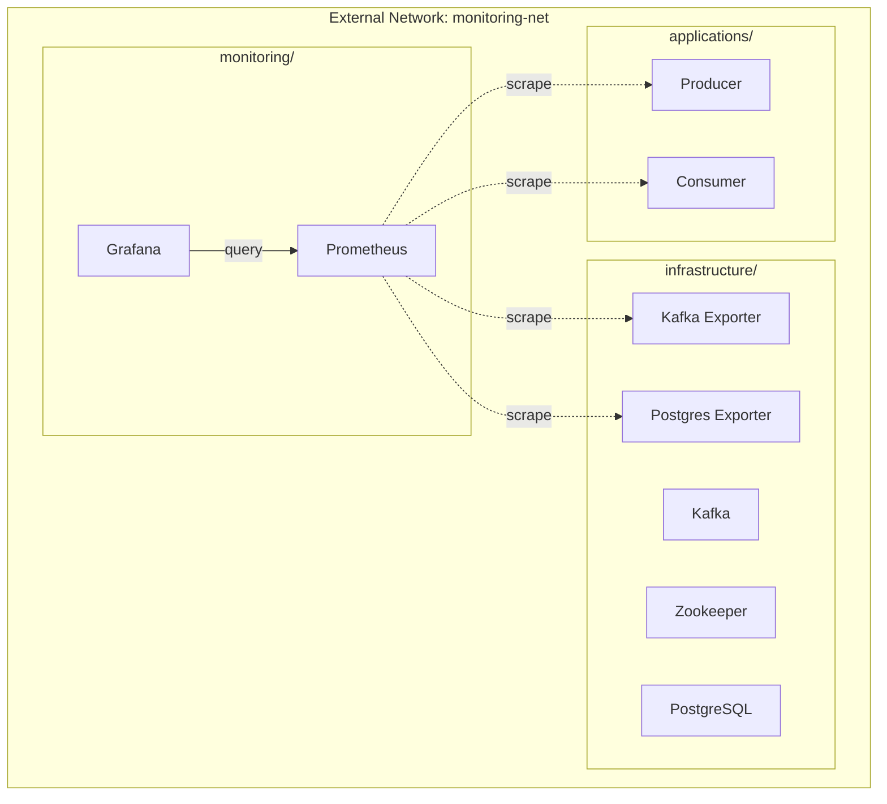

```mermaid
graph TB
    subgraph "External Network: monitoring-net"
        subgraph "monitoring/"
            P[Prometheus]
            G[Grafana]
        end
        
        subgraph "infrastructure/"
            K[Kafka]
            Z[Zookeeper]
            PG[PostgreSQL]
            
            KE[Kafka Exporter]
            PE[Postgres Exporter]
        end
        
        subgraph "applications/"
            PR[Producer]
            CO[Consumer]
        end
    end
    
    P -.->|scrape| KE
    P -.->|scrape| PE
    P -.->|scrape| PR
    P -.->|scrape| CO
    G -->|query| P
```